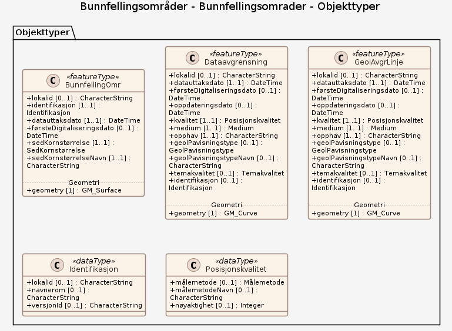

# Produktspesifikasjon: Bunnfellingsområder

*Bunnfellingsområder er naturlige forsenkninger på sjøbunnen med meget svake bunnstrømmer og fine sedimenter (silt og leire). Dårlig sirkulasjon av vannet på bunnen av i slike bassenger kan medføre opphoping av organisk materiale (f.eks. fra oppdrettsanlegg) og resultere i oksygensvikt.*

**Nøkkelord:** hav, sjø, fjord, kyst, havbunn, marin, sediment, sedimentasjon, bunnforhold, akkumulasjon, bunnfellingsområder, slam, oksygensvikt, vannutveksling, Norskekysten, Oslofjorden, Astafjorden, Rijpfjorden, Hvaler, Boknafjorden, Sørøysundet, Nordfjorden, Drammensfjorden, Porsangerfjorden, Ofoten, Kongsfjorden, Kvænangen, Skjervøy, Troms, Finnmark, Geologi, Jordarter, Havområder, Norge digitalt, geodataloven, MarineGrunnkart, Mareano, fellesDatakatalog, Natur, Forurensning, NGU, Marine grunnkart, Giske kommune, Møre og Romsdal, Ålesund kommune, Møre og Romsdal, Stavanger kommune, Rogaland, Oslo kommune, Oslo, Hareid kommune, Møre og Romsdal

**Emnekategorier:** 

**Geografisk utstrekning**:

- **Vest**: 4.5
- **Øst**: 27.0
- **Sør**: 59.0
- **Nord**: 80.5

**Tidsmessig utstrekning**:

- **Tidsperiode**:
  - **Fra**: 2005-06-15
  - **Til**: 2025-03-14

## Om spesifikasjonen

> **Denne versjonen av produktspesifikasjonen:**  
> **Opprettet dato:** 2005-06-15 
> **Endret dato:** 2025-03-14 
> **Språk:** nor 
> **Kontaktinformasjon:** Norges geologiske undersøkelse, [sigrid.elvenes@ngu.no](mailto:sigrid.elvenes@ngu.no)

## Termer og definisjoner
**Begrep** — kort forklaring

## Forkortelser

| Forkortelse | Betyr |
|-------------|-------|
| SOSI | Samordnet Opplegg for Stedfestet Informasjon |
| GML | Geography Markup Language |

## Om produktet Bunnfellingsområder

> **Romlig representasjonstype:** Vektor 
> **Unik identifikator:** <https://data.geonorge.no/sosi/geologi/bunnfellingsomrader> 
> **Kontaktinformasjon:** Norges geologiske undersøkelse, [sigrid.elvenes@ngu.no](mailto:sigrid.elvenes@ngu.no)
>
> **Romlig oppløsning:**
>
> **Ekvivalent målestokk**: 10 000, 20 000, 50 000
>
> **Begrensninger:**
>
> **Juridiske begrensninger**:
>
> - **Tilgangsbegrensninger**: Åpne data
> - **Bruksbegrensninger**: Lisens
> - **Lisens**: Norsk lisens for offentlige data (NLOD) 2.0
> - **Lisenslenke**: <https://data.norge.no/nlod/no/2.0>
>
> **Sikkerhetsbegrensninger**:
>
> - **Klassifisering**: Ugradert

### Formål

Laget  fremhever deler av havbunnen, tolket som akkumuleringsområder, som er preget av svake strømmer og lite erosjon eller transport av finere sedimenter. Kunnskap om disse områdene kan være til hjelp for arealplanlegging f.eks. ved planlegging av avfallsutslippspunkter eller akvakulturplasser som krever god vannutveksling.

### Bruksområde

Datasettet kan blant annet anvendes som underlag i overordnet areal- og miljøplanlegging i kystsonen, for akvakultur- og fiskeriformål, og for å ivareta det marine miljøet.

## Omfang

### Hele datasettet

**Nivå**: dataset

**Nivåbeskrivelse**: Gjelder hele datasettet. Hvis omfang ikke er oppgitt under en overskrift, gjelder teksten for hele datasettet og alle leveranser

### Bunnfellingsomrader

**Nivå**: dataset

**Nivåbeskrivelse**: OGC API-Features fra Norges geologiske undersøkelse

## Datainnhold og struktur

### Datamodell - Bunnfellingsomrader

➡️ [Se full datamodell for omfang "Bunnfellingsomrader" (diagram per pakke og objektkatalog)](bunnfellingsomrader/objektkatalog.html)

## Referansesystem

| EPSG-kode | Navn på referansesystem |
| --- | --- |
| [EPSG:4258](https://epsg.io/4258) | [EUREF 89 Geografisk (ETRS 89) 2d](https://register.geonorge.no/epsg-koder) |
| [EPSG:25833](https://epsg.io/25833) | [EUREF89 UTM sone 33, 2d](https://register.geonorge.no/epsg-koder) |

## Datakvalitet

**Nivå**: dataset

- **Kvalitetsmål**: SOSI produktspesifikasjon: Bunnfellingsområder
  **Målebeskrivelse**: Dataene er i henhold til produktspesifikasjonen
  **Beskrivende resultat**: Dataene er i henhold til produktspesifikasjonen

- **Kvalitetsmål**: Sosi applikasjonsskjema
  **Målebeskrivelse**: SOSI-filer er i henhold til applikasjonsskjema
  **Beskrivende resultat**: SOSI-filer er i henhold til applikasjonsskjema

- **Kvalitetsmål**: Sosi applikasjonsskjema
  **Målebeskrivelse**: GML-filer er i henhold til applikasjonsskjema
  **Beskrivende resultat**: GML-filer er i henhold til applikasjonsskjema

- **Kvalitetsmål**: Prosentvis dekning i forhold til datasettets utstrekning
  **Målebeskrivelse**: Datasettets faktiske kartlagte areal i forhold til datasettets spesifiserte utstrekning
  **Resultat**: 5

- **Kvalitetsmål**: Prosentvis oppfyllelse av FAIR-prinsipper
  **Målebeskrivelse**: Angir fullstendighet i forhold til krav fra FAIR-prinsippene (The FAIR Guiding Principles for scientific data management and stewardship)
  **Resultat**: 100

- **Kvalitetsmål**: FAIR
  **Resultat**: Prosentvis oppfyllelse av FAIR-prinsipper: 100%

- **Kvalitetsmål**: Coverage
  **Resultat**: Prosentvis dekning i forhold til datasettets utstrekning: 5%

## Datafangst og produksjon

**Datainnsamling og prosessering**:

- **Prosesstrinn**:
  - **Beskrivelse**: Informasjon om bunnfellingsområder er basert på Bunnsedimenter (kornstørrelse), detaljert. Grunnlaget for tolkning av Bunnsedimenter (kornstørrelse) er video av sjøbunnen, tolkning av digitale reflektivitetsdata, samt tolkning av analoge og digitale seismiske data. Akustiske data og video er verifisert med analyser av bunnprøver. Detaljerte vanndypsdata har inngått som støtte i tolkningen. Datasettet er digitalisert og tilrettelagt vha. ESRI ArcGIS verktøy. Metodikken er beskrevet i egenskapsfeltene Målemetode og GeolPavisningstype. Temakoder og egenskaper følger i hovedsak SOSI-standarden.

## Vedlikehold

**Vedlikeholdsfrekvens**: Etter behov

**Status**: Kontinuerlig oppdatert

## Presentasjon

**navn**: Tegneregler

**Lenke**:
<https://register.geonorge.no/tegneregler/bunnfellingsområder>

## Leveranse

| Tjeneste | Endepunkt | Type | Format | Leveranseenheter |
| --- | --- | --- | --- | --- |
| OGC API-Features | [Lenke](https://geo.ngu.no/api/features/bunnfellingsomrader) | OGC:API-Features | JSON, GeoJSON | landsfiler |
| WMS-tjeneste | [Lenke](https://geo.ngu.no/mapserver/MarineGrunnkartWMS?REQUEST=GetCapabilities&SERVICE=WMS) | OGC:WMS | PDF | landsfiler |
| Geonorge nedlastning | [Lenke](https://nedlasting.ngu.no/api/capabilities/) | GEONORGE:DOWNLOAD | FGDB, GML, SOSI | fylkesvis, landsfiler |
| Atom Feed | [Lenke](https://nedlasting.ngu.no/api/atom/901afb33-8897-40fb-80a5-f4e4e799ae68) | W3C:AtomFeed | FGDB, GML, SOSI | landsfiler |
| Bunnfellingsområder | [Lenke](https://geo.ngu.no/mapserver/MarineGrunnkartWMS/?request=getcapabilities&service=wms) | Tjenestelag | image/png |  |
| GeoPackage: bunnfellingsomrader | [Lenke](https://raw.githubusercontent.com/larsingea/ps_test/main/produktspesifikasjon/bunnfellingsomrader/bunnfellingsomrader/bunnfellingsomrader.gpkg) | Nedlasting | GPKG |  |
| GML/XSD-skjema: bunnfellingsomrader | [Lenke](https://raw.githubusercontent.com/larsingea/ps_test/main/produktspesifikasjon/bunnfellingsomrader/bunnfellingsomrader/schema/xsd/INPUT/bunnfellingsomrader.xsd) | Nedlasting | XSD |  |
| JSON Schema: bunnfellingsomrader | [Lenke](https://raw.githubusercontent.com/larsingea/ps_test/main/produktspesifikasjon/bunnfellingsomrader/bunnfellingsomrader/schema/jsonschema/INPUT/bunnfellingsomrader/bunnfellingsomrader.json) | Nedlasting | JSON Schema |  |

## Metadata

**Metadatastandard**: ISO19115

**Metadatastandardversjon**: 2003

**Metadatadato**: 2026-09-02

**språk**: nor

**Kontakt**:

- **Organisasjon**: Norges geologiske undersøkelse
- **Kontaktperson**: Janne Grete Wesche
- **Logo**: <https://register.geonorge.no/data/organizations/970188290_NGU_hovedlogo_svart.svg> thumbnail.png
- **Epost**: metadataansvarlig@ngu.no
- **rolle**: pointOfContact

**Metadataidentifikator**:

- **Utsteder**: Geonorge
- **kode**: 901afb33-8897-40fb-80a5-f4e4e799ae68
- **koderom**: <https://kartkatalog.geonorge.no/metadata/>
- **Metadatalenke**: <https://kartkatalog.geonorge.no/metadata/901afb33-8897-40fb-80a5-f4e4e799ae68>

## Tilleggsinformasjon

Detaljnivået i datagrunnlaget tilsier bruk i kartmålestokk 1:10 000 - 1:50 000 (detaljert).

- **Produktark:** [https://register.geonorge.no/produktark/bunnfellingsområder](https://register.geonorge.no/produktark/bunnfellingsområder)
