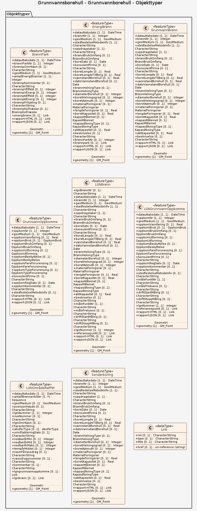
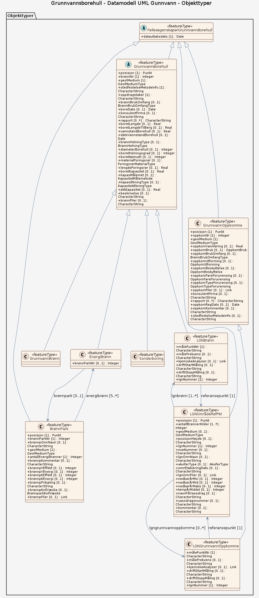

# Produktspesifikasjon: Grunnvannsborehull

*Datasettet gir en landsdekkende oversikt over borede grunnvannsbrønner, energibrønner og naturlige oppkommer av grunnvann (tidligere kalt kilder). Datasettet viser lokalisering og tekniske, administrative og geologiske forhold registrert for grunnvanns- og energibrønner. Oftest er de registrert av borefirma iht. oppgaveplikten etter Vannressursloven §46. Dataene er tilgjengelig i GRANADA - Nasjonal grunnvannsdatabase <https://geo.ngu.no/kart/granada_mobil/*>

**Nøkkelord:** Grunnvann, Hydrogeologi, Grunnvannsforsyning, Grunnvannskvalitet, LGN, GRANADA, Brønnpark, Energibrønn, Grunnvannsbrønn, Geologi, Energiressurser, Inspire, Det offentlige kartgrunnlaget, Norge digitalt, geodataloven, dataNorgeNo, modellbaserteVegprosjekter, fellesDatakatalog

**Emnekategorier:** Geovitenskapelig informasjon

**Geografisk utstrekning**:

- **Vest**: 4.5
- **Øst**: 31.2
- **Sør**: 57.9
- **Nord**: 71.2

**Tidsmessig utstrekning**:

- **Tidsperiode**:
  - **Fra**: 2000-09-05
  - **Til**: 2026-09-08

## Om spesifikasjonen

> **Denne versjonen av produktspesifikasjonen:**  
> **Opprettet dato:** 2000-09-05 
> **Endret dato:** 2026-09-08 
> **Språk:** nor 
> **Kontaktinformasjon:** Norges geologiske undersøkelse, [wmsdrift@ngu.no](mailto:wmsdrift@ngu.no)

## Om produktet Grunnvannsborehull

> **Romlig representasjonstype:** Vektor 
> **Unik identifikator:** <https://data.geonorge.no/sosi/geologi/grunnvannsborehull> 
> **Kontaktinformasjon:** Norges geologiske undersøkelse, [wmsdrift@ngu.no](mailto:wmsdrift@ngu.no)
>
> **Romlig oppløsning:**
>
> **Ekvivalent målestokk**: 50000
>
> **Begrensninger:**
>
> **Ressursbegrensninger**:
>
> - **Bruksbegrensninger**: Ingen begrensninger på bruk er oppgitt.
>
> **Juridiske begrensninger**:
>
> - **Tilgangsbegrensninger**: Åpne data
> - **Bruksbegrensninger**: Lisens
> - **Lisens**: Norsk lisens for offentlige data (NLOD)
> - **Lisenslenke**: <http://data.norge.no/nlod/no/1.0>
> - **Andre begrensninger**: Grunnvannsdatabasen GRANADA gir en landsdekkende oversikt over ulike grunnvannsborehull, hvor brønnene er stedfestet med ulike metoder og med ulik grad av nøyaktighet. Oppgitte data er veiledende, og man må ta høyde for at det kan være gjengitt, målt eller tolket feil. Lenke til viktig informasjon om nøyaktighet og tolkning av kartene: <https://www.ngu.no/geologiske%20ressurser/grunnvann/etterregistrering-av-br%C3%B8nner/disclaimer>
>
> **Sikkerhetsbegrensninger**:
>
> - **Klassifisering**: Ugradert

### Formål

Grunnvannsborehull er et punkt hvor det er foretatt en boring etter grunnvann, og hvor formålet er vannforsyning, landsomfattende overvåkning av grunnvannsparametre over tid, etablering av energibrønner til grunnvarmeanlegg, oversikt over naturlige oppkommer (kilder) eller undersøkelsesbrønner (sonderinger). Ved sonderboring registreres grunnvannsrelaterte data under selve boringen, men hvor borehullet kollapser (raser sammen) etter avsluttet boring.

### Bruksområde

Datasettet gir en landsdekkende oversikt over borede grunnvannsbrønner, energibrønner og naturlige oppkommer av grunnvann (tidligere kalt kilder). Grunnvannsborehull er et punkt hvor det er foretatt en boring etter grunnvann, og hvor formålet er vannforsyning, landsomfattende overvåkning av grunnvannsparametre over tid, etablering av energibrønner til grunnvarmeanlegg, oversikt over naturlige oppkommer (kilder) eller undersøkelsesbrønner (sonderinger).

## Omfang

### Hele datasettet

**Nivå**: dataset

**Nivåbeskrivelse**: Gjelder hele datasettet. Hvis omfang ikke er oppgitt under en overskrift, gjelder teksten for hele datasettet og alle leveranser

### Grunnvannborehull

**Nivå**: dataset

**Nivåbeskrivelse**: OGC API-Features fra Norges geologiske undersøkelse

### Datamodell UML Gunnvann

**Nivå**: dataset

## Datainnhold og struktur

### Datamodell - Grunnvannborehull

➡️ [Se full datamodell for omfang "Grunnvannborehull" (diagram per pakke og objektkatalog)](grunnvannborehull/objektkatalog.html)

### Datamodell - Datamodell UML Gunnvann

➡️ [Se full datamodell for omfang "Datamodell UML Gunnvann" (diagram per pakke og objektkatalog)](datamodell-uml-gunnvann/objektkatalog.html)

## Referansesystem

| EPSG-kode | Navn på referansesystem |
| --- | --- |
| [EPSG:4258](https://epsg.io/4258) | [EUREF 89 Geografisk (ETRS 89) 2d](https://register.geonorge.no/epsg-koder) |
| [EPSG:25832](https://epsg.io/25832) | [EUREF89 UTM sone 32, 2d](https://register.geonorge.no/epsg-koder) |
| [EPSG:25833](https://epsg.io/25833) | [EUREF89 UTM sone 33, 2d](https://register.geonorge.no/epsg-koder) |
| [EPSG:25835](https://epsg.io/25835) | [EUREF89 UTM sone 35, 2d](https://register.geonorge.no/epsg-koder) |

## Datakvalitet

**Nivå**: dataset

**Kvalitetsmål**: COMMISSION REGULATION (EU) No 1089/2010 of 23 November 2010 implementing Directive 2007/2/EC of the European Parliament and of the Council as regards interoperability of spatial data sets and services

- **Beskrivende resultat**: Dataene er ikke vurdert iht produktspesifikasjonen

**Kvalitetsmål**: SOSI produktspesifikasjon: Grunnvannsborehull

- **Beskrivende resultat**: Dataene er i henhold til produktspesifikasjonen

**Kvalitetsmål**: Sosi applikasjonsskjema

- **Beskrivende resultat**: SOSI-filer er i henhold til applikasjonsskjema

**Kvalitetsmål**: Prosentvis oppfyllelse av FAIR-prinsipper

- **Målebeskrivelse**: Angir fullstendighet i forhold til krav fra FAIR-prinsippene (The FAIR Guiding Principles for scientific data management and stewardship)
- **Resultat**: 98

## Datafangst og produksjon

**Datainnsamling og prosessering**:

- **Prosesstrinn**:
  - **Beskrivelse**: Datafangsten er basert på innholdet i et brønnskjema som primært brønnborefirmaene leverer når det bores en brønn. Forskrift om oppgaveplikt ved brønnboring og grunnvannsundersøkelser trådte i kraft 1. januar 1997 og omfatter rapporteringsplikt til NGU. De innrapporterte brønndataene blir deretter kvalitetssikret av NGU, og er deretter tilgjengelig i karttjenester og som nedlastbart datasett umiddelbart.

## Vedlikehold

**Vedlikeholdsfrekvens**: Etter behov

**Status**: Kontinuerlig oppdatert

## Presentasjon

**navn**: Tegneregler

**Lenke**:
<https://register.geonorge.no/register/versjoner/tegneregler/norges-geologiske-undersøkelse/grunnvannsborehull>

## Leveranse

| Tjeneste | Endepunkt | Type | Format | Leveranseenheter |
| --- | --- | --- | --- | --- |
| Geonorge nedlastning | [Lenke](https://nedlasting.ngu.no/api/capabilities/) | GEONORGE:DOWNLOAD | FGDB, Shape, SOSI | landsfiler, fylkesvis |
| Egen nedlastningsside | [Lenke](https://geo.ngu.no/download/order?dataset=1800) | WWW:DOWNLOAD-1.0-http--download | FGDB, Shape, SOSI | landsfiler, kommunevis |
| OGC API-Features | [Lenke](https://geo.ngu.no/api/features/grunnvannborehull) | OGC:API-Features | JSON, GeoJSON | landsfiler |
| Atom Feed | [Lenke](https://nedlasting.ngu.no/api/atom/82cd33ef-52dd-4c83-b2d6-e55a0941b33b) | W3C:AtomFeed | FGDB, MS_EXCEL, Shape, SOSI | landsfiler, fylkesvis |
| Grunnvann (Granada) WMS | [Lenke](https://geo.ngu.no/mapserver/GranadaWMS5?request=GetCapabilities&service=WMS) | WMS-tjeneste | png |  |
| GeoPackage: datamodell-uml-gunnvann | [Lenke](https://raw.githubusercontent.com/larsingea/ps_test/main/produktspesifikasjon/grunnvannsborehull/datamodell-uml-gunnvann/datamodell-uml-gunnvann.gpkg) | Nedlasting | GPKG |  |
| GeoPackage: grunnvannborehull | [Lenke](https://raw.githubusercontent.com/larsingea/ps_test/main/produktspesifikasjon/grunnvannsborehull/grunnvannborehull/grunnvannborehull.gpkg) | Nedlasting | GPKG |  |
| GML/XSD-skjema: datamodell-uml-gunnvann | [Lenke](https://raw.githubusercontent.com/larsingea/ps_test/main/produktspesifikasjon/grunnvannsborehull/datamodell-uml-gunnvann/schema/xsd/INPUT/datamodell-uml-gunnvann.xsd) | Nedlasting | XSD |  |
| GML/XSD-skjema: grunnvannborehull | [Lenke](https://raw.githubusercontent.com/larsingea/ps_test/main/produktspesifikasjon/grunnvannsborehull/grunnvannborehull/schema/xsd/INPUT/grunnvannborehull.xsd) | Nedlasting | XSD |  |
| JSON Schema: datamodell-uml-gunnvann | [Lenke](https://raw.githubusercontent.com/larsingea/ps_test/main/produktspesifikasjon/grunnvannsborehull/datamodell-uml-gunnvann/schema/jsonschema/INPUT/datamodellumlgunnvann/datamodell-uml-gunnvann.json) | Nedlasting | JSON Schema |  |
| JSON Schema: grunnvannborehull | [Lenke](https://raw.githubusercontent.com/larsingea/ps_test/main/produktspesifikasjon/grunnvannsborehull/grunnvannborehull/schema/jsonschema/INPUT/grunnvannborehull/grunnvannborehull.json) | Nedlasting | JSON Schema |  |

## Metadata

**Metadatastandard**: ISO19115

**Metadatastandardversjon**: 2003

**Metadatadato**: 2026-09-15

**språk**: nor

**Kontakt**:

- **Organisasjon**: Norges geologiske undersøkelse
- **Kontaktperson**: Janne Grete Wesche
- **Logo**: <https://register.geonorge.no/data/organizations/970188290_NGU_hovedlogo_svart.svg> thumbnail.png
- **Epost**: metadataansvarlig@ngu.no
- **rolle**: pointOfContact

**Metadataidentifikator**:

- **Utsteder**: Geonorge
- **kode**: 82cd33ef-52dd-4c83-b2d6-e55a0941b33b
- **koderom**: <https://kartkatalog.geonorge.no/metadata/>
- **Metadatalenke**: <https://kartkatalog.geonorge.no/metadata/82cd33ef-52dd-4c83-b2d6-e55a0941b33b>

## Tilleggsinformasjon

NGU poengterer at brønner kan finnes overalt uavhengig av hva som er registrert i brønndatabasen, og at tiltakshavere (eks. Statnett, Bane NOR, Statens vegvesen) må foreta befaringer for å avdekke dette. Tilgjengelig på GRANADA <https://geo.ngu.no/kart/granada_mobil/>
Viktig informasjon om nøyaktighet og tolkning av grunnvannsdataene finnes på <https://www.ngu.no/geologiske%20ressurser/grunnvann/etterregistrering-av-br%C3%B8nner/disclaimer>

- **Produktark:** [https://register.geonorge.no/register/versjoner/produktark/norges-geologiske-undersøkelse/grunnvannsborehull](https://register.geonorge.no/register/versjoner/produktark/norges-geologiske-undersøkelse/grunnvannsborehull)
- **Produktside:** [https://www.ngu.no/geologiske-ressurser/grunnvann](https://www.ngu.no/geologiske-ressurser/grunnvann)
