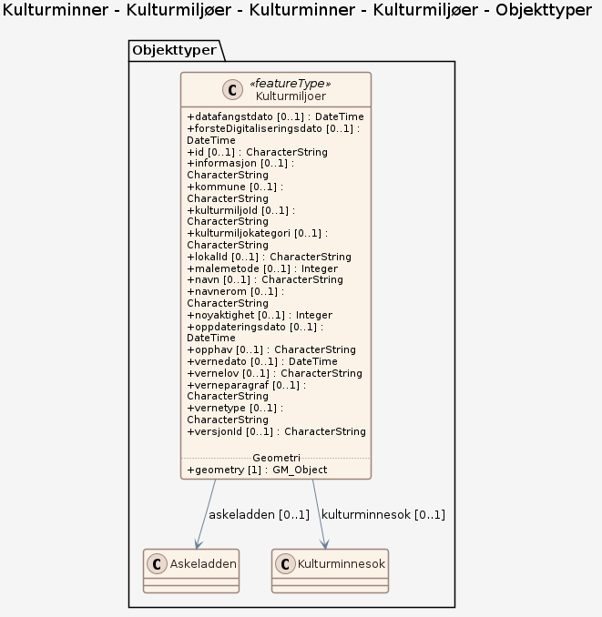

# Produktspesifikasjon: Kulturminner - Kulturmiljøer

*Datasettet "Kulturminner – kulturmiljøer" dekker freda kulturmiljøer, Kulturmiljø og landskap av lokal interesse,  Kulturmiljøer og landskap av nasjonal interesse, Kulturmiljø og landskap av regional interesse og verdensarvområder.

For beskrivelser og definisjoner av de ulike kategoriene kulturmilijøer, se <https://register.geonorge.no/sosi-kodelister/kulturminner/kulturmilj%C3%B8kategori*>

**Nøkkelord:** Kulturmiljø, kulturmiljøer, fredete freda, kulturminne, kulturminner, verdensarv, UNESCO, Norge fastland, Vernede områder, Inspire, Det offentlige kartgrunnlaget, Norge digitalt, geodataloven, modellbaserteVegprosjekter, fellesDatakatalog

**Emnekategorier:** Miljødata

**Geografisk utstrekning**:

- **Vest**: 4.81904632206732
- **Øst**: 30.856353766596
- **Sør**: 57.9898019251197
- **Nord**: 70.604192847774

**Tidsmessig utstrekning**:

- **Tidsperiode**:
  - **Fra**: 2013-01-22
  - **Til**: 2026-08-20

## Om spesifikasjonen

> **Denne versjonen av produktspesifikasjonen:**  
> **Opprettet dato:** 2013-01-22 
> **Endret dato:** 2026-08-20 
> **Språk:** nor 
> **Kontaktinformasjon:** Riksantikvaren, [postmottak@ra.no](mailto:postmottak@ra.no)

## Termer og definisjoner
**Begrep** — kort forklaring

## Forkortelser

| Forkortelse | Betyr |
|-------------|-------|
| SOSI | Samordnet Opplegg for Stedfestet Informasjon |
| GML | Geography Markup Language |

## Om produktet Kulturminner - Kulturmiljøer

> **Romlig representasjonstype:** Vektor 
> **Unik identifikator:** <https://data.geonorge.no/sosi/kulturminner/kulturmiljoer> 
> **Kontaktinformasjon:** Riksantikvaren, [postmottak@ra.no](mailto:postmottak@ra.no)
>
> **Romlig oppløsning:**
>
> **Ekvivalent målestokk**: 250000
>
> **Begrensninger:**
>
> **Ressursbegrensninger**:
>
> - **Bruksbegrensninger**: Ingen begrensninger på bruk er oppgitt.
>
> **Juridiske begrensninger**:
>
> - **Tilgangsbegrensninger**: Åpne data
> - **Bruksbegrensninger**: Lisens
> - **Lisens**: Norsk lisens for offentlige data (NLOD)
> - **Lisenslenke**: <http://data.norge.no/nlod/no/1.0>
> - **Andre begrensninger**: Ingen begrensninger oppgitt.
>
> **Sikkerhetsbegrensninger**:
>
> - **Klassifisering**: Ugradert

### Bruksområde

Kulturmiljøer og landskaper som er prioritert nasjonalt, regionalt eller lokalt er viktige å ta hensyn til i planprosessen, da de legger føringer for bruken av, ofte større, områder.

## Omfang

### Hele datasettet

**Nivå**: dataset

**Nivåbeskrivelse**: Gjelder hele datasettet. Hvis omfang ikke er oppgitt under en overskrift, gjelder teksten for hele datasettet og alle leveranser

### Kulturminner - Kulturmiljøer

**Nivå**: dataset

**Nivåbeskrivelse**: OGC API – Features (koblet til datasettet i Geonorge)

## Datainnhold og struktur

### Datamodell - Kulturminner - Kulturmiljøer

➡️ [Se full datamodell for omfang "Kulturminner - Kulturmiljøer" (diagram per pakke og objektkatalog)](kulturminner-kulturmiljer/objektkatalog.html)

## Referansesystem

| EPSG-kode | Navn på referansesystem |
| --- | --- |
| [EPSG:25832](https://epsg.io/25832) | [EUREF89 UTM sone 32, 2d](https://register.geonorge.no/epsg-koder) |
| [EPSG:25833](https://epsg.io/25833) | [EUREF89 UTM sone 33, 2d](https://register.geonorge.no/epsg-koder) |
| [EPSG:25835](https://epsg.io/25835) | [EUREF89 UTM sone 35, 2d](https://register.geonorge.no/epsg-koder) |
| [EPSG:3035](https://epsg.io/3035) | [EUREF89 / ETRS89-LAEA Europe](https://register.geonorge.no/epsg-koder) |
| [EPSG:4258](https://epsg.io/4258) | [EUREF 89 Geografisk (ETRS 89) 2d](https://register.geonorge.no/epsg-koder) |

## Datakvalitet

**Nivå**: dataset

- **Kvalitetsmål**: COMMISSION REGULATION (EU) No 1089/2010 of 23 November 2010 implementing Directive 2007/2/EC of the European Parliament and of the Council as regards interoperability of spatial data sets and services
  **Målebeskrivelse**: Dataene er ikke vurdert iht produktspesifikasjonen
  **Beskrivende resultat**: Dataene er ikke vurdert iht produktspesifikasjonen

- **Kvalitetsmål**: SOSI produktspesifikasjon: Kulturminner - Kulturmiljøer
  **Målebeskrivelse**: Dataene er i henhold til produktspesifikasjonen
  **Beskrivende resultat**: Dataene er i henhold til produktspesifikasjonen

- **Kvalitetsmål**: Sosi applikasjonsskjema
  **Målebeskrivelse**: SOSI-filer er i henhold til applikasjonsskjema
  **Beskrivende resultat**: SOSI-filer er i henhold til applikasjonsskjema

- **Kvalitetsmål**: Sosi applikasjonsskjema
  **Målebeskrivelse**: GML-filer er i henhold til applikasjonsskjema
  **Beskrivende resultat**: GML-filer er i henhold til applikasjonsskjema

- **Kvalitetsmål**: Prosentvis oppfyllelse av FAIR-prinsipper
  **Målebeskrivelse**: Angir fullstendighet i forhold til krav fra FAIR-prinsippene (The FAIR Guiding Principles for scientific data management and stewardship)
  **Resultat**: 93

- **Kvalitetsmål**: FAIR
  **Resultat**: Prosentvis oppfyllelse av FAIR-prinsipper: 93%

## Vedlikehold

**Vedlikeholdsfrekvens**: Ukentlig

**Status**: Kontinuerlig oppdatert

## Presentasjon

**navn**: Tegneregler

**Lenke**:
<https://register.geonorge.no/tegneregler/kulturminner-kulturmiljoer>

## Leveranse

| Tjeneste | Endepunkt | Type | Format | Leveranseenheter |
| --- | --- | --- | --- | --- |
| Geonorge nedlastning | [Lenke](https://nedlasting.geonorge.no/api/capabilities/) | GEONORGE:DOWNLOAD | FGDB, GML, PostGIS, SOSI | fylkesvis, kommunevis, landsfiler |
| Atom Feed | [Lenke](http://nedlasting.geonorge.no/geonorge/ATOM-feeds/Kulturmiljoer_AtomFeedFGDB.xml) | W3C:AtomFeed | FGDB | fylkesvis, kommunevis, landsfiler |
| Atom Feed | [Lenke](http://nedlasting.geonorge.no/geonorge/ATOM-feeds/Kulturmiljoer_AtomFeedGML.xml) | W3C:AtomFeed | GML | fylkesvis, kommunevis, landsfiler |
| Atom Feed | [Lenke](http://nedlasting.geonorge.no/geonorge/ATOM-feeds/Kulturmiljoer_AtomFeedPostGIS.xml) | W3C:AtomFeed | PostGIS | fylkesvis, kommunevis, landsfiler |
| Atom Feed | [Lenke](http://nedlasting.geonorge.no/geonorge/ATOM-feeds/Kulturmiljoer_AtomFeedSOSI.xml) | W3C:AtomFeed | SOSI | fylkesvis, kommunevis, landsfiler |
| Kulturminner - Kulturmiljøer WMS | [Lenke](https://kart.ra.no/wms/kulturmiljoer?SERVICE=WMS&VERSION=1.3.0&REQUEST=GetCapabilities) | WMS-tjeneste | image/png |  |

## Metadata

**Metadatastandard**: ISO19115

**Metadatastandardversjon**: 2003

**Metadatadato**: 2026-08-24

**språk**: nor

**Kontakt**:

- **Organisasjon**: Riksantikvaren
- **Logo**: <https://register.geonorge.no/data/organizations/974760819_riksantikvaren_liten.png>
- **Epost**: Datatjenester@ra.no
- **rolle**: pointOfContact

**Metadataidentifikator**:

- **Utsteder**: Geonorge
- **kode**: 17adbcac-bbb2-4efc-ab51-756573c8f178
- **koderom**: <https://kartkatalog.geonorge.no/metadata/>
- **Metadatalenke**: <https://kartkatalog.geonorge.no/metadata/17adbcac-bbb2-4efc-ab51-756573c8f178>

