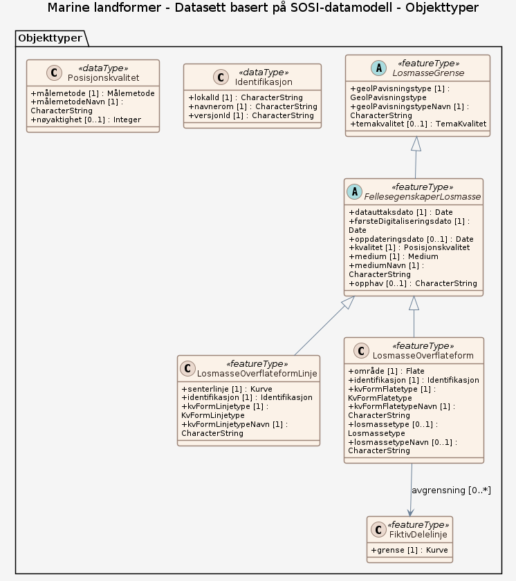

### Datamodell

**Kilde:** [SOSI UML XMI-fil](https://sosi.geonorge.no/svn/SOSI/SOSI%20Del%203/NGU/MarineLandformer-1.0.xml)

#### LosmasseOverflateformLinje

observert overflateform med lineær utstrekning  Eksempel: Terrassekant, vifte, haug, rygg

Egenskaper

<table class="feature-attribute-table">
  <colgroup>
    <col style="width: 35%;" />
    <col style="width: 65%;" />
  </colgroup>
  <tbody>
    <tr>
      <th scope="row">Navn:</th>
      <td><strong>senterlinje</strong></td>
    </tr>
    <tr>
      <th scope="row">Definisjon:</th>
      <td>forløp som følger objektets sentrale del</td>
    </tr>
    <tr>
      <th scope="row">Multiplisitet:</th>
      <td>1</td>
    </tr>
    <tr>
      <th scope="row">Type:</th>
      <td>Kurve</td>
    </tr>
  </tbody>
</table>

<table class="feature-attribute-table">
  <colgroup>
    <col style="width: 35%;" />
    <col style="width: 65%;" />
  </colgroup>
  <tbody>
    <tr>
      <th scope="row">Navn:</th>
      <td><strong>identifikasjon</strong></td>
    </tr>
    <tr>
      <th scope="row">Definisjon:</th>
      <td>unik identifikasjon av et objekt</td>
    </tr>
    <tr>
      <th scope="row">Multiplisitet:</th>
      <td>1</td>
    </tr>
    <tr>
      <th scope="row">Type:</th>
      <td>Identifikasjon</td>
    </tr>
  </tbody>
</table>

<table class="feature-attribute-table">
  <colgroup>
    <col style="width: 35%;" />
    <col style="width: 65%;" />
  </colgroup>
  <tbody>
    <tr>
      <th scope="row">Navn:</th>
      <td><strong>identifikasjon.lokalId</strong></td>
    </tr>
    <tr>
      <th scope="row">Definisjon:</th>
      <td>lokal identifikator, tildelt av dataleverendør/dataforvalter. Den lokale identifikatoren er unik innenfor navnerommet, ingen andre objekter har samme identifikator.  NOTE: Det er data leverendørens ansvar å sørge for at denne lokale identifikatoren er unik innenfor navnerommet.</td>
    </tr>
    <tr>
      <th scope="row">Multiplisitet:</th>
      <td>1</td>
    </tr>
    <tr>
      <th scope="row">Type:</th>
      <td>CharacterString</td>
    </tr>
  </tbody>
</table>

<table class="feature-attribute-table">
  <colgroup>
    <col style="width: 35%;" />
    <col style="width: 65%;" />
  </colgroup>
  <tbody>
    <tr>
      <th scope="row">Navn:</th>
      <td><strong>identifikasjon.navnerom</strong></td>
    </tr>
    <tr>
      <th scope="row">Definisjon:</th>
      <td>navnerom som unikt identifiserer datakilden til objektet, starter med to bokstavs kode jfr ISO 3166. Benytter understreking  ("_") dersom data produsenten ikke er assosiert med bare et land.  NOTE 1 : Verdien for nanverom vil eies av den dataprodusent som har ansvar for de unike identifikatorene og vil registreres i "INSPIRE external  Object Identifier Namespaces Register"  Eksempel: NO for Norge.</td>
    </tr>
    <tr>
      <th scope="row">Multiplisitet:</th>
      <td>1</td>
    </tr>
    <tr>
      <th scope="row">Type:</th>
      <td>CharacterString</td>
    </tr>
  </tbody>
</table>

<table class="feature-attribute-table">
  <colgroup>
    <col style="width: 35%;" />
    <col style="width: 65%;" />
  </colgroup>
  <tbody>
    <tr>
      <th scope="row">Navn:</th>
      <td><strong>identifikasjon.versjonId</strong></td>
    </tr>
    <tr>
      <th scope="row">Definisjon:</th>
      <td>identifikasjon av en spesiell versjon av et geografisk objekt (instans), maksimum lengde på 25 karakterers. Dersom spesifikasjonen av et geografisk objekt med en identifikasjon inkludererer livsløpssyklusinformasjon, benyttes denne versjonId for å skille mellom ulike versjoner av samme objekt. versjonId er en unik  identifikasjon av versjonen.  NOTE Maksimum lengde er valgt for å tillate tidsregistrering i henhold til  ISO 8601, slik som  "2007-02-12T12:12:12+05:30" som versjonId.</td>
    </tr>
    <tr>
      <th scope="row">Multiplisitet:</th>
      <td>1</td>
    </tr>
    <tr>
      <th scope="row">Type:</th>
      <td>CharacterString</td>
    </tr>
  </tbody>
</table>

<table class="feature-attribute-table">
  <colgroup>
    <col style="width: 35%;" />
    <col style="width: 65%;" />
  </colgroup>
  <tbody>
    <tr>
      <th scope="row">Navn:</th>
      <td><strong>kvFormLinjetype</strong></td>
    </tr>
    <tr>
      <th scope="row">Definisjon:</th>
      <td>kvartærgeologiske formelementlinjer</td>
    </tr>
    <tr>
      <th scope="row">Multiplisitet:</th>
      <td>1</td>
    </tr>
    <tr>
      <th scope="row">Type:</th>
      <td>KvFormLinjetype</td>
    </tr>
    <tr>
      <th scope="row">Tillatte verdier:</th>
      <td>- Ikke angitt - Drumlin – Strømlinjeformet rygg i løsmasser og/eller berggrunn, orientert parallelt med isbevegelsesretningen. Hvis løsmasseryggen er akkumulert i le av oppstikkende berggrunn kan formen kalles knaus og hale. - Drumlinoid rygg – Utydelig strømlinjeformet rygg i løsmasser og/eller berggrunn, orientert parallelt med isbevegelsesretningen. Hvis løsmasseryggen er akkumulert i le av oppstikkende berggrunn kan formen kalles knaus og hale. - Randmorene – Ryggformet moreneavsetning dannet langs ytterkanten av en bre. Omfatter ende- og sidemorener. - Parallelle rygger og furer i overflaten – Langstrakte strømlinjeformede rygger og furer i overflaten. Formene er orientert parallelt med tidligere isbevegelsesretning og er dannet under en isbre. Lavt relieff og liten bredde i forhold til lengde. - Sprekkefyllrygg – Ryggform som dannes ved at løsmasser blir presset opp i sprekk i sålen av en isbre. Forbindes med stagnasjon av breen. - Tilbaketrekningsmorene – Morenerygger avsatt foran breen ved lite fremstøt eller stillstand av brefronten, i en periode med generell tilbaketrekning av breen - Morenerygg – Ryggformet moreneavsetning - Esker (ryggformet breelvavsetning) – Klar ryggform i løsmasser. Angir at materialet er avsatt i tunneler eller sprekker i eller under en bre. Dersom den ryggformete breelvavsetningen er stor nok til å danne figur på kartet brukes fargen for breelvavsetninger til å angi utbredelsen og eskersymbolet til å angi ryggformen. - Breelvnedskjæring – Erosjonskant dannet av breelv - Bre-lateralt smeltevannsløp (spylerenne, venstre side) (2) – Smeltevannsløp dannet langs kanten av en bre (venstre side) - Smeltevannsløp (spylerenne) – Kanal i løsmasser dannet av smeltevann fra isbreer - Bre-lateralt smeltevannsløp (spylerenne, høyre side) (1) – Smeltevannsløp dannet langs kanten av en bre (høyre side) - Smeltevannsløp over passpunkt – Smeltevannsspor dannet ved overløp mellom to høyder (passpunkt) - Side av smeltevannsgjel (1) – Tørrlagt gjel utformet i fast fjell av smeltevann fra en isbre (venstre side) - Side av smeltevannsgjel (2) – Tørrlagt gjel utformet i fast fjell av smeltevann fra en isbre (høyre side) - Smeltevannsgjel – Tørrlagt gjel, utformet i fast fjell av smeltevann fra en isbre - Spylefelt – Fjelloverflate avspylt av smeltevann fra en isbre - Iskontaktskråning – Bratt skråning utformet i løsmasser avsatt med støtte mot en brekant - Strandlinje fra bredemt sjø – Horisontal linje i landskapet som markerer ytterkanten av en tidligere bredemt sjø. Kan være utformet både i løsmasser og i fast fjell. Blir også kalt sete. - Strandvoll fra bredemt sjø – Voll av sorterte løsmasser. Dannet av bølgeaktivitet langs strandsonen i en bredemt sjø. - Pløyespor fra isfjell – Avlange grøfter i løsmasser. Dannet av drivende isfjell i kontakt med bunnen av hav eller innsjø. - Stor dødisgrop – Stor forsenkning i løsmasser. Dannet ved smelting av begravde isrester. Kalles også grytehull. - Grop dannet av isfjell – Forsenkning i løsmasser. Dannet ved at et grunnstøtt isfjell blir liggende i ro. - Breelvvifte – Vifteformet løsmasseavsetning, hovedsaklig formet av rennende smeltevann fra en isbre. - Nivasjonskant – Skrent dannet i bakkant av snøleie - Terrassekant, glasial – Bratt kant/skråning som avgrenser en terrasseflate i sorterte løsmasser. Dannet i brenært miljø. - Glasitektonisk skrent – Bratt skråning dannet der en isbre har dratt med seg et flak av underlaget - Elve-/bekkenedskjæring – Kant dannet av rennende vann som har erodert ned i underlaget - Tidligere elve-/bekkeløp – Inaktiv kanal/løp, formet av rennende vann - Flomløp – Kanal formet av fluvial erosjon under ekstremt stor vannføring - Gjel, elv/bekk – Gjel utformet i fast fjell av vann - Vifteform – Vifteformet løsmasseavsetning, hovedsaklig formet av rennende vann - Ravine – Dypt nedskåret, v-formet kanal i løsmasser - Terrassekant – Bratt kant/skråning som avgrenser en terrasseflate i sorterte løsmasser - Nedskåret bekkeløp, vannførende - Nedskåret bekkeløp, sjeldent vannførende - Stor gjel utformet av elv og/eller breelv (venstre side) – Stort gjel (eller canyon) utformet av vann, i fast fjell (venstre side) - Stor gjel utformet av elv og/eller breelv (høyre side) – Stort gjel (eller canyon) utformet av vann, i fast fjell (høyre side) - Strømgrop – Erosjonsgroper som dannes i elvebunn og på elvesletter i flomperioder. - Kanal, uspesifisert (under vann) – Kanal på sjøbunnen - Fjellkløft (under vann) – Kløft eller sprekk i fast fjell på sjøbunnen - Kanalside (under vann) – Side av en kanal på sjøbunnen, som definerer bredden av kanalen - Strandvoll – Voll av sorterte løsmasser. Dannet av bølgeaktivitet langs en strandsone. - Strandlinje utformet i løsmasser – Horisontal linje i landskapet som markerer en tidligere strandlinje. Utformet i løsmasser. - Strandlinje utformet i fastFjell – Horisontal linje i landskapet som markerer en tidligere strandlinje. Utformet i fast fjell. - Abrasjonskant – Tydelig skrent i løsmasse eller fast fjell. Erodert av bølgeaktivitet i strandsone. - Skredvifte, ytterkant – Ytre grense av vifteformet skredavsetning. Ikke knyttet til en spesifikk skredprosess. - Skredløp, tydelig – Kanal i bratt skråning dannet av gjentatte skred av forskjellig type (snøskred, jordskred, steinsprang) - Snøskredvoll - Snøskredtunge - Front av fjellskredavsetning – Ytre grense av fjellskredavsetning - Skredkant – Bratt skrent som markerer løsnekant av et skred. Kan være dannet av forskjellige typer skred i både løsmasser og fast fjell. - Jord- og flomskredløp – Kanal i løsmasser dannet som følge av jord- eller flomskred - Nedslagsgrop (maringeologi) – Grop dannet ved foten av skråning i sjøen pga. skred - Skredkant, flak (maringeologi) – Bakkant av flakformet skred på sjøbunnen - Skredfront (maringeologi) – Front av et løsmasseskred. Viser utstrekning av en skredvifte på sjøbunnen. - Snøskredløp – Tydelig løp, erodert gjennom gjentatte snøskred - Jord- og flomskredslevée – Små rygger langs jord- og flomskredløp - Skrederosjonskant – Kant i løsmassedekket langs skredløp. Dannet av gjentatte skred langs samme løp. - Steinstriper – Rekker av steiner orientert nedover en skråning grunnet gjentatte fryse- og tineprosesser. Fremstår som striper nedover fjellsider. - Rygg – Ryggform i løsmasser. Primært brukt for rygger dannet ved avsetning eller deformasjon, ikke for ryggformer som har oppstått som følge av erosjon. - Deflasjonsgrop – Fordypning i løsmasser dannet ved vinderosjon. Kan være flere meter bred og dyp. - Markert haug eller rygg – Avgrensning av en enkelt haug eller rygg i løsmasser - Nedskjæring i løsmasser (maringeologi) – Nedskjæring i løsmasser - Lineament (maringeologi) – Regionalt utstrakt, linjeformet landskapstrekk som antas å avspeile svakhetsstrukturer eller inhomogeniteter i jordskorpen - Sandbølge (maringeologi) – Sandbølge eller sanddyne dannet av strømmende vann eller vind - Kildehorisont – Horisont med grunnvannsutslag - Forkastningslinje med antatt glasial og/eller postglasial aktivitet – Rettlinjet form i landoverflaten, som oftest synlig som en bratt skrent. Tolket som en forkastning med antatt aktivitet i glasial eller postglasial tid, basert på påvist deformasjon og skred/utglidninger av glasiale eller postglasiale løsmasser. - Glasitektonisk haug (maringeologi) – Haug- og ryggformet terreng som dannes når isbreen drar med seg og senere legger igjen store flak av underlaget - Glasitektonisk grop (maringeologi) – Forsenkning som dannes når isbreen beveger seg framover underlaget og drar med seg store flak av underlaget - Rygg, uspesifisert (maringeologi) – Rygg, uspesifisert - Strømrenne (maringeologi) – Renner på havbunnen dannet av bunnstrømmer - Renne, uspesifisert (maringeologi) – Renne, uspesifisert - Sedimentbølge (maringeologi) – Stor, bølgelignende landform på havbunnen dannet av bunnstrømmer. Toppen av bølgen er vanligvis orientert vinkelrett på strømretningen. Sedimentbølger består oftest av en blanding av slam, silt og sand, men kan og inneholde grus. - Korallrev (maringeologi) – Korallrev - Forkastning (maringeologi) – Bruddflate der det har foregått målbar/visuell forskyving av bergartene. Bevegelsesretningen på forskyvningen mellom forkastningsblokkene definerer betegnelsen for forkastningstypen, deriblant normal-, revers-, skrå- og sidelengsforkastning. - Sprekk (maringeologi) – Smal fordypning i havbunnen, som dannes ved nedsynkning av sedimenter pga. forkastning, utslipp av gass fra oppløsning av gasshydrater, eller svekket stabilitet av skråning etter utglidning av et skred. - Kant, uspesifisert (maringeologi) – Kant av usikker opprinnelse i løsmasser (f.eks. pga. skred, strøm eller en kombinasjon) - Ankerspor (maringeologi) – Ankerspor på sjøbunnen - Kabel (maringeologi) – Kabel - Rørledning (maringeologi) – Rørledning</td>
    </tr>
  </tbody>
</table>

<table class="feature-attribute-table">
  <colgroup>
    <col style="width: 35%;" />
    <col style="width: 65%;" />
  </colgroup>
  <tbody>
    <tr>
      <th scope="row">Navn:</th>
      <td><strong>kvFormLinjetypeNavn</strong></td>
    </tr>
    <tr>
      <th scope="row">Definisjon:</th>
      <td>navn på kvartærgeologiske formelementlinjer</td>
    </tr>
    <tr>
      <th scope="row">Multiplisitet:</th>
      <td>1</td>
    </tr>
    <tr>
      <th scope="row">Type:</th>
      <td>CharacterString</td>
    </tr>
  </tbody>
</table>

Relasjoner

**Arv**
FellesegenskaperLosmasse

#### FiktivDelelinje

linje for å dele opp store flateobjekter  Merknad: En del produktspesifikasjoner benytter spesifikke fiktive delelinjer.

Egenskaper

<table class="feature-attribute-table">
  <colgroup>
    <col style="width: 35%;" />
    <col style="width: 65%;" />
  </colgroup>
  <tbody>
    <tr>
      <th scope="row">Navn:</th>
      <td><strong>grense</strong></td>
    </tr>
    <tr>
      <th scope="row">Definisjon:</th>
      <td>forløp som følger overgang mellom ulike fenomener</td>
    </tr>
    <tr>
      <th scope="row">Multiplisitet:</th>
      <td>1</td>
    </tr>
    <tr>
      <th scope="row">Type:</th>
      <td>Kurve</td>
    </tr>
  </tbody>
</table>

#### FellesegenskaperLosmasse (abstrakt)

abstrakt objekt som bærer en rekke egenskaper som er fagområde-uavhengige og kan benyttes for alle objekttyper  Merknad: Spesielt i produktspesifikasjonsarbeid vil en velge egenskaper og avgrensningslinjer fra denne klassen.

Egenskaper

<table class="feature-attribute-table">
  <colgroup>
    <col style="width: 35%;" />
    <col style="width: 65%;" />
  </colgroup>
  <tbody>
    <tr>
      <th scope="row">Navn:</th>
      <td><strong>datauttaksdato</strong></td>
    </tr>
    <tr>
      <th scope="row">Definisjon:</th>
      <td>dato for uttak fra en database  Merknad: Skiller seg fra Kopidato ved at en ikke skiller på om det er uttak fra en originaldatabase eller en kopidatabase.</td>
    </tr>
    <tr>
      <th scope="row">Multiplisitet:</th>
      <td>1</td>
    </tr>
    <tr>
      <th scope="row">Type:</th>
      <td>DateTime</td>
    </tr>
  </tbody>
</table>

<table class="feature-attribute-table">
  <colgroup>
    <col style="width: 35%;" />
    <col style="width: 65%;" />
  </colgroup>
  <tbody>
    <tr>
      <th scope="row">Navn:</th>
      <td><strong>førsteDigitaliseringsdato</strong></td>
    </tr>
    <tr>
      <th scope="row">Definisjon:</th>
      <td>dato når en representasjon av objektet i digital form første gang ble etablert  Merknad: førsteDigitaliseringsdato kan skille seg fra førsteDatafangstdato ved at den første datafangsten skjedde analogt og gjort om til digital form senere i en produksjonsprosess. Eventuelt at innlegging i databasen skjedde på et senere tidspunkt enn registreringen /observasjonen / målingen av objektet.</td>
    </tr>
    <tr>
      <th scope="row">Multiplisitet:</th>
      <td>1</td>
    </tr>
    <tr>
      <th scope="row">Type:</th>
      <td>DateTime</td>
    </tr>
  </tbody>
</table>

<table class="feature-attribute-table">
  <colgroup>
    <col style="width: 35%;" />
    <col style="width: 65%;" />
  </colgroup>
  <tbody>
    <tr>
      <th scope="row">Navn:</th>
      <td><strong>oppdateringsdato</strong></td>
    </tr>
    <tr>
      <th scope="row">Definisjon:</th>
      <td>dato for siste endring på objektetdataene  Merknad: Oppdateringsdato kan være forskjellig fra Datafangsdato ved at data som er registrert kan bufres en kortere eller lengre periode før disse legges inn i datasystemet (databasen).  -Definition- Date and time at which this version of the spatial object was inserted or changed in the spatial data set.</td>
    </tr>
    <tr>
      <th scope="row">Multiplisitet:</th>
      <td>0..1</td>
    </tr>
    <tr>
      <th scope="row">Type:</th>
      <td>DateTime</td>
    </tr>
  </tbody>
</table>

<table class="feature-attribute-table">
  <colgroup>
    <col style="width: 35%;" />
    <col style="width: 65%;" />
  </colgroup>
  <tbody>
    <tr>
      <th scope="row">Navn:</th>
      <td><strong>kvalitet</strong></td>
    </tr>
    <tr>
      <th scope="row">Definisjon:</th>
      <td>beskrivelse av kvaliteten på stedfestingen  Merknad: Denne er identisk med ..KVALITET i tidligere versjoner av SOSI.</td>
    </tr>
    <tr>
      <th scope="row">Multiplisitet:</th>
      <td>1</td>
    </tr>
    <tr>
      <th scope="row">Type:</th>
      <td>Posisjonskvalitet</td>
    </tr>
  </tbody>
</table>

<table class="feature-attribute-table">
  <colgroup>
    <col style="width: 35%;" />
    <col style="width: 65%;" />
  </colgroup>
  <tbody>
    <tr>
      <th scope="row">Navn:</th>
      <td><strong>kvalitet.målemetode</strong></td>
    </tr>
    <tr>
      <th scope="row">Definisjon:</th>
      <td>metode for måling i grunnriss (x,y), og høyde (z) når metoden er den samme som ved måling i grunnriss</td>
    </tr>
    <tr>
      <th scope="row">Multiplisitet:</th>
      <td>1</td>
    </tr>
    <tr>
      <th scope="row">Type:</th>
      <td>Målemetode</td>
    </tr>
    <tr>
      <th scope="row">Tillatte verdier:</th>
      <td>- Terrengmålt: Uspesifisert måleinstrument – Målt i terrenget , uspesifisert metode/måleinstrument - Terrengmålt: Totalstasjon – Målt i terrenget med totalstasjon - Terrengmålt: Teodolitt og el avstandsmåler – Målt i terrenget med teodolitt og elektronisk avstandsmåler - Terrengmålt: Teodolitt og målebånd – Målt i terrenget med teodolitt og målebånd - Terrengmålt: Ortogonalmetoden – Målt i terrenget, ortogonalmetoden - Utmål – Punkt beregnet på bakgrunn av måling mot andre punkter, slik som to avstander eller avstand og retning

-- Definition --
Point calculated on the basis of other items, such as two distances or distance + direction. - Tatt fra plan – Tatt fra plan eller godkjent tiltak - Annet  (denne har ingen mening, bør fjernes?) – Annet - Stereoinstrument – Målt i stereoinstrument, uspesifisert instrument - Aerotriangulert – Punkt beregnet ved aerotriangulering

-- Definition --
Point calculated by aerotriangulation - Stereoinstrument: Analytisk plotter – Målt i stereoinstrument, analytisk plotter - Stereoinstrument: Autograf – Målt i stereoinstrument, autograf, analogt instrument - Stereoinstrument: Digitalt – Målt i stereoinstrument, digitalt instrument - Scannet fra kart – Geometri overført fra kart maskinelt ved hjelp av skanner, uspesifisert kartmedium - Skannet fra kart: Blyantoriginal – Geometri overført fra kart maskinelt ved hjelp av skanner. Kartmedium er blyantoriginal - Skannet fra kart: Rissefolie – Geometri overført fra kart maskinelt ved hjelp av skanner. Kartmedium er rissefolie - Skannet fra kart: Transparent folie, god kvalitet – Geometri overført fra kart maskinelt ved hjelp av skanner. Kartmedium er transparent folie av  god kvalitet. - Skannet fra kart: Transparent folie, mindre god kvalitet – Geometri overført fra kart maskinelt ved hjelp av skanner. Kartmedium er transparent folie av mindre god kvalitet - Skannet fra kart: Papirkopi – Geometri overført fra kart maskinelt ved hjelp av skanner. Kartmedium er papirkopi. - Flybåren laserscanner – Målt med laserskanner fra fly - Bilbåren laser – Målt med laserskanner plassert i kjøretøy - Lineær referanse – brukes for objekter som er stedfestet med lineær referanse, enten disse leveres med stedfesting kun som lineære referanser, eller med koordinatgeometri avledet fra lineære referanser - Digitaliseringbord: Ortofoto eller flybilde – Geometri overført fra ortofoto eller flybilde ved hjelp av manuell registrering på et digitaliseringsbord, uspesifisert bildemedium - Digitaliseringbord: Ortofoto, film – Geometri overført fra ortofoto ved hjelp av manuell registrering på et digitaliseringsbord. Bildemedium er film - Digitaliseringbord: Ortofoto, fotokopi – Geometri overført fra ortofoto ved hjelp av manuell registrering på et digitaliseringsbord. Bildemedium er fotokopi - Digitaliseringbord: Flybilde, film – Geometri overført fra flybilde ved hjelp av manuell registrering på et digitaliseringsbord. Bildemedium er film - Digitaliseringbord: Flybilde, fotokopi – Geometri overført fra flybilde ved hjelp av manuell registrering på et digitaliseringsbord. Bildemedium er fotokopi - Digitalisert på skjerm fra ortofoto – Geometri overført fra ortofoto ved hjelp av manuell registrering på skjerm - Digitalisert på skjerm fra satellittbilde – Geometri overført fra satellittbilde ved hjelp av manuell registrering på skjerm - Digitalisert på skjerm fra andre digitale rasterdata - Digitalisert på skjerm fra tolkning av seismikk - Vektorisering av laserdata – Vektorisering fra laserdata, brukes også der vektoriseringen støttes av ortofoto - Digitaliseringsbord: Kart – Geometri overført fra kart ved hjelp av manuell registrering på et digitaliseringsbord, medium uspesifisert - Digitaliseringsbord: Kart, blyantoriginal – Geometri overført fra kart ved hjelp av manuell registrering på et digitaliseringsbord. Kartmedium er blyantoriginal - Digitaliseringsbord: Kart, rissefoile – Geometri overført fra kart ved hjelp av manuell registrering på et digitaliseringsbord. Kartmedium er rissefolie - Digitaliseringsbord: Kart, transparent foile, god kvalitet – Geometri overført fra kart ved hjelp av manuell registrering på et digitaliseringsbord. Kartmedium er transparent folie av god kvalitet, samkopi - Digitaliseringsbord: Kart, transparent foile, mindre god kvalitet – Geometri overført fra kart ved hjelp av manuell registrering på et digitaliseringsbord. Kartmedium er transparent folie av mindre god kvalitet, samkopi - Digitaliseringsbord: Kart, papirkopi – Geometri overført fra kart ved hjelp av manuell registrering på et digitaliseringsbord. Kartmedium er papirkopi - Digitalisert på skjerm fra skannet kart – Geometri overført fra kart ved hjelp av manuell registrering på skjerm, medium skannet kart (raster), samkopi - Genererte data (interpolasjon) – Genererte data, interpolasjonsmetode. Ikke nærmere spesifisert - Genererte data (interpolasjon): Terrengmodell – Genererte data, interpolasjonsmetode, fra terrengmodell - Genererte data (interpolasjon): Vektet middel – Genererte data, interpolasjonsmetode, vektet middel - Genererte data: Fra annen geometri – Genererte data: Sirkelgeometri, korridor eller annen geometri generert ut fra f.eks et punkt eller en linje (f.eks midtlinje veg) - Genererte data: Generalisering - Genererte data: Sentralpunkt - Genererte data: Sammenknytningspunkt, randpunkt – Genererte data: Sammenknytningspunkt (f.eks mellom ulike kartlegginger), randpunkt (f.eks mellom ulike kilder til kart) - Koordinater hentet fra GAB – Koordinater hentet fra GAB, forløperen til registerdelen av matrikkelen - Koordinater hentet fra JREG – Koordinater hentet fra JREG, jordregisteret - Beregnet – Beregnet, uspesifisert hvordan - Spesielle metoder – Spesielle metoder, uspesifisert - Spesielle metoder: Målt med stikkstang - Spesielle metoder: Målt med waterstang - Spesielle metoder: Målt med målehjul - Spesielle metoder: Målt med stigningsmåler - Fastsatt punkt – Punkt fastsatt ut fra et grunnlag (kart, bilde), f.eks ved partenes enighet ved en oppmålingsforretning - Fastsatt ved dom eller kongelig resolusjon – Geometri fastsatt ved dom, lov, traktat eller kongelig resolusjon - Annet (spesifiseres i filhode) ( bør vel fjernes, blir borte ved overføring mellom systemer) – Annet (spesifiseres i filhode) - Frihåndstegning – Digitalisert ut fra frihåndstegning.  Frihåndstegning er basert på svært grovt grunnlag eller ikke noe grunnlag - Frihåndstegning på kart – Digitalisert fra krokering på kart, dvs grovt skissert på kart - Frihåndstegning på skjerm – Digitalisert ut fra frihåndstegning (direkte på skjerm). Frihåndstegning er basert på svært grovt grunnlag eller ikke noe grunnlag - Treghetsstedfesting - GNSS: Kodemåling, relative målinger – Innmålt med satellittbaserte systemer for navigasjon og posisjonering med global dekning (f.eks GPS, GLONASS, GALILEO): Kodemåling, relative målinger. - GNSS: Kodemåling, enkle målinger – Innmålt med satellittbaserte systemer for navigasjon og posisjonering med global dekning (f.eks GPS, GLONASS, GALILEO): Kodemåling, enkle målinger. - GNSS: Fasemåling, statisk måling – Innmålt med satellittbaserte systemer for navigasjon og posisjonering med global dekning (f.eks GPS, GLONASS, GALILEO): Fasemåling statisk måling. - GNSS: Fasemåling, andre metoder – Innmålt med satellittbaserte systemer for navigasjon og posisjonering med global dekning (f.eks GPS, GLONASS, GALILEO): Fasemåling andre metoder. - Kombinasjon av GNSS/Treghet – Kombinasjon av GPS/Treghet - GNSS: Fasemåling RTK – Innmålt med satellittbaserte systemer for navigasjon og posisjonering med global dekning (f.eks GPS, GLONASS, GALILEO).: Fasemåling RTK (realtids kinematisk måling) - GNSS: Fasemåling , float-løsning – Innmålt med satellittbaserte systemer for navigasjon og posisjonering med global dekning (f.eks GPS, GLONASS, GALILEO). Fasemåling float-løsning - Ukjent målemetode – Målemetode er ukjent</td>
    </tr>
  </tbody>
</table>

<table class="feature-attribute-table">
  <colgroup>
    <col style="width: 35%;" />
    <col style="width: 65%;" />
  </colgroup>
  <tbody>
    <tr>
      <th scope="row">Navn:</th>
      <td><strong>kvalitet.målemetodeNavn</strong></td>
    </tr>
    <tr>
      <th scope="row">Definisjon:</th>
      <td>navn på metode for måling i grunnriss (x,y), og høyde (z) når metoden er den samme som ved måling i grunnriss</td>
    </tr>
    <tr>
      <th scope="row">Multiplisitet:</th>
      <td>1</td>
    </tr>
    <tr>
      <th scope="row">Type:</th>
      <td>CharacterString</td>
    </tr>
  </tbody>
</table>

<table class="feature-attribute-table">
  <colgroup>
    <col style="width: 35%;" />
    <col style="width: 65%;" />
  </colgroup>
  <tbody>
    <tr>
      <th scope="row">Navn:</th>
      <td><strong>kvalitet.nøyaktighet</strong></td>
    </tr>
    <tr>
      <th scope="row">Definisjon:</th>
      <td>punktstandardavviket i grunnriss for punkter samt tverravvik for linjer  Merknad: Oppgitt i cm</td>
    </tr>
    <tr>
      <th scope="row">Multiplisitet:</th>
      <td>0..1</td>
    </tr>
    <tr>
      <th scope="row">Type:</th>
      <td>Integer</td>
    </tr>
  </tbody>
</table>

<table class="feature-attribute-table">
  <colgroup>
    <col style="width: 35%;" />
    <col style="width: 65%;" />
  </colgroup>
  <tbody>
    <tr>
      <th scope="row">Navn:</th>
      <td><strong>medium</strong></td>
    </tr>
    <tr>
      <th scope="row">Definisjon:</th>
      <td>objektets beliggenhet i forhold til jordoverflaten  Eksempel: På bro, i tunnel, inne i et bygningsmessig anlegg, etc.</td>
    </tr>
    <tr>
      <th scope="row">Multiplisitet:</th>
      <td>1</td>
    </tr>
    <tr>
      <th scope="row">Type:</th>
      <td>Medium</td>
    </tr>
    <tr>
      <th scope="row">Tillatte verdier:</th>
      <td>- Alltid i vann - I bygning/bygningsmessig anlegg - I luft - På isbre - På sjøbunnen - På terrenget/på bakkenivå – default - På vannoverflaten - Tidvis under vann - Under isbre - Under sjøbunnen - Under terrenget - Ukjent – ukjent</td>
    </tr>
  </tbody>
</table>

<table class="feature-attribute-table">
  <colgroup>
    <col style="width: 35%;" />
    <col style="width: 65%;" />
  </colgroup>
  <tbody>
    <tr>
      <th scope="row">Navn:</th>
      <td><strong>mediumNavn</strong></td>
    </tr>
    <tr>
      <th scope="row">Definisjon:</th>
      <td>objektets beliggenhet i forhold til jordoverflaten  Eksempel: På bro, i tunnel, inne i et bygningsmessig anlegg, etc.</td>
    </tr>
    <tr>
      <th scope="row">Multiplisitet:</th>
      <td>1</td>
    </tr>
    <tr>
      <th scope="row">Type:</th>
      <td>CharacterString</td>
    </tr>
  </tbody>
</table>

<table class="feature-attribute-table">
  <colgroup>
    <col style="width: 35%;" />
    <col style="width: 65%;" />
  </colgroup>
  <tbody>
    <tr>
      <th scope="row">Navn:</th>
      <td><strong>opphav</strong></td>
    </tr>
    <tr>
      <th scope="row">Definisjon:</th>
      <td>referanse til opphavsmaterialet, kildematerialet, organisasjons/publiseringskilde  Merknad: Kan også beskrive navn på person og årsak til oppdatering</td>
    </tr>
    <tr>
      <th scope="row">Multiplisitet:</th>
      <td>0..1</td>
    </tr>
    <tr>
      <th scope="row">Type:</th>
      <td>CharacterString</td>
    </tr>
  </tbody>
</table>

Relasjoner

**Arv**
LosmasseGrense

#### LosmasseGrense (abstrakt)

avgrensning av ulike typer løsmasser (jordarter)

Egenskaper

<table class="feature-attribute-table">
  <colgroup>
    <col style="width: 35%;" />
    <col style="width: 65%;" />
  </colgroup>
  <tbody>
    <tr>
      <th scope="row">Navn:</th>
      <td><strong>geolPavisningstype</strong></td>
    </tr>
    <tr>
      <th scope="row">Definisjon:</th>
      <td>hvor sikkert et geologisk objekt er påvist i terrenget, eller hvilken metode som ligger til grunn for å påvisningen/registreringen -- Definition -- with what certainty a geological object has been identified in the terrain, or on which method the identification/registration is based</td>
    </tr>
    <tr>
      <th scope="row">Multiplisitet:</th>
      <td>1</td>
    </tr>
    <tr>
      <th scope="row">Type:</th>
      <td>GeolPavisningstype</td>
    </tr>
    <tr>
      <th scope="row">Tillatte verdier:</th>
      <td>- Ikke spesifisert - Sikker påvisning/observasjon – Avgrensningen eller registreringen av objektet er påvist eller observert i felt - Usikker påvisning/observasjon – Ikke påvist/observert men antatt avgrensning/registrering av objekt - Konstruert avgrensning – Tilfeldig plassert avgrensning og meget usikker.  Benyttes blant annet under vann- eller breoverflater - Geofysisk tolket grense – Avgrensning basert på geofysiske indikasjoner - Dårlig synlig avgrensning i terrenget – Basert på generalisert tolkning av objekter med små innbyrdes variasjoner (f.eks. skille mellom tynt humusdekke og bart fjell, eller mellom to svært like bergarter) - Overgangsmessig grense – Glidende overgang mellom to bergarter,  jordarter o.l. - Tolket avgrensning/registrering – Avgrensninger av geologisk objekt eller delobjekt fremkommet ved generalisering, samtolkning eller aggregering - Flyfototolket objekt eller delobjekt - Observasjon med usikker geografisk beliggenhet - Avgrensning ikke basert på geologi – Der f.eks. en administrativ grense eller kystkontur har bidratt til avgrensning av et geologisk objekt - Avgrensning basert på geofysiske data/metoder verifisert ved prøvetaking - Avgrensning basert på tolkning av tilgjengelige geologiske/geofysiske data (varierende oppløsning), litteratur og kart - Avgrensning basert på geologisk observasjon i felt, prøvetaking og analyser - Tolket avgrensning basert på tilgjengelig geologisk kartlegging - Avgrensning basert på prøvetaking - Avgrensning basert på seismikk - Avgrensning basert på detaljerte dybdedata – Avgrensning ved bruk av multistråleekkolodd eller interferometrisk sonar - Avgrensning basert på backscatter data/sidescan.sonar – Avgrensning basert på bunnreflektivitet/data fra sidescan.sonar - Avgrensning basert på prøvetaking og akustiske data/metoder - Avgrensning basert på akustiske data/metoder - Avgrensning basert på flere metoder/datatyper - Avgrensning basert på undervannsfoto og/eller -video - Aavgrensning basert på akustiske data/metoder verifisert ved prøvetaking, foto o.l. – Avgrensning basert på akustiske data/metoder verifisert ved prøvetaking, foto o.l. - Avgrensningen er foretatt ut fra tolkning basert på tilgjengelige batymetriske data (varierende oppløsning), litteratur og kart - Avgrensning basert på Lidardata, flyfoto og/eller multi-/hyperspektrale bilder og eksisterende geologisk informasjon - Avgrensning basert på romlig modellering med utgangspunkt i detaljerte dybdedata - Avgrensning basert på romlig modellering med utgangspunkt i detaljerte dybdedata, prøvetaking samt fysiske datasett som strøm, bølger, eksponering og lysforhold</td>
    </tr>
  </tbody>
</table>

<table class="feature-attribute-table">
  <colgroup>
    <col style="width: 35%;" />
    <col style="width: 65%;" />
  </colgroup>
  <tbody>
    <tr>
      <th scope="row">Navn:</th>
      <td><strong>geolPavisningstypeNavn</strong></td>
    </tr>
    <tr>
      <th scope="row">Definisjon:</th>
      <td>hvor sikkert et geologisk objekt er påvist i terrenget, eller hvilken metode som ligger til grunn for å påvisningen/registreringen. -- Definition -- with what certainty a geological object has been identified in the terrain, or on which method the identification/registration is based</td>
    </tr>
    <tr>
      <th scope="row">Multiplisitet:</th>
      <td>1</td>
    </tr>
    <tr>
      <th scope="row">Type:</th>
      <td>CharacterString</td>
    </tr>
  </tbody>
</table>

<table class="feature-attribute-table">
  <colgroup>
    <col style="width: 35%;" />
    <col style="width: 65%;" />
  </colgroup>
  <tbody>
    <tr>
      <th scope="row">Navn:</th>
      <td><strong>temakvalitet</strong></td>
    </tr>
    <tr>
      <th scope="row">Definisjon:</th>
      <td>kvaliteten på registrering/kartlegging av tema sett i forhold til faktiske forhold i naturen. Ulik tematisk oppløsning/generaliseringsgrad kan være styrt av temaets samfunnsmessige betydning, områdets arealmessige betydning eller prosjektets økonomi. Med nøyaktighet i denne sammenheng menes hvor korrekt registreringen avspeiler objektets posisjon i naturen og presisjonen i valg av tematisk innhold i forhold til generalisering  Merknad: Tematisk oppløsning/generaliseringsgrad kan være styrt av temaets samfunnsmessige betydning, områdets arealmessige betydning eller prosjektets målsetning</td>
    </tr>
    <tr>
      <th scope="row">Multiplisitet:</th>
      <td>0..1</td>
    </tr>
    <tr>
      <th scope="row">Type:</th>
      <td>TemaKvalitet</td>
    </tr>
    <tr>
      <th scope="row">Tillatte verdier:</th>
      <td>- Høyest mulig posisjonell og tematisk nøyaktighet – Den geologiske observasjonen/registreringen er stedfestet med høyest mulig posisjonell og tematisk nøyaktighet for direkte bruk i kommunenes reguleringsplaner (Målestokk under 1:20.000) - Høy posisjonell- og tematisk nøyaktighet, høy oppløsning, lite generalisering – Registrering basert på det som for naturinformasjon må anses å være av høy posisjonell- og tematisk nøyaktighet (+/- 20 m). Høy oppløsning og lite generalisering. Kan anvendes i kommuneplanens arealdel. Minste arealenhet er 0.5-1 dekar (~M 1: 20.000) - God posisjonell- og tematisk nøyaktighet, god oppløsning, noe generalisert – Registrering stedfestet med nøyaktighet i terrenget på +/- 50m, akseptabelt for oversiktsinformasjon på kommunenivå (arealplan). Minste arealenhet er ca. 2 dekar for viktige tema, ca. 5 dekar for øvrige (~M 1:50.000) - Lav posisjonell- og tematisk nøyaktighet, lav oppløsning, med generalisering – Registrering med lav oppløsning (+/- 100 m) og hvor det er gjort generalisering, ofte basert på flyfototolkning. Minste gjengitte arealenhet ca. 10 dekar for viktige tema, ca 20 dekar for de øvrige. Kan med forbehold benyttes som oversiktsinformasjon på kommunenivå (~M 1:100.000) - Meget lav posisjonell- og tematisk nøyaktighet, meget lav oppløsning, stor grad generalisert – Registrering basert på oversiktskartlegging i liten målestokk. Meget lav oppløsning (+/- 250 m) og kan inneholde stor grad av generalisering. Minste arealenhet er ca. 60 dekar. Bør kun anvendes til regionale oversikter (~M 1:250.000) - Meget lav posisjonell- og tematisk nøyaktighet, sterkt generalisert – Beregnet for oversiktskart i meget små målestokker. Minste arealenhet er ca. 1000 dekar. Anvendelsesområdet er landsoversikter og oversikt over store regioner (~M &gt; 250.000).</td>
    </tr>
  </tbody>
</table>

#### LosmasseOverflateform

areal med formelement i løsmassenes overflate

Egenskaper

<table class="feature-attribute-table">
  <colgroup>
    <col style="width: 35%;" />
    <col style="width: 65%;" />
  </colgroup>
  <tbody>
    <tr>
      <th scope="row">Navn:</th>
      <td><strong>område</strong></td>
    </tr>
    <tr>
      <th scope="row">Definisjon:</th>
      <td>objektets utstrekning</td>
    </tr>
    <tr>
      <th scope="row">Multiplisitet:</th>
      <td>1</td>
    </tr>
    <tr>
      <th scope="row">Type:</th>
      <td>Flate</td>
    </tr>
  </tbody>
</table>

<table class="feature-attribute-table">
  <colgroup>
    <col style="width: 35%;" />
    <col style="width: 65%;" />
  </colgroup>
  <tbody>
    <tr>
      <th scope="row">Navn:</th>
      <td><strong>identifikasjon</strong></td>
    </tr>
    <tr>
      <th scope="row">Definisjon:</th>
      <td>unik identifikasjon av et objekt</td>
    </tr>
    <tr>
      <th scope="row">Multiplisitet:</th>
      <td>1</td>
    </tr>
    <tr>
      <th scope="row">Type:</th>
      <td>Identifikasjon</td>
    </tr>
  </tbody>
</table>

<table class="feature-attribute-table">
  <colgroup>
    <col style="width: 35%;" />
    <col style="width: 65%;" />
  </colgroup>
  <tbody>
    <tr>
      <th scope="row">Navn:</th>
      <td><strong>identifikasjon.lokalId</strong></td>
    </tr>
    <tr>
      <th scope="row">Definisjon:</th>
      <td>lokal identifikator, tildelt av dataleverendør/dataforvalter. Den lokale identifikatoren er unik innenfor navnerommet, ingen andre objekter har samme identifikator.  NOTE: Det er data leverendørens ansvar å sørge for at denne lokale identifikatoren er unik innenfor navnerommet.</td>
    </tr>
    <tr>
      <th scope="row">Multiplisitet:</th>
      <td>1</td>
    </tr>
    <tr>
      <th scope="row">Type:</th>
      <td>CharacterString</td>
    </tr>
  </tbody>
</table>

<table class="feature-attribute-table">
  <colgroup>
    <col style="width: 35%;" />
    <col style="width: 65%;" />
  </colgroup>
  <tbody>
    <tr>
      <th scope="row">Navn:</th>
      <td><strong>identifikasjon.navnerom</strong></td>
    </tr>
    <tr>
      <th scope="row">Definisjon:</th>
      <td>navnerom som unikt identifiserer datakilden til objektet, starter med to bokstavs kode jfr ISO 3166. Benytter understreking  ("_") dersom data produsenten ikke er assosiert med bare et land.  NOTE 1 : Verdien for nanverom vil eies av den dataprodusent som har ansvar for de unike identifikatorene og vil registreres i "INSPIRE external  Object Identifier Namespaces Register"  Eksempel: NO for Norge.</td>
    </tr>
    <tr>
      <th scope="row">Multiplisitet:</th>
      <td>1</td>
    </tr>
    <tr>
      <th scope="row">Type:</th>
      <td>CharacterString</td>
    </tr>
  </tbody>
</table>

<table class="feature-attribute-table">
  <colgroup>
    <col style="width: 35%;" />
    <col style="width: 65%;" />
  </colgroup>
  <tbody>
    <tr>
      <th scope="row">Navn:</th>
      <td><strong>identifikasjon.versjonId</strong></td>
    </tr>
    <tr>
      <th scope="row">Definisjon:</th>
      <td>identifikasjon av en spesiell versjon av et geografisk objekt (instans), maksimum lengde på 25 karakterers. Dersom spesifikasjonen av et geografisk objekt med en identifikasjon inkludererer livsløpssyklusinformasjon, benyttes denne versjonId for å skille mellom ulike versjoner av samme objekt. versjonId er en unik  identifikasjon av versjonen.  NOTE Maksimum lengde er valgt for å tillate tidsregistrering i henhold til  ISO 8601, slik som  "2007-02-12T12:12:12+05:30" som versjonId.</td>
    </tr>
    <tr>
      <th scope="row">Multiplisitet:</th>
      <td>1</td>
    </tr>
    <tr>
      <th scope="row">Type:</th>
      <td>CharacterString</td>
    </tr>
  </tbody>
</table>

<table class="feature-attribute-table">
  <colgroup>
    <col style="width: 35%;" />
    <col style="width: 65%;" />
  </colgroup>
  <tbody>
    <tr>
      <th scope="row">Navn:</th>
      <td><strong>kvFormFlatetype</strong></td>
    </tr>
    <tr>
      <th scope="row">Definisjon:</th>
      <td>område med bestemte formelementer</td>
    </tr>
    <tr>
      <th scope="row">Multiplisitet:</th>
      <td>1</td>
    </tr>
    <tr>
      <th scope="row">Type:</th>
      <td>KvFormFlatetype</td>
    </tr>
    <tr>
      <th scope="row">Tillatte verdier:</th>
      <td>- Esker – Tydelig ryggform i sorterte løsmasser, som opprinnelig ble avsatt i tunneler eller hulrom i en bre. For å tydeliggjøre ryggformen kan linjesymbol for esker (12) brukes i kombinasjon med dette flatesymbolet. - Haug- og ryggformet terreng – Område karakterisert av hauger og rygger med ulik lengde og orientering. - Drumlin – Strømlinjeformet rygg i løsmasse orientert parallelt med isbevegelsesretningen. - Drumlinsverm – Område med mange drumliner med lik orientering. - Dødislandskap – Område med landformer og løsmasser avsatt ved nedsmelting av dynamisk død breis. Kan omfatte både morene (oftest ablasjonsmorene) og glasifluvialt materiale. - Rogenmoreneområde – Bølgende rygger av hovedsakelig morenemateriale, orientert på tvers av brebevegelsen. Forekommer ofte i nær relasjon til områder med drumliner. - Tuemarkområde – Område med tuer som er et resultat av frostaktivitet i torv. - Polygonmark område – Område hvor overflaten er preget av mønstre oppstått ved gjentatte fryse-tineprosesser. Dette kan være dannet som isfylte sprekker i bakken eller ved steinsortering. - Palsområde – Myrområde med torvdekke, isfylte hauger. Oppstått ved dannelse av is i torva som ikke smelter om sommeren. - Område med landformer fra uspesifiserte skredmasser - Område med landformer fra fjellskredmasser - Område med landformer fra løsmasseskredavsetninger - Område med landformer fra kvikkleireskredsavsetninger - Vifte, uspesifisert – Uspesifisert dannelsesmåte - Område som er bakkeplanert - Deltaflate - Elveslette - Karst område - Sandbølgefelt - Område med pløyespor – Område med furer på havbunnen som dannes når isfjell driver vilkårlig med havstrømmene og skraper ned i havbunnen - Skredvifte - Gjel – Trang dal med bratte sider som er oppstått ved at en elv eller undersjøiske strømmer har gravd seg ned i berggrunnen eller i harde sedimenter - Grop dannet av isfjell – Forsenkning i løsmasser. Dannet ved at et grunnstøtt isfjell blir liggende i ro. - Glasitektonisk haug - Glasitektonisk grop – Forsenkning som dannes når isbreen beveger seg framover underlaget og drar med seg store flak av underlaget - Skredområde – Skredpåvirket område, kan bl.a. omfatte skredgrop, skredløp og skredvifte - Parallellfuret overflate – Område med furer dannet av isbreer parallelt med den tidligere isbevegelsen. Også kalt &lt;i&gt;fluted surface.&lt;/i&gt; - Mudringsmasser - Mudringsområde - Dumpeplass - Massetak - Fylling - Sedimentbølger – Område med sedimentbølger - Område med rygger – Område med rygger av uspesifisert opprinnelse - Korallrev – Enkelt rev eller område med flere rev på havbunnen, dannet av koraller og andre organismer - Randmorene – Ryggformet moreneavsetning dannet langs ytterkanten av en bre. Omfatter ende- og sidemorener. - Israndavsetning – Landform av morenemateriale og/eller breelvmateriale dannet langs breranden - Morenerygg – Ryggformet moreneavsetning - Rygg, uspesifisert – Klar ryggform på havbunnen med uspesifisert opprinnelse</td>
    </tr>
  </tbody>
</table>

<table class="feature-attribute-table">
  <colgroup>
    <col style="width: 35%;" />
    <col style="width: 65%;" />
  </colgroup>
  <tbody>
    <tr>
      <th scope="row">Navn:</th>
      <td><strong>kvFormFlatetypeNavn</strong></td>
    </tr>
    <tr>
      <th scope="row">Definisjon:</th>
      <td>navn på område med bestemte formelementer</td>
    </tr>
    <tr>
      <th scope="row">Multiplisitet:</th>
      <td>1</td>
    </tr>
    <tr>
      <th scope="row">Type:</th>
      <td>CharacterString</td>
    </tr>
  </tbody>
</table>

<table class="feature-attribute-table">
  <colgroup>
    <col style="width: 35%;" />
    <col style="width: 65%;" />
  </colgroup>
  <tbody>
    <tr>
      <th scope="row">Navn:</th>
      <td><strong>losmassetype</strong></td>
    </tr>
    <tr>
      <th scope="row">Definisjon:</th>
      <td>kvartærgeologiske løsmassetyper (jordartstyper)</td>
    </tr>
    <tr>
      <th scope="row">Multiplisitet:</th>
      <td>0..1</td>
    </tr>
    <tr>
      <th scope="row">Type:</th>
      <td>Losmassetype</td>
    </tr>
    <tr>
      <th scope="row">Tillatte verdier:</th>
      <td>- Løsmasser/berggrunn under vann, uspesifisert – Brukes for en avsetning der genetisk opprinnelse ikke er påvist, og det er heller ikke bestemt  om sedimentet er av marin opprinnelse. - Morenemateriale, uspesifisert – Materiale plukket opp, transportert og avsatt av isbreen. Det er vanligvis dårlig sortert og kan inneholde alt fra leir til stein og blokk. Mektighet, morenetype og overflateform kan variere. Benyttes ved kartframstilling i svært små målestokker. - Morenemateriale, sammenhengende dekke, stedvis med stor mektighet – Materiale transportert og avsatt av isbreer. Materialet er dårlig sortert, ofte kompakt og kan inneholde alle kornstørrelser, alt fra leir til stein og store blokker. Avsetningens tykkelse kan variere fra noen desimeter til mange titalls meter. Eventuelle fjellblotninger er markert som punktsymboler. - Morenemateriale, usammenhengende eller tynt dekke over berggrunnen – Materiale transportert og avsatt av isbreer. Materialet er dårlig sortert, ofte kompakt og kan inneholde alle kornstørrelser, alt fra leir til stein og store blokker. Avsetningen er normalt usammenhengende med hyppige fjellblotninger. Den er sjelden mer enn 0.5 m tykk, men kan enkelte steder være mektigere. - Moreneleire – Morenemateriale med særlig høyt leir- og siltinnhold, oftest meget kompakt. - Avsmeltningsmorene (Ablasjonsmorene) – Løst lagret, delvis sortert morenemateriale. Forekommer ofte som tilfeldig orienterte hauger og rygger, dannet ved passiv isnedsmelting (dødis). - Randmorene/randmorenesone – Enkeltrygger eller større områder med morenemateriale som er avsatt langs en brefront. Materialet er usortert og kan inneholde alle kornstørrelser fra leir til stein og store blokker. - Drumlin – Strømlinjeformet løsmasserygg. Vanligvis utformet i morenemateriale, men kan også bestå av sorterte sedimenter. Hvis løsmasseavsetningen er akkumulert på lesiden av oppstikkende fjell, kan formen kalles knaus-og-hale. Ryggformen orientert parallelt med tidligere isbevegelsesretning. - Rogenmorene – Område med bølgende rygger av hovedsakelig morenemateriale, orientert på tvers av brebevegelsen. - Breelvavsetning (Glasifluvial avsetning) – Materiale transportert og avsatt av breelver. Sedimentet består av sorterte, ofte lagdelte avsetninger av forskjellig kornstørrelse fra fin sand til stein og blokk. Breelvavsetninger har ofte tydelige overflateformer som tørrlagte kanaler, terrasser og rygger. Mektigheten er ofte flere ti-talls meter. - Breelv- og elveavsetning – Materiale transportert og avsatt av elver eller breelver. Sedimentet består av sorterte lag av forskjellig kornstørrelse fra fin sand til grus og stein. Det er ikke skilt mellom breelv- og elveavsetninger. Brukes kun i spesielle tilfeller. - Ryggformet breelvavsetning (Esker) – Materiale transportert og avsatt av breelver. Sorterte og lagdelte sedimenter, vesentlig sand, grus og stein, avsatt i tunneler eller sprekker i isbreer. Der avsetningen er stor nok til å danne figur på kartet brukes løsmassetypen til å angi utbredelsen og linjesymbolet for esker til å angi ryggformer. - Haugformet breelvavsetning (Kame) – Område med hauger av breelvmateriale, opprinnelig avsatt i hulrom i en bre eller langs en brekant. Kan ha terrasseform hvis materialet ble avsatt langs en iskant. Der avsetningen er stor nok til å danne figur på kartet brukes løsmassetypen til å angi utbredelsen og punktsymbolet for kame til å angi haugformer. - Bresjø- eller brekammeravsetning (Glasilakustrin avsetning) – Sortert, ofte finkornet materiale avsatt i bresjø eller vannfylt brekammer, hvor tykkelsen er mer enn 0,5 m. Mektigheten kan være flere ti-talls meter. - Breelv- og bresjø-/brekammeravsetning (Glasifluvial og glasilakustrin avsetning) – Materiale avsatt av breelv eller i bredemte sjøer eller brekammer. Det er ikke skilt mellom breelv- og bresjø-/kammeravsetninger. - Innsjøavsetning (Lakustrin avsetning) – Sortert, ofte finkornet og organisk-rikt materiale avsatt i innsjø. - Bresjø-/brekammer og innsjøavsetning (Glasilakustrin og lakustrin avsetning) – Brukt der de to avsetningstypene bresjø-/brekammer og innsjøavsetning ikke separeres. - Strandavsetning innsjø og/eller bresjø – Avsetning av sortert og godt rundet materiale dannet ved bølgeaktivitet i strandsonen i innsjø eller bredemt sjø. Kornstørrelse varierer, men grus og stein er vanlig. - Hav- og fjordavsetning, uspesifisert – Finkornet, marin avsetning. Brukt for kart i små målestokker der avsetningen ikke er inndelt etter mektighet - Hav- og fjordavsetning, sammenhengende dekke, stedvis med stor mektighet – Sammenhengende, finkornet marin avsetning med mektighet opp til mange ti-talls meter. Avsetningstypen kan også omfatteskredmasser fra kvikkleireskred, ofte angitt med tilleggssymbol. - Marin strandavsetning, sammenhengende dekke – Sammenhengende avsetning av strandvaskede, marine sedimenter, dannet av bølge- og strømaktivitet i strandsonen. Avsetningen danner ofte strandvoller. Materialet er ofte rundet og godt sortert. Kornstørrelsen varierer fra sand til blokk, men sand, grus og stein er vanligst. Strandavsetninger ligger som et forholdsvis tynt dekke over berggrunn eller andre sedimenter. Der avsetningen er stor nok til å danne figur på kartet brukes løsmassetypen til å angi utbredelsen og linjesymbolet for strandvoll til å angi ryggformer. - Hav-, fjord- og strandavsetning, usammenhengende eller tynt dekke over berggrunnen – Område med ulike typer marine avsetninger. Tykkelsen på avsetningene er normalt mindre enn 0,5 m, men den kan helt lokalt være noe større. Kornstørrelser angis normalt ikke, men kan være alt fra leir til blokk. - Skjellsand (maringeologi) – Avsetning som i stor grad består av knuste skall av kalkutskillende organismer. Er en type av bioklastisk materiale. Kornstørrelse varierer fra nesten hele skall til sand. Det kan være ansamlet store mengder av skjellsand i umiddelbar nærhet av gode skjellvekstområder. - Marin gytje – Avsetning som består av finkornet materiale med høyt organisk innhold. Det organiske materialet er primærprodusert i saltvann. - Elve- og bekkeavsetning (Fluvial avsetning) – Materiale som er transportert og avsatt av elver og bekker. Sortert sand og grus dominerer og partiklene er ofte godt rundet. Avsetningene kan ha meget varierende mektigheter. Typiske overflateformer er elvesletter, terrasser og vifter. - Elveavsetning, sammenhengende dekke – Materiale som er transportert og avsatt av elver og bekker. De mest typiske formene er elvesletter, terrasser og vifter. Sand og grus dominerer, og materialet er sortert og rundet. Brukes kun i spesielle tilfeller. - Elve- og bekkeavsetning, usammenhengende eller tynt dekke – Materiale som er transportert og avsatt av elver og bekker. Sortert sand og grus dominerer og partiklene er ofte godt rundet. Tykkelsen på avsetningene er normalt mindre enn 0,5 m, men den kan helt lokalt være noe større. - Flomavsetning bresjøtapping (uspesifisert) – Brukes for spesielle sedimenter avsatt ved plutselig uttapning av bresjøer. - Flomavsetning fra bresjøtapping, sammenhengende – Materiale transportert og avsatt av vann ved katastrofal tapping av bresjø. - Flomavsetning fra bresjøtapping, usammenhengende eller tynt dekke over berggrunnen – Materiale transportert og avsatt av vann ved katastrofal tapping av bresjø. Tykkelse mindre enn 0,5 m. - Flomavsetning – Materiale som er transportert og avsatt fra elver og bekker ved unormalt høy vannføring. I flate områder (elvesletter) vil avsetningen være finkornet (silt og sand), mens i brattere vassdrag vil relativt grovt materiale bli avsatt i vifteform der terrenget flater ut. - Flomavsetning, usammenhengende eller tynt dekke – Materiale som er transportert og avsatt fra elver og bekker ved unormalt høy vannføring. I flate områder (elvesletter) vil avsetningen være finkornet (silt og sand), mens i brattere vassdrag vil relativt grovt materiale bli avsatt i vifteform der terrenget flater ut. - Vindavsetning (Eolisk avsetning) – Godt sortert sand og grov silt, transportert og avsatt av vind. Ofte kalt flygesand. - Forvitringsmateriale, ikke inndelt etter mektighet – Løsmasser dannet på stedet ved fysisk eller kjemisk nedbryting av berggrunnen. Gradvis overgang til underliggende fast fjell. Brukes når en ikke skiller mellom sammenhengende og usammenhengende dekke av denne avsetningstypen. - Forvitringsmateriale – Usorterte løsmasser av varierende kornstrørrelse. Materalet er dannet på stedet ved fysisk eller kjemisk nedbryting av berggrunnen. Gradvis overgang til underliggende fast fjell. Tykkelsen er mer enn 0,5 m. - Forvitringsmateriale, usammenhengende eller tynt dekke over berggrunnen – Usorterte løsmasser av varierende kornstrørrelse. Materalet er dannet på stedet ved fysisk eller kjemisk nedbryting av berggrunnen. Gradvis overgang til underliggende fast fjell. - Forvitringsmateriale, stein- og blokkrikt (blokkhav) – Blokkrike avsetninger, ofte kalt blokkhav. Mest vanlig i høyfjellsområder. Dannet på stedet, primært ved frostforvitring av berggrunnen over lange tidsrom. Materialet er mer finkornet under overflaten. - Skredmateriale, ikke inndelt etter mektighet – Avsetninger dannet ved steinsprang, fjellskred, snø- eller løsmasseskred fra bratte dalsider. Uspesifisert tykkelse - Skredmateriale, sammenhengende dekke – Avsetninger dannet ved steinsprang, fjellskred, snøskred eller løsmasseskred fra bratte dalsider. Materialet kan inneholde alle kornstørrelser og ha varierende sorteringsgrad. Punktsymbol viser dominerende skredtype. - Skredmateriale, usammenhengende eller tynt dekke – Avsetninger dannet ved steinsprang, fjellskred, snø- og løsmasseskred fra bratte dalsider. Materialet kan inneholde alle kornstørrelser og ha varierende sorteringsgrad. Punktsymbol viser dominerende skredtype. - Steinbreavsetning – Tungeformet masse av usortert materiale som inneholder, eller har inneholdt is og derfor er, eller har vært i bevegelse. Bevegelsen skyldes intern deformasjon av isen under påvirkning av tyngdekraften. Avsetningstypen dannes under permafrostforhold. De fleste steinbreer i Norge er i dag inaktive uten bevegelse. - Torv og myr – Organisk materiale dannet av ikke nedbrutte planterester, akkumulert gjennom perioden etter siste istid. Det skilles ikke mellom ulike torvtyper. - Tynt dekke av organisk materiale over berggrunn – Område med tynt dekke av bakkevegetasjon og delvis nedbrutte planterester, som ligger direkte på berggrunn. Fjellblotninger opptrer hyppig innen slike områder. - Usammenhengende eller tynt løsmassedekke over berggrunnen, flere løsmassetyper, uspesifisert – Forskjellige sedimenter som danner et tynt eller usammenhengende dekke over berggrunnen. Denne betegnelsen brukes bare når en ikke velger å skille mellom ulike typer av løsmasser. - Sammenhengende løsmassedekke av flere jordarter – Vanligvis skredmateriale med morenemateriale, forvitringsmateriale, torv og humus sterkt blanda ved skråningsprosesser. Brukes kun i spesielle tilfeller der det er meget vanskelig å skille mellom opprinnelige løsmassetyper. - Bart fjell/fjell med tynt torvdekke, uspesifisert – Brukes når en ikke velger å skille mellom bart fjell og humusdekke eller tynt torvdekke over berggrunnen. - Fyllmasse (antropogent materiale) – Løsmasser som i hovedsak er transportert og avsatt av mennesker. Løsmassetypen finnes ofte i områder med nyere bygningsmasse og ved store veganlegg. - Steintipp – Masser av sprengt fjell, transportert og avsatt av mennesker. Ofte knyttet til gruvedrift. - Menneskepåvirket materiale, ikke nærmere spesifisert – Dominerende stedegne masser, omarbeidet i overflaten slik at opprinnelig løsmassetype ikke er gjenkjennelig. - Bart fjell – Fjelloverflate uten løsmassedekke. - Bart fjell/fjell med usammenhengende eller tynt løsmassedekke – Brukes på oversiktskart der bart fjell slås sammen med alle typer tynt eller usammenhengende løsmassedekke. - Harde sedimenter eller sedimentære bergarter (maringeologi) – Blotning av konsoliderte sedimenter eller sedimentære bergarter på havbunnen. - Marin suspensjonsavsetning (maringeologi) – Finkornete (leire, silt) sedimenter transportert og avsatt fra suspensjon. Draperer vanligvis underliggende sedimenter eller fjell og er oftest lagdelt. - Marin bunnstrømavsetning (maringeologi) – Sedimenter som består av hovedsaklig sand og grus transportert og avsatt fra bunnstrømmer. Dekker bunnen av undersjøiske kanaler laget av bunnstrømmer. Har ofte kryss-sjiktet og lentikulær- sjiktet indre struktur. - Glasimarin avsetning (maringeologi) – Hovedsakelig finkornete suspensjonsavsetninger (silt, leire) avsatt i nærhet av is/isbreer. Kan være påvirket av bunnstrømmer og utjevner topografien mer enn draperer. Forekommer i mektige lag i områder på kontinentalhyllen langs kysten og i fjorder. - Iskontaktavsetning (maringeologi) – Sedimenter avsatt i kontakt med is. Kan være morene, glasifluvialt materiale, eller en blanding av glasialt avsatte sedimenter. Kornstørrelsen veksler mellom leire og grus alt etter hvilke prosesser som virket. - Utvaskingslag (maringeologi) – Sedimenter bestående av sand, grus og bergartsfragmenter etter at finstoffet er vasket vekk av bølger og strøm. Danner et dekkende lag over morene eller andre jordarter med stor variasjon i kornstørrelser. - Glasifluvial deltaavsetning (maringeologi) – Sedimenter transportert av breelver og avsatt i hav, bresjø eller innsjø. - Fluvial deltaavsetning (maringeologi) – Sedimenter avsatt ved utløpet av en elv i en fjord, innsjø eller i havet. Kornstørrelsen er ofte i sandfraksjonen nær elveutløpet og mer finkornete på dypere vann. Har typisk skrålaging med helling i strømretningen. - Tidevannsavsetning (maringeologi) – Avsetning dannet i kystnære områder ved tidevannstransport. Sedimentene er sandige til leirholdige med typiske strukturer som sanddyner, rifler, kryss-sjikting, mikro-kryss-sjikting, flasersjikting og lentikulær sjikting. - Estuarin avsetning (maringeologi) – Et sediment avsatt i brakkvann i et estuarie. Sedimentet er karakterisert av finkornet materiale (silt, leire) av marin og fluvial opprinnelse blandet med en høy andel rester av terrestrisk organisk materiale. - Levé avsetning (maringeologi) – Avsetning dannet som en forhøyning av sedimenter langs en eller begge sidene  av en undersjøisk kanal (kløft, viftedal eller dyphavskanal). Avsetningen kan ha varierende kornstørrelse, fra finkornet (leir) til nokså grovt materiale (sand). - Grunnmarin avsetning (maringeologi) – Sedimenter avsatt i turbulent grunt marint miljø der det fineste materialet er vasket ut og transportert til dypere vann av strømmer og bølger. Består av sand, grus og stein. I områder med mye sand kan sandbølger bygges med en karakteristisk kryss-sjikting og skrålaging. - Konturittavsetning (maringeologi) – Klastiske sedimenter transportert og avsatt av kontur-strømmer langs egga kanten. Består av fint, velsortert materiale (silt og leir). Avsetningene har vanligvis horisontal- eller kryss-sjiktning og normal- eller omvendt gradering. - Turbidittavsetning (maringeologi) – Avsetninger dannet ved sedimenttransport og utfelling fra en turbidittstrøm.  Består av materiale i kornstørrelse fra leire til sand og er ofte karakterisert ved normalgradert lagning og moderat til dårlig sortering. Finnes oftest ved foten av skråninger med stor mektighet av løse sedimenter (for eksempel langs kontinentalskråningen). - Debrisstrømavsetning (maringeologi) – Avsetning fra en flytende masse av stein, jord og slam. Den består av usortert materiale der mer enn halvparten av partiklene er større enn sandstørrelse. - Undersjøisk vifteavsetning (maringeologi) – En konisk eller vifteformet avsetning beliggende ved munningen av en undersjøisk kløft. Består for det meste av fine sedimenter (leire, silt). Viften har en finlaget indre struktur med en svak helling av lagene mot dyphavet. - Kanalsavsetning (maringeologi) – Sedimenter avsatt i en kanal. Avsetningene vil vanligvis bestå av relativt grove sedimenter (sand, grus) - Dypmarin avsetning (maringeologi) – Samlebetegnelse på dyphavssedimenter. Kan være både konturittisk, hemipelagisk, eupelagisk osv. Dette er fine sedimenter bunnfelt utenfor kontinentalmarginen. Består i stor grad av leire og rester av pelagiske organismer. - Bioklastisk avsetning (maringeologi) – Sediment som for en stor del består av små partikler av biologisk opprinnelse (skjell, korall). Kornstørrelsen kan variere fra sand til hele skjell eller korallkolonier. Forekommer i begrensete områder der vekstforholdene har vært optimale over lengre tid og mengden av annet klastisk materiale liten. - Vulkanosedimentær avsetning (maringeologi) – Avsetning som består av materiale av vulkansk opprinnelse. Alt etter kornstørrelse kan sedimentene deles inn i vulkansk aske, lapilli (2-64 mm) og breksje (&gt;64mm). - Lagdelte sedimenter (&gt;1 m) over debrisstrøm (maringeologi) – Lagdelte sedimenter (&gt;1m) over debrisstrømavsetning. - Karbonatskorpe (maringeologi) – Forekomster av karbonatsementerte sedimenter som danner opp til flere desimeter tykke skorper på havbunnen - Morene med tynt dekke av glasimarine sedimenter – Morene med tynt dekke (mindre enn 1-2 m) av glasimarine sedimenter - Morene med tynt dekke av finkornige sedimenter – Morene med tynt dekke (mindre enn 1-2 m) av finkornige sedimenter - Skredmateriale, dekket av yngre sedimenter (maringeologi) – Skredmateriale, dekket av yngre sedimenter - Skredmateriale, delvis dekket av yngre sedimenter (maringeologi) – Skredmateriale, delvis dekket av yngre sedimenter - Skredmateriale og hemipelagiske avsetninger (maringeologi) – Veksling mellom skredavsetninger og hemipelagiske avsetninger. Hemipelagiske avsetninger består stort sett av finkornet materiale, delvis produsert i vannmassene lokalt, og delvis tilført utenifra. - Uspesifisert marin avsetning (maringeologi) – Marin avsetning med ukjent opprinnelse - Jord- og flomskredavsetning – Materiale transportert og avsatt av løsmasseskred (ikke leirskred). Avsetningene danner gjerne rygger, lober eller vifteformer. - Jord- og flomskredavsetning, usammenhengende eller tynt dekke – Materiale transportert og avsatt av løsmasseskred (ikke leirskred). Avsetningene danner gjerne rygger, lober eller vifteformer. - Leirskredavsetning, stedvis med stor mektighet – Avsetning som dannes når leirholdige sedimenter løsner og glir ut. - Leirskredavsetning, usammenhengende eller tynt dekke over berggrunnen – Avsetning som dannes når leirholdige sedimenter løsner og glir ut. - Fjellskredavsetning, stedvis med stor mektighet – Materiale transportert og avsatt av fjellskred. Fjellskred har stort volum og svært lang utløpslengde og avsetningen har derfor typisk stor utstrekning. Avsetningens overflate er ofte dominert av kantete blokker. - Fjellskredavsetning, usammenhengende eller tynt dekke – Materiale transportert og avsatt av fjellskred. Fjellskred har stort volum og svært lang utløpslengde og avsetningen har derfor typisk stor utstrekning. Avsetningens overflate er ofte dominert av kantete blokker. - Steinsprangavsetning, stedvis med stor mektighet – Avsetning bestående av usortert materiale nedenfor en bratt kant i fast fjell, hvor stein og blokk over tid har løsnet og falt ned til skråningsfoten. Materialet varierer i kornstørrelse fra sand til blokk, med generelt økende kornstørrelse med lengre avstand fra løsneområdet. - Steinsprangavsetning, usammenhengende eller tynt dekke – Avsetning bestående av usortert materiale nedenfor en bratt kant i fast fjell, hvor stein og blokk over tid har løsnet og falt ned til skråningsfoten. Materialet varierer i kornstørrelse fra sand til blokk, med generelt økende kornstørrelse med lengre avstand fra løsneområdet. - Snøskredavsetning, stedvis med stor mektighet – Materiale transportert og avsatt av snøskred. Kan omfatte alle kornstørrelser og er usortert. Gjentatt snøskredaktivitet over tid kan bygge store vifteformete avsetninger. - Snøskredavsetning, usammenhengende eller tynt dekke – Materiale transportert og avsatt av snøskred. Kan omfatte alle kornstørrelser og er usortert. - Steinskredavsetning, stedvis med stor mektighet – Materiale transportert og avsatt av steinskred. Steinskred har mindre volum og kortere utløpslengde enn fjellskred, men består hovedsakelig av større blokker enn nærliggende steinsprangavsetninger. Avsetningens overflate er ofte dominert av kantete blokker. - Steinskredavsetning, usammenhengende eller tynt dekke – Materiale transportert og avsatt av steinskred. Steinskred har mindre volum og kortere utløpslengde enn fjellskred, men består hovedsakelig av større blokker enn nærliggende steinsprangavsetninger. Avsetningens overflate er ofte dominert av kantete blokker. - Snø- og jordskredavsetning, stedvis med stor mektighet – Materiale transportert og avsatt av snøskred og jordskred. Begge prosessene er aktive ulike tider på året. Materialet omfatter alle kornstørrelser og er usortert. Gjentatt skredaktivitet over tid kan bygge store vifteformete avsetninger. - Snø- og jordskredavsetning, usammenhengende eller tynt dekke – Materiale transportert og avsatt av snøskred og jordskred. Begge prosessene er aktive ulike tider på året. Materialet omfatter alle kornstørrelser og er usortert. - Jordskred- og steinsprangavsetning, stedvis med stor mektighet – Materiale transportert og avsatt av jordskred og steinsprang. Sorteringsgraden er varierende i avsetningen. Gjentatt skredaktivitet over tid kan danne tykke avsetninger. - Jordskred- og steinsprangavsetning, usammenhengende eller tynt dekke – Materiale transportert og avsatt av jordskred og steinsprang. Sorteringsgraden er varierende i avsetningen. - Snø- og steinsprangavsetning, stedvis med stor mektighet – Materiale transportert og avsatt av snøskred og steinsprang. Sorteringsgraden er varierende i avsetningen. Gjentatt skredaktivitet over tid kan danne tykke avsetninger. - Snø- og steinsprangavsetning, usammenhengende eller tynt dekke – Materiale transportert og avsatt av snøskred og steinsprang. Sorteringsgraden er varierende i avsetningen. - Sigejord med høyt organisk innhold – Sterkt frostpåvirket blandingsmateriale som beveger seg sakte nedover en slak skråning. Materialet har opprinnelse i en eller flere finstoffholdige løsmassetyper, ofte morene. - Steinrikt, sigende skråningsmateriale – Grovkornet, frostpåvirket blandingsmateriale som beveger seg sakte nedover en skråning. Materialet har opprinnelse i forvitret fjell eller skredmateriale.</td>
    </tr>
  </tbody>
</table>

<table class="feature-attribute-table">
  <colgroup>
    <col style="width: 35%;" />
    <col style="width: 65%;" />
  </colgroup>
  <tbody>
    <tr>
      <th scope="row">Navn:</th>
      <td><strong>losmassetypeNavn</strong></td>
    </tr>
    <tr>
      <th scope="row">Definisjon:</th>
      <td>navn på kvartærgeologiske løsmassetyper (jordartstyper)</td>
    </tr>
    <tr>
      <th scope="row">Multiplisitet:</th>
      <td>0..1</td>
    </tr>
    <tr>
      <th scope="row">Type:</th>
      <td>CharacterString</td>
    </tr>
  </tbody>
</table>

Relasjoner

**Arv**
FellesegenskaperLosmasse

**Assosiasjoner**
FiktivDelelinje – rolle: avgrensning – kardinalitet: 0..*

### Kodelister

#### «Enumeration» KvFormLinjetype

**Definisjon:** kvartærgeologiske formelementlinjer

Merknad: Linjetema på kvartærgeologiske kart. Viser former skapt under isavsmeltingen, elve-/bekkeformer, strandformer eller skredformer mm. Ved flere av linjesymbolene må en ta hensyn til digitaliseringsretningen for å få symbolet riktig

Koder

<table class="code-list-table">
  <thead>
    <tr>
      <th>Kodenavn:</th>
      <th>Definisjon:</th>
      <th>Kodeverdi:</th>
    </tr>
  </thead>
  <tbody>
    <tr>
      <td>Ikke angitt</td>
      <td></td>
      <td></td>
    </tr>
    <tr>
      <td>Drumlin</td>
      <td>Strømlinjeformet rygg i løsmasser og/eller berggrunn, orientert parallelt med isbevegelsesretningen. Hvis løsmasseryggen er akkumulert i le av oppstikkende berggrunn kan formen kalles knaus og hale.</td>
      <td></td>
    </tr>
    <tr>
      <td>Drumlinoid rygg</td>
      <td>Utydelig strømlinjeformet rygg i løsmasser og/eller berggrunn, orientert parallelt med isbevegelsesretningen. Hvis løsmasseryggen er akkumulert i le av oppstikkende berggrunn kan formen kalles knaus og hale.</td>
      <td></td>
    </tr>
    <tr>
      <td>Randmorene</td>
      <td>Ryggformet moreneavsetning dannet langs ytterkanten av en bre. Omfatter ende- og sidemorener.</td>
      <td></td>
    </tr>
    <tr>
      <td>Parallelle rygger og furer i overflaten</td>
      <td>Langstrakte strømlinjeformede rygger og furer i overflaten. Formene er orientert parallelt med tidligere isbevegelsesretning og er dannet under en isbre. Lavt relieff og liten bredde i forhold til lengde.</td>
      <td></td>
    </tr>
    <tr>
      <td>Sprekkefyllrygg</td>
      <td>Ryggform som dannes ved at løsmasser blir presset opp i sprekk i sålen av en isbre. Forbindes med stagnasjon av breen.</td>
      <td></td>
    </tr>
    <tr>
      <td>Tilbaketrekningsmorene</td>
      <td>Morenerygger avsatt foran breen ved lite fremstøt eller stillstand av brefronten, i en periode med generell tilbaketrekning av breen</td>
      <td></td>
    </tr>
    <tr>
      <td>Morenerygg</td>
      <td>Ryggformet moreneavsetning</td>
      <td></td>
    </tr>
    <tr>
      <td>Esker (ryggformet breelvavsetning)</td>
      <td>Klar ryggform i løsmasser. Angir at materialet er avsatt i tunneler eller sprekker i eller under en bre. Dersom den ryggformete breelvavsetningen er stor nok til å danne figur på kartet brukes fargen for breelvavsetninger til å angi utbredelsen og eskersymbolet til å angi ryggformen.</td>
      <td></td>
    </tr>
    <tr>
      <td>Breelvnedskjæring</td>
      <td>Erosjonskant dannet av breelv</td>
      <td></td>
    </tr>
    <tr>
      <td>Bre-lateralt smeltevannsløp (spylerenne, venstre side) (2)</td>
      <td>Smeltevannsløp dannet langs kanten av en bre (venstre side)</td>
      <td></td>
    </tr>
    <tr>
      <td>Smeltevannsløp (spylerenne)</td>
      <td>Kanal i løsmasser dannet av smeltevann fra isbreer</td>
      <td></td>
    </tr>
    <tr>
      <td>Bre-lateralt smeltevannsløp (spylerenne, høyre side) (1)</td>
      <td>Smeltevannsløp dannet langs kanten av en bre (høyre side)</td>
      <td></td>
    </tr>
    <tr>
      <td>Smeltevannsløp over passpunkt</td>
      <td>Smeltevannsspor dannet ved overløp mellom to høyder (passpunkt)</td>
      <td></td>
    </tr>
    <tr>
      <td>Side av smeltevannsgjel (1)</td>
      <td>Tørrlagt gjel utformet i fast fjell av smeltevann fra en isbre (venstre side)</td>
      <td></td>
    </tr>
    <tr>
      <td>Side av smeltevannsgjel (2)</td>
      <td>Tørrlagt gjel utformet i fast fjell av smeltevann fra en isbre (høyre side)</td>
      <td></td>
    </tr>
    <tr>
      <td>Smeltevannsgjel</td>
      <td>Tørrlagt gjel, utformet i fast fjell av smeltevann fra en isbre</td>
      <td></td>
    </tr>
    <tr>
      <td>Spylefelt</td>
      <td>Fjelloverflate avspylt av smeltevann fra en isbre</td>
      <td></td>
    </tr>
    <tr>
      <td>Iskontaktskråning</td>
      <td>Bratt skråning utformet i løsmasser avsatt med støtte mot en brekant</td>
      <td></td>
    </tr>
    <tr>
      <td>Strandlinje fra bredemt sjø</td>
      <td>Horisontal linje i landskapet som markerer ytterkanten av en tidligere bredemt sjø. Kan være utformet både i løsmasser og i fast fjell. Blir også kalt sete.</td>
      <td></td>
    </tr>
    <tr>
      <td>Strandvoll fra bredemt sjø</td>
      <td>Voll av sorterte løsmasser. Dannet av bølgeaktivitet langs strandsonen i en bredemt sjø.</td>
      <td></td>
    </tr>
    <tr>
      <td>Pløyespor fra isfjell</td>
      <td>Avlange grøfter i løsmasser. Dannet av drivende isfjell i kontakt med bunnen av hav eller innsjø.</td>
      <td></td>
    </tr>
    <tr>
      <td>Stor dødisgrop</td>
      <td>Stor forsenkning i løsmasser. Dannet ved smelting av begravde isrester. Kalles også grytehull.</td>
      <td></td>
    </tr>
    <tr>
      <td>Grop dannet av isfjell</td>
      <td>Forsenkning i løsmasser. Dannet ved at et grunnstøtt isfjell blir liggende i ro.</td>
      <td></td>
    </tr>
    <tr>
      <td>Breelvvifte</td>
      <td>Vifteformet løsmasseavsetning, hovedsaklig formet av rennende smeltevann fra en isbre.</td>
      <td></td>
    </tr>
    <tr>
      <td>Nivasjonskant</td>
      <td>Skrent dannet i bakkant av snøleie</td>
      <td></td>
    </tr>
    <tr>
      <td>Terrassekant, glasial</td>
      <td>Bratt kant/skråning som avgrenser en terrasseflate i sorterte løsmasser. Dannet i brenært miljø.</td>
      <td></td>
    </tr>
    <tr>
      <td>Glasitektonisk skrent</td>
      <td>Bratt skråning dannet der en isbre har dratt med seg et flak av underlaget</td>
      <td></td>
    </tr>
    <tr>
      <td>Elve-/bekkenedskjæring</td>
      <td>Kant dannet av rennende vann som har erodert ned i underlaget</td>
      <td></td>
    </tr>
    <tr>
      <td>Tidligere elve-/bekkeløp</td>
      <td>Inaktiv kanal/løp, formet av rennende vann</td>
      <td></td>
    </tr>
    <tr>
      <td>Flomløp</td>
      <td>Kanal formet av fluvial erosjon under ekstremt stor vannføring</td>
      <td></td>
    </tr>
    <tr>
      <td>Gjel, elv/bekk</td>
      <td>Gjel utformet i fast fjell av vann</td>
      <td></td>
    </tr>
    <tr>
      <td>Vifteform</td>
      <td>Vifteformet løsmasseavsetning, hovedsaklig formet av rennende vann</td>
      <td></td>
    </tr>
    <tr>
      <td>Ravine</td>
      <td>Dypt nedskåret, v-formet kanal i løsmasser</td>
      <td></td>
    </tr>
    <tr>
      <td>Terrassekant</td>
      <td>Bratt kant/skråning som avgrenser en terrasseflate i sorterte løsmasser</td>
      <td></td>
    </tr>
    <tr>
      <td>Nedskåret bekkeløp, vannførende</td>
      <td></td>
      <td></td>
    </tr>
    <tr>
      <td>Nedskåret bekkeløp, sjeldent vannførende</td>
      <td></td>
      <td></td>
    </tr>
    <tr>
      <td>Stor gjel utformet av elv og/eller breelv (venstre side)</td>
      <td>Stort gjel (eller canyon) utformet av vann, i fast fjell (venstre side)</td>
      <td></td>
    </tr>
    <tr>
      <td>Stor gjel utformet av elv og/eller breelv (høyre side)</td>
      <td>Stort gjel (eller canyon) utformet av vann, i fast fjell (høyre side)</td>
      <td></td>
    </tr>
    <tr>
      <td>Strømgrop</td>
      <td>Erosjonsgroper som dannes i elvebunn og på elvesletter i flomperioder.</td>
      <td></td>
    </tr>
    <tr>
      <td>Kanal, uspesifisert (under vann)</td>
      <td>Kanal på sjøbunnen</td>
      <td></td>
    </tr>
    <tr>
      <td>Fjellkløft (under vann)</td>
      <td>Kløft eller sprekk i fast fjell på sjøbunnen</td>
      <td></td>
    </tr>
    <tr>
      <td>Kanalside (under vann)</td>
      <td>Side av en kanal på sjøbunnen, som definerer bredden av kanalen</td>
      <td></td>
    </tr>
    <tr>
      <td>Strandvoll</td>
      <td>Voll av sorterte løsmasser. Dannet av bølgeaktivitet langs en strandsone.</td>
      <td></td>
    </tr>
    <tr>
      <td>Strandlinje utformet i løsmasser</td>
      <td>Horisontal linje i landskapet som markerer en tidligere strandlinje. Utformet i løsmasser.</td>
      <td></td>
    </tr>
    <tr>
      <td>Strandlinje utformet i fastFjell</td>
      <td>Horisontal linje i landskapet som markerer en tidligere strandlinje. Utformet i fast fjell.</td>
      <td></td>
    </tr>
    <tr>
      <td>Abrasjonskant</td>
      <td>Tydelig skrent i løsmasse eller fast fjell. Erodert av bølgeaktivitet i strandsone.</td>
      <td></td>
    </tr>
    <tr>
      <td>Skredvifte, ytterkant</td>
      <td>Ytre grense av vifteformet skredavsetning. Ikke knyttet til en spesifikk skredprosess.</td>
      <td></td>
    </tr>
    <tr>
      <td>Skredløp, tydelig</td>
      <td>Kanal i bratt skråning dannet av gjentatte skred av forskjellig type (snøskred, jordskred, steinsprang)</td>
      <td></td>
    </tr>
    <tr>
      <td>Snøskredvoll</td>
      <td></td>
      <td></td>
    </tr>
    <tr>
      <td>Snøskredtunge</td>
      <td></td>
      <td></td>
    </tr>
    <tr>
      <td>Front av fjellskredavsetning</td>
      <td>Ytre grense av fjellskredavsetning</td>
      <td></td>
    </tr>
    <tr>
      <td>Skredkant</td>
      <td>Bratt skrent som markerer løsnekant av et skred. Kan være dannet av forskjellige typer skred i både løsmasser og fast fjell.</td>
      <td></td>
    </tr>
    <tr>
      <td>Jord- og flomskredløp</td>
      <td>Kanal i løsmasser dannet som følge av jord- eller flomskred</td>
      <td></td>
    </tr>
    <tr>
      <td>Nedslagsgrop (maringeologi)</td>
      <td>Grop dannet ved foten av skråning i sjøen pga. skred</td>
      <td></td>
    </tr>
    <tr>
      <td>Skredkant, flak (maringeologi)</td>
      <td>Bakkant av flakformet skred på sjøbunnen</td>
      <td></td>
    </tr>
    <tr>
      <td>Skredfront (maringeologi)</td>
      <td>Front av et løsmasseskred. Viser utstrekning av en skredvifte på sjøbunnen.</td>
      <td></td>
    </tr>
    <tr>
      <td>Snøskredløp</td>
      <td>Tydelig løp, erodert gjennom gjentatte snøskred</td>
      <td></td>
    </tr>
    <tr>
      <td>Jord- og flomskredslevée</td>
      <td>Små rygger langs jord- og flomskredløp</td>
      <td></td>
    </tr>
    <tr>
      <td>Skrederosjonskant</td>
      <td>Kant i løsmassedekket langs skredløp. Dannet av gjentatte skred langs samme løp.</td>
      <td></td>
    </tr>
    <tr>
      <td>Steinstriper</td>
      <td>Rekker av steiner orientert nedover en skråning grunnet gjentatte fryse- og tineprosesser. Fremstår som striper nedover fjellsider.</td>
      <td></td>
    </tr>
    <tr>
      <td>Rygg</td>
      <td>Ryggform i løsmasser. Primært brukt for rygger dannet ved avsetning eller deformasjon, ikke for ryggformer som har oppstått som følge av erosjon.</td>
      <td></td>
    </tr>
    <tr>
      <td>Deflasjonsgrop</td>
      <td>Fordypning i løsmasser dannet ved vinderosjon. Kan være flere meter bred og dyp.</td>
      <td></td>
    </tr>
    <tr>
      <td>Markert haug eller rygg</td>
      <td>Avgrensning av en enkelt haug eller rygg i løsmasser</td>
      <td></td>
    </tr>
    <tr>
      <td>Nedskjæring i løsmasser (maringeologi)</td>
      <td>Nedskjæring i løsmasser</td>
      <td></td>
    </tr>
    <tr>
      <td>Lineament (maringeologi)</td>
      <td>Regionalt utstrakt, linjeformet landskapstrekk som antas å avspeile svakhetsstrukturer eller inhomogeniteter i jordskorpen</td>
      <td></td>
    </tr>
    <tr>
      <td>Sandbølge (maringeologi)</td>
      <td>Sandbølge eller sanddyne dannet av strømmende vann eller vind</td>
      <td></td>
    </tr>
    <tr>
      <td>Kildehorisont</td>
      <td>Horisont med grunnvannsutslag</td>
      <td></td>
    </tr>
    <tr>
      <td>Forkastningslinje med antatt glasial og/eller postglasial aktivitet</td>
      <td>Rettlinjet form i landoverflaten, som oftest synlig som en bratt skrent. Tolket som en forkastning med antatt aktivitet i glasial eller postglasial tid, basert på påvist deformasjon og skred/utglidninger av glasiale eller postglasiale løsmasser.</td>
      <td></td>
    </tr>
    <tr>
      <td>Glasitektonisk haug (maringeologi)</td>
      <td>Haug- og ryggformet terreng som dannes når isbreen drar med seg og senere legger igjen store flak av underlaget</td>
      <td></td>
    </tr>
    <tr>
      <td>Glasitektonisk grop (maringeologi)</td>
      <td>Forsenkning som dannes når isbreen beveger seg framover underlaget og drar med seg store flak av underlaget</td>
      <td></td>
    </tr>
    <tr>
      <td>Rygg, uspesifisert (maringeologi)</td>
      <td>Rygg, uspesifisert</td>
      <td></td>
    </tr>
    <tr>
      <td>Strømrenne (maringeologi)</td>
      <td>Renner på havbunnen dannet av bunnstrømmer</td>
      <td></td>
    </tr>
    <tr>
      <td>Renne, uspesifisert (maringeologi)</td>
      <td>Renne, uspesifisert</td>
      <td></td>
    </tr>
    <tr>
      <td>Sedimentbølge (maringeologi)</td>
      <td>Stor, bølgelignende landform på havbunnen dannet av bunnstrømmer. Toppen av bølgen er vanligvis orientert vinkelrett på strømretningen. Sedimentbølger består oftest av en blanding av slam, silt og sand, men kan og inneholde grus.</td>
      <td></td>
    </tr>
    <tr>
      <td>Korallrev (maringeologi)</td>
      <td>Korallrev</td>
      <td></td>
    </tr>
    <tr>
      <td>Forkastning (maringeologi)</td>
      <td>Bruddflate der det har foregått målbar/visuell forskyving av bergartene. Bevegelsesretningen på forskyvningen mellom forkastningsblokkene definerer betegnelsen for forkastningstypen, deriblant normal-, revers-, skrå- og sidelengsforkastning.</td>
      <td></td>
    </tr>
    <tr>
      <td>Sprekk (maringeologi)</td>
      <td>Smal fordypning i havbunnen, som dannes ved nedsynkning av sedimenter pga. forkastning, utslipp av gass fra oppløsning av gasshydrater, eller svekket stabilitet av skråning etter utglidning av et skred.</td>
      <td></td>
    </tr>
    <tr>
      <td>Kant, uspesifisert (maringeologi)</td>
      <td>Kant av usikker opprinnelse i løsmasser (f.eks. pga. skred, strøm eller en kombinasjon)</td>
      <td></td>
    </tr>
    <tr>
      <td>Ankerspor (maringeologi)</td>
      <td>Ankerspor på sjøbunnen</td>
      <td></td>
    </tr>
    <tr>
      <td>Kabel (maringeologi)</td>
      <td>Kabel</td>
      <td></td>
    </tr>
    <tr>
      <td>Rørledning (maringeologi)</td>
      <td>Rørledning</td>
      <td></td>
    </tr>
  </tbody>
</table>

#### «Enumeration» Målemetode

**Definisjon:** metode som ligger til grunn for registrering av posisjon

-- Definition - -
method on which registration of position is based

Koder

<table class="code-list-table">
  <thead>
    <tr>
      <th>Kodenavn:</th>
      <th>Definisjon:</th>
      <th>Kodeverdi:</th>
    </tr>
  </thead>
  <tbody>
    <tr>
      <td>Terrengmålt: Uspesifisert måleinstrument</td>
      <td>Målt i terrenget , uspesifisert metode/måleinstrument</td>
      <td></td>
    </tr>
    <tr>
      <td>Terrengmålt: Totalstasjon</td>
      <td>Målt i terrenget med totalstasjon</td>
      <td></td>
    </tr>
    <tr>
      <td>Terrengmålt: Teodolitt og el avstandsmåler</td>
      <td>Målt i terrenget med teodolitt og elektronisk avstandsmåler</td>
      <td></td>
    </tr>
    <tr>
      <td>Terrengmålt: Teodolitt og målebånd</td>
      <td>Målt i terrenget med teodolitt og målebånd</td>
      <td></td>
    </tr>
    <tr>
      <td>Terrengmålt: Ortogonalmetoden</td>
      <td>Målt i terrenget, ortogonalmetoden</td>
      <td></td>
    </tr>
    <tr>
      <td>Utmål</td>
      <td>Punkt beregnet på bakgrunn av måling mot andre punkter, slik som to avstander eller avstand og retning

-- Definition --
Point calculated on the basis of other items, such as two distances or distance + direction.</td>
      <td></td>
    </tr>
    <tr>
      <td>Tatt fra plan</td>
      <td>Tatt fra plan eller godkjent tiltak</td>
      <td></td>
    </tr>
    <tr>
      <td>Annet  (denne har ingen mening, bør fjernes?)</td>
      <td>Annet</td>
      <td></td>
    </tr>
    <tr>
      <td>Stereoinstrument</td>
      <td>Målt i stereoinstrument, uspesifisert instrument</td>
      <td></td>
    </tr>
    <tr>
      <td>Aerotriangulert</td>
      <td>Punkt beregnet ved aerotriangulering

-- Definition --
Point calculated by aerotriangulation</td>
      <td></td>
    </tr>
    <tr>
      <td>Stereoinstrument: Analytisk plotter</td>
      <td>Målt i stereoinstrument, analytisk plotter</td>
      <td></td>
    </tr>
    <tr>
      <td>Stereoinstrument: Autograf</td>
      <td>Målt i stereoinstrument, autograf, analogt instrument</td>
      <td></td>
    </tr>
    <tr>
      <td>Stereoinstrument: Digitalt</td>
      <td>Målt i stereoinstrument, digitalt instrument</td>
      <td></td>
    </tr>
    <tr>
      <td>Scannet fra kart</td>
      <td>Geometri overført fra kart maskinelt ved hjelp av skanner, uspesifisert kartmedium</td>
      <td></td>
    </tr>
    <tr>
      <td>Skannet fra kart: Blyantoriginal</td>
      <td>Geometri overført fra kart maskinelt ved hjelp av skanner. Kartmedium er blyantoriginal</td>
      <td></td>
    </tr>
    <tr>
      <td>Skannet fra kart: Rissefolie</td>
      <td>Geometri overført fra kart maskinelt ved hjelp av skanner. Kartmedium er rissefolie</td>
      <td></td>
    </tr>
    <tr>
      <td>Skannet fra kart: Transparent folie, god kvalitet</td>
      <td>Geometri overført fra kart maskinelt ved hjelp av skanner. Kartmedium er transparent folie av  god kvalitet.</td>
      <td></td>
    </tr>
    <tr>
      <td>Skannet fra kart: Transparent folie, mindre god kvalitet</td>
      <td>Geometri overført fra kart maskinelt ved hjelp av skanner. Kartmedium er transparent folie av mindre god kvalitet</td>
      <td></td>
    </tr>
    <tr>
      <td>Skannet fra kart: Papirkopi</td>
      <td>Geometri overført fra kart maskinelt ved hjelp av skanner. Kartmedium er papirkopi.</td>
      <td></td>
    </tr>
    <tr>
      <td>Flybåren laserscanner</td>
      <td>Målt med laserskanner fra fly</td>
      <td></td>
    </tr>
    <tr>
      <td>Bilbåren laser</td>
      <td>Målt med laserskanner plassert i kjøretøy</td>
      <td></td>
    </tr>
    <tr>
      <td>Lineær referanse</td>
      <td>brukes for objekter som er stedfestet med lineær referanse, enten disse leveres med stedfesting kun som lineære referanser, eller med koordinatgeometri avledet fra lineære referanser</td>
      <td></td>
    </tr>
    <tr>
      <td>Digitaliseringbord: Ortofoto eller flybilde</td>
      <td>Geometri overført fra ortofoto eller flybilde ved hjelp av manuell registrering på et digitaliseringsbord, uspesifisert bildemedium</td>
      <td></td>
    </tr>
    <tr>
      <td>Digitaliseringbord: Ortofoto, film</td>
      <td>Geometri overført fra ortofoto ved hjelp av manuell registrering på et digitaliseringsbord. Bildemedium er film</td>
      <td></td>
    </tr>
    <tr>
      <td>Digitaliseringbord: Ortofoto, fotokopi</td>
      <td>Geometri overført fra ortofoto ved hjelp av manuell registrering på et digitaliseringsbord. Bildemedium er fotokopi</td>
      <td></td>
    </tr>
    <tr>
      <td>Digitaliseringbord: Flybilde, film</td>
      <td>Geometri overført fra flybilde ved hjelp av manuell registrering på et digitaliseringsbord. Bildemedium er film</td>
      <td></td>
    </tr>
    <tr>
      <td>Digitaliseringbord: Flybilde, fotokopi</td>
      <td>Geometri overført fra flybilde ved hjelp av manuell registrering på et digitaliseringsbord. Bildemedium er fotokopi</td>
      <td></td>
    </tr>
    <tr>
      <td>Digitalisert på skjerm fra ortofoto</td>
      <td>Geometri overført fra ortofoto ved hjelp av manuell registrering på skjerm</td>
      <td></td>
    </tr>
    <tr>
      <td>Digitalisert på skjerm fra satellittbilde</td>
      <td>Geometri overført fra satellittbilde ved hjelp av manuell registrering på skjerm</td>
      <td></td>
    </tr>
    <tr>
      <td>Digitalisert på skjerm fra andre digitale rasterdata</td>
      <td></td>
      <td></td>
    </tr>
    <tr>
      <td>Digitalisert på skjerm fra tolkning av seismikk</td>
      <td></td>
      <td></td>
    </tr>
    <tr>
      <td>Vektorisering av laserdata</td>
      <td>Vektorisering fra laserdata, brukes også der vektoriseringen støttes av ortofoto</td>
      <td></td>
    </tr>
    <tr>
      <td>Digitaliseringsbord: Kart</td>
      <td>Geometri overført fra kart ved hjelp av manuell registrering på et digitaliseringsbord, medium uspesifisert</td>
      <td></td>
    </tr>
    <tr>
      <td>Digitaliseringsbord: Kart, blyantoriginal</td>
      <td>Geometri overført fra kart ved hjelp av manuell registrering på et digitaliseringsbord. Kartmedium er blyantoriginal</td>
      <td></td>
    </tr>
    <tr>
      <td>Digitaliseringsbord: Kart, rissefoile</td>
      <td>Geometri overført fra kart ved hjelp av manuell registrering på et digitaliseringsbord. Kartmedium er rissefolie</td>
      <td></td>
    </tr>
    <tr>
      <td>Digitaliseringsbord: Kart, transparent foile, god kvalitet</td>
      <td>Geometri overført fra kart ved hjelp av manuell registrering på et digitaliseringsbord. Kartmedium er transparent folie av god kvalitet, samkopi</td>
      <td></td>
    </tr>
    <tr>
      <td>Digitaliseringsbord: Kart, transparent foile, mindre god kvalitet</td>
      <td>Geometri overført fra kart ved hjelp av manuell registrering på et digitaliseringsbord. Kartmedium er transparent folie av mindre god kvalitet, samkopi</td>
      <td></td>
    </tr>
    <tr>
      <td>Digitaliseringsbord: Kart, papirkopi</td>
      <td>Geometri overført fra kart ved hjelp av manuell registrering på et digitaliseringsbord. Kartmedium er papirkopi</td>
      <td></td>
    </tr>
    <tr>
      <td>Digitalisert på skjerm fra skannet kart</td>
      <td>Geometri overført fra kart ved hjelp av manuell registrering på skjerm, medium skannet kart (raster), samkopi</td>
      <td></td>
    </tr>
    <tr>
      <td>Genererte data (interpolasjon)</td>
      <td>Genererte data, interpolasjonsmetode. Ikke nærmere spesifisert</td>
      <td></td>
    </tr>
    <tr>
      <td>Genererte data (interpolasjon): Terrengmodell</td>
      <td>Genererte data, interpolasjonsmetode, fra terrengmodell</td>
      <td></td>
    </tr>
    <tr>
      <td>Genererte data (interpolasjon): Vektet middel</td>
      <td>Genererte data, interpolasjonsmetode, vektet middel</td>
      <td></td>
    </tr>
    <tr>
      <td>Genererte data: Fra annen geometri</td>
      <td>Genererte data: Sirkelgeometri, korridor eller annen geometri generert ut fra f.eks et punkt eller en linje (f.eks midtlinje veg)</td>
      <td></td>
    </tr>
    <tr>
      <td>Genererte data: Generalisering</td>
      <td></td>
      <td></td>
    </tr>
    <tr>
      <td>Genererte data: Sentralpunkt</td>
      <td></td>
      <td></td>
    </tr>
    <tr>
      <td>Genererte data: Sammenknytningspunkt, randpunkt</td>
      <td>Genererte data: Sammenknytningspunkt (f.eks mellom ulike kartlegginger), randpunkt (f.eks mellom ulike kilder til kart)</td>
      <td></td>
    </tr>
    <tr>
      <td>Koordinater hentet fra GAB</td>
      <td>Koordinater hentet fra GAB, forløperen til registerdelen av matrikkelen</td>
      <td></td>
    </tr>
    <tr>
      <td>Koordinater hentet fra JREG</td>
      <td>Koordinater hentet fra JREG, jordregisteret</td>
      <td></td>
    </tr>
    <tr>
      <td>Beregnet</td>
      <td>Beregnet, uspesifisert hvordan</td>
      <td></td>
    </tr>
    <tr>
      <td>Spesielle metoder</td>
      <td>Spesielle metoder, uspesifisert</td>
      <td></td>
    </tr>
    <tr>
      <td>Spesielle metoder: Målt med stikkstang</td>
      <td></td>
      <td></td>
    </tr>
    <tr>
      <td>Spesielle metoder: Målt med waterstang</td>
      <td></td>
      <td></td>
    </tr>
    <tr>
      <td>Spesielle metoder: Målt med målehjul</td>
      <td></td>
      <td></td>
    </tr>
    <tr>
      <td>Spesielle metoder: Målt med stigningsmåler</td>
      <td></td>
      <td></td>
    </tr>
    <tr>
      <td>Fastsatt punkt</td>
      <td>Punkt fastsatt ut fra et grunnlag (kart, bilde), f.eks ved partenes enighet ved en oppmålingsforretning</td>
      <td></td>
    </tr>
    <tr>
      <td>Fastsatt ved dom eller kongelig resolusjon</td>
      <td>Geometri fastsatt ved dom, lov, traktat eller kongelig resolusjon</td>
      <td></td>
    </tr>
    <tr>
      <td>Annet (spesifiseres i filhode) ( bør vel fjernes, blir borte ved overføring mellom systemer)</td>
      <td>Annet (spesifiseres i filhode)</td>
      <td></td>
    </tr>
    <tr>
      <td>Frihåndstegning</td>
      <td>Digitalisert ut fra frihåndstegning.  Frihåndstegning er basert på svært grovt grunnlag eller ikke noe grunnlag</td>
      <td></td>
    </tr>
    <tr>
      <td>Frihåndstegning på kart</td>
      <td>Digitalisert fra krokering på kart, dvs grovt skissert på kart</td>
      <td></td>
    </tr>
    <tr>
      <td>Frihåndstegning på skjerm</td>
      <td>Digitalisert ut fra frihåndstegning (direkte på skjerm). Frihåndstegning er basert på svært grovt grunnlag eller ikke noe grunnlag</td>
      <td></td>
    </tr>
    <tr>
      <td>Treghetsstedfesting</td>
      <td></td>
      <td></td>
    </tr>
    <tr>
      <td>GNSS: Kodemåling, relative målinger</td>
      <td>Innmålt med satellittbaserte systemer for navigasjon og posisjonering med global dekning (f.eks GPS, GLONASS, GALILEO): Kodemåling, relative målinger.</td>
      <td></td>
    </tr>
    <tr>
      <td>GNSS: Kodemåling, enkle målinger</td>
      <td>Innmålt med satellittbaserte systemer for navigasjon og posisjonering med global dekning (f.eks GPS, GLONASS, GALILEO): Kodemåling, enkle målinger.</td>
      <td></td>
    </tr>
    <tr>
      <td>GNSS: Fasemåling, statisk måling</td>
      <td>Innmålt med satellittbaserte systemer for navigasjon og posisjonering med global dekning (f.eks GPS, GLONASS, GALILEO): Fasemåling statisk måling.</td>
      <td></td>
    </tr>
    <tr>
      <td>GNSS: Fasemåling, andre metoder</td>
      <td>Innmålt med satellittbaserte systemer for navigasjon og posisjonering med global dekning (f.eks GPS, GLONASS, GALILEO): Fasemåling andre metoder.</td>
      <td></td>
    </tr>
    <tr>
      <td>Kombinasjon av GNSS/Treghet</td>
      <td>Kombinasjon av GPS/Treghet</td>
      <td></td>
    </tr>
    <tr>
      <td>GNSS: Fasemåling RTK</td>
      <td>Innmålt med satellittbaserte systemer for navigasjon og posisjonering med global dekning (f.eks GPS, GLONASS, GALILEO).: Fasemåling RTK (realtids kinematisk måling)</td>
      <td></td>
    </tr>
    <tr>
      <td>GNSS: Fasemåling , float-løsning</td>
      <td>Innmålt med satellittbaserte systemer for navigasjon og posisjonering med global dekning (f.eks GPS, GLONASS, GALILEO). Fasemåling float-løsning</td>
      <td></td>
    </tr>
    <tr>
      <td>Ukjent målemetode</td>
      <td>Målemetode er ukjent</td>
      <td></td>
    </tr>
  </tbody>
</table>

#### «Enumeration» Medium

**Definisjon:** objektets beliggenhet i forhold til jordoverflaten

Eksempel:
Veg på bro, i tunnel, inne i et bygningsmessig anlegg, etc.

Koder

<table class="code-list-table">
  <thead>
    <tr>
      <th>Kodenavn:</th>
      <th>Definisjon:</th>
      <th>Kodeverdi:</th>
    </tr>
  </thead>
  <tbody>
    <tr>
      <td>Alltid i vann</td>
      <td></td>
      <td></td>
    </tr>
    <tr>
      <td>I bygning/bygningsmessig anlegg</td>
      <td></td>
      <td></td>
    </tr>
    <tr>
      <td>I luft</td>
      <td></td>
      <td></td>
    </tr>
    <tr>
      <td>På isbre</td>
      <td></td>
      <td></td>
    </tr>
    <tr>
      <td>På sjøbunnen</td>
      <td></td>
      <td></td>
    </tr>
    <tr>
      <td>På terrenget/på bakkenivå</td>
      <td>default</td>
      <td></td>
    </tr>
    <tr>
      <td>På vannoverflaten</td>
      <td></td>
      <td></td>
    </tr>
    <tr>
      <td>Tidvis under vann</td>
      <td></td>
      <td></td>
    </tr>
    <tr>
      <td>Under isbre</td>
      <td></td>
      <td></td>
    </tr>
    <tr>
      <td>Under sjøbunnen</td>
      <td></td>
      <td></td>
    </tr>
    <tr>
      <td>Under terrenget</td>
      <td></td>
      <td></td>
    </tr>
    <tr>
      <td>Ukjent</td>
      <td>ukjent</td>
      <td></td>
    </tr>
  </tbody>
</table>

#### «Enumeration» GeolPavisningstype

**Definisjon:** hvor sikkert et geologisk objekt er påvist i terrenget, eller hvilken metode som ligger til grunn for påvisningen/registreringen

Koder

<table class="code-list-table">
  <thead>
    <tr>
      <th>Kodenavn:</th>
      <th>Definisjon:</th>
      <th>Kodeverdi:</th>
    </tr>
  </thead>
  <tbody>
    <tr>
      <td>Ikke spesifisert</td>
      <td></td>
      <td></td>
    </tr>
    <tr>
      <td>Sikker påvisning/observasjon</td>
      <td>Avgrensningen eller registreringen av objektet er påvist eller observert i felt</td>
      <td></td>
    </tr>
    <tr>
      <td>Usikker påvisning/observasjon</td>
      <td>Ikke påvist/observert men antatt avgrensning/registrering av objekt</td>
      <td></td>
    </tr>
    <tr>
      <td>Konstruert avgrensning</td>
      <td>Tilfeldig plassert avgrensning og meget usikker.  Benyttes blant annet under vann- eller breoverflater</td>
      <td></td>
    </tr>
    <tr>
      <td>Geofysisk tolket grense</td>
      <td>Avgrensning basert på geofysiske indikasjoner</td>
      <td></td>
    </tr>
    <tr>
      <td>Dårlig synlig avgrensning i terrenget</td>
      <td>Basert på generalisert tolkning av objekter med små innbyrdes variasjoner (f.eks. skille mellom tynt humusdekke og bart fjell, eller mellom to svært like bergarter)</td>
      <td></td>
    </tr>
    <tr>
      <td>Overgangsmessig grense</td>
      <td>Glidende overgang mellom to bergarter,  jordarter o.l.</td>
      <td></td>
    </tr>
    <tr>
      <td>Tolket avgrensning/registrering</td>
      <td>Avgrensninger av geologisk objekt eller delobjekt fremkommet ved generalisering, samtolkning eller aggregering</td>
      <td></td>
    </tr>
    <tr>
      <td>Flyfototolket objekt eller delobjekt</td>
      <td></td>
      <td></td>
    </tr>
    <tr>
      <td>Observasjon med usikker geografisk beliggenhet</td>
      <td></td>
      <td></td>
    </tr>
    <tr>
      <td>Avgrensning ikke basert på geologi</td>
      <td>Der f.eks. en administrativ grense eller kystkontur har bidratt til avgrensning av et geologisk objekt</td>
      <td></td>
    </tr>
    <tr>
      <td>Avgrensning basert på geofysiske data/metoder verifisert ved prøvetaking</td>
      <td></td>
      <td></td>
    </tr>
    <tr>
      <td>Avgrensning basert på tolkning av tilgjengelige geologiske/geofysiske data (varierende oppløsning), litteratur og kart</td>
      <td></td>
      <td></td>
    </tr>
    <tr>
      <td>Avgrensning basert på geologisk observasjon i felt, prøvetaking og analyser</td>
      <td></td>
      <td></td>
    </tr>
    <tr>
      <td>Tolket avgrensning basert på tilgjengelig geologisk kartlegging</td>
      <td></td>
      <td></td>
    </tr>
    <tr>
      <td>Avgrensning basert på prøvetaking</td>
      <td></td>
      <td></td>
    </tr>
    <tr>
      <td>Avgrensning basert på seismikk</td>
      <td></td>
      <td></td>
    </tr>
    <tr>
      <td>Avgrensning basert på detaljerte dybdedata</td>
      <td>Avgrensning ved bruk av multistråleekkolodd eller interferometrisk sonar</td>
      <td></td>
    </tr>
    <tr>
      <td>Avgrensning basert på backscatter data/sidescan.sonar</td>
      <td>Avgrensning basert på bunnreflektivitet/data fra sidescan.sonar</td>
      <td></td>
    </tr>
    <tr>
      <td>Avgrensning basert på prøvetaking og akustiske data/metoder</td>
      <td></td>
      <td></td>
    </tr>
    <tr>
      <td>Avgrensning basert på akustiske data/metoder</td>
      <td></td>
      <td></td>
    </tr>
    <tr>
      <td>Avgrensning basert på flere metoder/datatyper</td>
      <td></td>
      <td></td>
    </tr>
    <tr>
      <td>Avgrensning basert på undervannsfoto og/eller -video</td>
      <td></td>
      <td></td>
    </tr>
    <tr>
      <td>Aavgrensning basert på akustiske data/metoder verifisert ved prøvetaking, foto o.l.</td>
      <td>Avgrensning basert på akustiske data/metoder verifisert ved prøvetaking, foto o.l.</td>
      <td></td>
    </tr>
    <tr>
      <td>Avgrensningen er foretatt ut fra tolkning basert på tilgjengelige batymetriske data (varierende oppløsning), litteratur og kart</td>
      <td></td>
      <td></td>
    </tr>
    <tr>
      <td>Avgrensning basert på Lidardata, flyfoto og/eller multi-/hyperspektrale bilder og eksisterende geologisk informasjon</td>
      <td></td>
      <td></td>
    </tr>
    <tr>
      <td>Avgrensning basert på romlig modellering med utgangspunkt i detaljerte dybdedata</td>
      <td></td>
      <td></td>
    </tr>
    <tr>
      <td>Avgrensning basert på romlig modellering med utgangspunkt i detaljerte dybdedata, prøvetaking samt fysiske datasett som strøm, bølger, eksponering og lysforhold</td>
      <td></td>
      <td></td>
    </tr>
  </tbody>
</table>

#### «Enumeration» TemaKvalitet

**Definisjon:** kvaliteten på registrering/kartlegging av tema sett i forhold til faktiske forhold i naturen. Ulik tematisk oppløsning/generaliseringsgrad kan være styrt av temaets samfunnsmessige betydning, områdets arealmessige betydning eller prosjektets økonomi. Med nøyaktighet i denne sammenheng menes hvor korrekt registreringen avspeiler objektets posisjon i naturen og presisjonen i valg av tematisk innhold i forhold til generalisering

Merknad: Tematisk oppløsning/generaliseringsgrad kan være styrt av temaets samfunnsmessige betydning, områdets arealmessige betydning eller prosjektets målsetning

Koder

<table class="code-list-table">
  <thead>
    <tr>
      <th>Kodenavn:</th>
      <th>Definisjon:</th>
      <th>Kodeverdi:</th>
    </tr>
  </thead>
  <tbody>
    <tr>
      <td>Høyest mulig posisjonell og tematisk nøyaktighet</td>
      <td>Den geologiske observasjonen/registreringen er stedfestet med høyest mulig posisjonell og tematisk nøyaktighet for direkte bruk i kommunenes reguleringsplaner (Målestokk under 1:20.000)</td>
      <td></td>
    </tr>
    <tr>
      <td>Høy posisjonell- og tematisk nøyaktighet, høy oppløsning, lite generalisering</td>
      <td>Registrering basert på det som for naturinformasjon må anses å være av høy posisjonell- og tematisk nøyaktighet (+/- 20 m). Høy oppløsning og lite generalisering. Kan anvendes i kommuneplanens arealdel. Minste arealenhet er 0.5-1 dekar (~M 1: 20.000)</td>
      <td></td>
    </tr>
    <tr>
      <td>God posisjonell- og tematisk nøyaktighet, god oppløsning, noe generalisert</td>
      <td>Registrering stedfestet med nøyaktighet i terrenget på +/- 50m, akseptabelt for oversiktsinformasjon på kommunenivå (arealplan). Minste arealenhet er ca. 2 dekar for viktige tema, ca. 5 dekar for øvrige (~M 1:50.000)</td>
      <td></td>
    </tr>
    <tr>
      <td>Lav posisjonell- og tematisk nøyaktighet, lav oppløsning, med generalisering</td>
      <td>Registrering med lav oppløsning (+/- 100 m) og hvor det er gjort generalisering, ofte basert på flyfototolkning. Minste gjengitte arealenhet ca. 10 dekar for viktige tema, ca 20 dekar for de øvrige. Kan med forbehold benyttes som oversiktsinformasjon på kommunenivå (~M 1:100.000)</td>
      <td></td>
    </tr>
    <tr>
      <td>Meget lav posisjonell- og tematisk nøyaktighet, meget lav oppløsning, stor grad generalisert</td>
      <td>Registrering basert på oversiktskartlegging i liten målestokk. Meget lav oppløsning (+/- 250 m) og kan inneholde stor grad av generalisering. Minste arealenhet er ca. 60 dekar. Bør kun anvendes til regionale oversikter (~M 1:250.000)</td>
      <td></td>
    </tr>
    <tr>
      <td>Meget lav posisjonell- og tematisk nøyaktighet, sterkt generalisert</td>
      <td>Beregnet for oversiktskart i meget små målestokker. Minste arealenhet er ca. 1000 dekar. Anvendelsesområdet er landsoversikter og oversikt over store regioner (~M &gt; 250.000).</td>
      <td></td>
    </tr>
  </tbody>
</table>

#### «Enumeration» KvFormFlatetype

**Definisjon:** område med bestemte formelementer

Merknad: Utformet som flateavgrensninger på kvartærgeologiske og maringeologiske kart. Formlementene kan være naturlig dannet eller menneskeskapt. De samme formelementene kan også forekomme som punktregistreringer og/eller linjeregistreringer

Koder

<table class="code-list-table">
  <thead>
    <tr>
      <th>Kodenavn:</th>
      <th>Definisjon:</th>
      <th>Kodeverdi:</th>
    </tr>
  </thead>
  <tbody>
    <tr>
      <td>Esker</td>
      <td>Tydelig ryggform i sorterte løsmasser, som opprinnelig ble avsatt i tunneler eller hulrom i en bre. For å tydeliggjøre ryggformen kan linjesymbol for esker (12) brukes i kombinasjon med dette flatesymbolet.</td>
      <td></td>
    </tr>
    <tr>
      <td>Haug- og ryggformet terreng</td>
      <td>Område karakterisert av hauger og rygger med ulik lengde og orientering.</td>
      <td></td>
    </tr>
    <tr>
      <td>Drumlin</td>
      <td>Strømlinjeformet rygg i løsmasse orientert parallelt med isbevegelsesretningen.</td>
      <td></td>
    </tr>
    <tr>
      <td>Drumlinsverm</td>
      <td>Område med mange drumliner med lik orientering.</td>
      <td></td>
    </tr>
    <tr>
      <td>Dødislandskap</td>
      <td>Område med landformer og løsmasser avsatt ved nedsmelting av dynamisk død breis. Kan omfatte både morene (oftest ablasjonsmorene) og glasifluvialt materiale.</td>
      <td></td>
    </tr>
    <tr>
      <td>Rogenmoreneområde</td>
      <td>Bølgende rygger av hovedsakelig morenemateriale, orientert på tvers av brebevegelsen. Forekommer ofte i nær relasjon til områder med drumliner.</td>
      <td></td>
    </tr>
    <tr>
      <td>Tuemarkområde</td>
      <td>Område med tuer som er et resultat av frostaktivitet i torv.</td>
      <td></td>
    </tr>
    <tr>
      <td>Polygonmark område</td>
      <td>Område hvor overflaten er preget av mønstre oppstått ved gjentatte fryse-tineprosesser. Dette kan være dannet som isfylte sprekker i bakken eller ved steinsortering.</td>
      <td></td>
    </tr>
    <tr>
      <td>Palsområde</td>
      <td>Myrområde med torvdekke, isfylte hauger. Oppstått ved dannelse av is i torva som ikke smelter om sommeren.</td>
      <td></td>
    </tr>
    <tr>
      <td>Område med landformer fra uspesifiserte skredmasser</td>
      <td></td>
      <td></td>
    </tr>
    <tr>
      <td>Område med landformer fra fjellskredmasser</td>
      <td></td>
      <td></td>
    </tr>
    <tr>
      <td>Område med landformer fra løsmasseskredavsetninger</td>
      <td></td>
      <td></td>
    </tr>
    <tr>
      <td>Område med landformer fra kvikkleireskredsavsetninger</td>
      <td></td>
      <td></td>
    </tr>
    <tr>
      <td>Vifte, uspesifisert</td>
      <td>Uspesifisert dannelsesmåte</td>
      <td></td>
    </tr>
    <tr>
      <td>Område som er bakkeplanert</td>
      <td></td>
      <td></td>
    </tr>
    <tr>
      <td>Deltaflate</td>
      <td></td>
      <td></td>
    </tr>
    <tr>
      <td>Elveslette</td>
      <td></td>
      <td></td>
    </tr>
    <tr>
      <td>Karst område</td>
      <td></td>
      <td></td>
    </tr>
    <tr>
      <td>Sandbølgefelt</td>
      <td></td>
      <td></td>
    </tr>
    <tr>
      <td>Område med pløyespor</td>
      <td>Område med furer på havbunnen som dannes når isfjell driver vilkårlig med havstrømmene og skraper ned i havbunnen</td>
      <td></td>
    </tr>
    <tr>
      <td>Skredvifte</td>
      <td></td>
      <td></td>
    </tr>
    <tr>
      <td>Gjel</td>
      <td>Trang dal med bratte sider som er oppstått ved at en elv eller undersjøiske strømmer har gravd seg ned i berggrunnen eller i harde sedimenter</td>
      <td></td>
    </tr>
    <tr>
      <td>Grop dannet av isfjell</td>
      <td>Forsenkning i løsmasser. Dannet ved at et grunnstøtt isfjell blir liggende i ro.</td>
      <td></td>
    </tr>
    <tr>
      <td>Glasitektonisk haug</td>
      <td></td>
      <td></td>
    </tr>
    <tr>
      <td>Glasitektonisk grop</td>
      <td>Forsenkning som dannes når isbreen beveger seg framover underlaget og drar med seg store flak av underlaget</td>
      <td></td>
    </tr>
    <tr>
      <td>Skredområde</td>
      <td>Skredpåvirket område, kan bl.a. omfatte skredgrop, skredløp og skredvifte</td>
      <td></td>
    </tr>
    <tr>
      <td>Parallellfuret overflate</td>
      <td>Område med furer dannet av isbreer parallelt med den tidligere isbevegelsen. Også kalt &lt;i&gt;fluted surface.&lt;/i&gt;</td>
      <td></td>
    </tr>
    <tr>
      <td>Mudringsmasser</td>
      <td></td>
      <td></td>
    </tr>
    <tr>
      <td>Mudringsområde</td>
      <td></td>
      <td></td>
    </tr>
    <tr>
      <td>Dumpeplass</td>
      <td></td>
      <td></td>
    </tr>
    <tr>
      <td>Massetak</td>
      <td></td>
      <td></td>
    </tr>
    <tr>
      <td>Fylling</td>
      <td></td>
      <td></td>
    </tr>
    <tr>
      <td>Sedimentbølger</td>
      <td>Område med sedimentbølger</td>
      <td></td>
    </tr>
    <tr>
      <td>Område med rygger</td>
      <td>Område med rygger av uspesifisert opprinnelse</td>
      <td></td>
    </tr>
    <tr>
      <td>Korallrev</td>
      <td>Enkelt rev eller område med flere rev på havbunnen, dannet av koraller og andre organismer</td>
      <td></td>
    </tr>
    <tr>
      <td>Randmorene</td>
      <td>Ryggformet moreneavsetning dannet langs ytterkanten av en bre. Omfatter ende- og sidemorener.</td>
      <td></td>
    </tr>
    <tr>
      <td>Israndavsetning</td>
      <td>Landform av morenemateriale og/eller breelvmateriale dannet langs breranden</td>
      <td></td>
    </tr>
    <tr>
      <td>Morenerygg</td>
      <td>Ryggformet moreneavsetning</td>
      <td></td>
    </tr>
    <tr>
      <td>Rygg, uspesifisert</td>
      <td>Klar ryggform på havbunnen med uspesifisert opprinnelse</td>
      <td></td>
    </tr>
  </tbody>
</table>

#### «Enumeration» Losmassetype

**Definisjon:** kvartærgeologiske løsmassetyper (jordartstyper)

Merknad: Nærmere forklaring til definisjoner og dannelsesmåte er å finne i heftet; Kvartærgeologisk kart over Norge, 1:1 mill., tema jordarter (Thoresen M, Norges geologiske undersøkelse, 1991) og i NGU intern-rapport 2001.018 (Bergstrøm m.fl.).

Koder

<table class="code-list-table">
  <thead>
    <tr>
      <th>Kodenavn:</th>
      <th>Definisjon:</th>
      <th>Kodeverdi:</th>
    </tr>
  </thead>
  <tbody>
    <tr>
      <td>Løsmasser/berggrunn under vann, uspesifisert</td>
      <td>Brukes for en avsetning der genetisk opprinnelse ikke er påvist, og det er heller ikke bestemt  om sedimentet er av marin opprinnelse.</td>
      <td></td>
    </tr>
    <tr>
      <td>Morenemateriale, uspesifisert</td>
      <td>Materiale plukket opp, transportert og avsatt av isbreen. Det er vanligvis dårlig sortert og kan inneholde alt fra leir til stein og blokk. Mektighet, morenetype og overflateform kan variere. Benyttes ved kartframstilling i svært små målestokker.</td>
      <td></td>
    </tr>
    <tr>
      <td>Morenemateriale, sammenhengende dekke, stedvis med stor mektighet</td>
      <td>Materiale transportert og avsatt av isbreer. Materialet er dårlig sortert, ofte kompakt og kan inneholde alle kornstørrelser, alt fra leir til stein og store blokker. Avsetningens tykkelse kan variere fra noen desimeter til mange titalls meter. Eventuelle fjellblotninger er markert som punktsymboler.</td>
      <td></td>
    </tr>
    <tr>
      <td>Morenemateriale, usammenhengende eller tynt dekke over berggrunnen</td>
      <td>Materiale transportert og avsatt av isbreer. Materialet er dårlig sortert, ofte kompakt og kan inneholde alle kornstørrelser, alt fra leir til stein og store blokker. Avsetningen er normalt usammenhengende med hyppige fjellblotninger. Den er sjelden mer enn 0.5 m tykk, men kan enkelte steder være mektigere.</td>
      <td></td>
    </tr>
    <tr>
      <td>Moreneleire</td>
      <td>Morenemateriale med særlig høyt leir- og siltinnhold, oftest meget kompakt.</td>
      <td></td>
    </tr>
    <tr>
      <td>Avsmeltningsmorene (Ablasjonsmorene)</td>
      <td>Løst lagret, delvis sortert morenemateriale. Forekommer ofte som tilfeldig orienterte hauger og rygger, dannet ved passiv isnedsmelting (dødis).</td>
      <td></td>
    </tr>
    <tr>
      <td>Randmorene/randmorenesone</td>
      <td>Enkeltrygger eller større områder med morenemateriale som er avsatt langs en brefront. Materialet er usortert og kan inneholde alle kornstørrelser fra leir til stein og store blokker.</td>
      <td></td>
    </tr>
    <tr>
      <td>Drumlin</td>
      <td>Strømlinjeformet løsmasserygg. Vanligvis utformet i morenemateriale, men kan også bestå av sorterte sedimenter. Hvis løsmasseavsetningen er akkumulert på lesiden av oppstikkende fjell, kan formen kalles knaus-og-hale. Ryggformen orientert parallelt med tidligere isbevegelsesretning.</td>
      <td></td>
    </tr>
    <tr>
      <td>Rogenmorene</td>
      <td>Område med bølgende rygger av hovedsakelig morenemateriale, orientert på tvers av brebevegelsen.</td>
      <td></td>
    </tr>
    <tr>
      <td>Breelvavsetning (Glasifluvial avsetning)</td>
      <td>Materiale transportert og avsatt av breelver. Sedimentet består av sorterte, ofte lagdelte avsetninger av forskjellig kornstørrelse fra fin sand til stein og blokk. Breelvavsetninger har ofte tydelige overflateformer som tørrlagte kanaler, terrasser og rygger. Mektigheten er ofte flere ti-talls meter.</td>
      <td></td>
    </tr>
    <tr>
      <td>Breelv- og elveavsetning</td>
      <td>Materiale transportert og avsatt av elver eller breelver. Sedimentet består av sorterte lag av forskjellig kornstørrelse fra fin sand til grus og stein. Det er ikke skilt mellom breelv- og elveavsetninger. Brukes kun i spesielle tilfeller.</td>
      <td></td>
    </tr>
    <tr>
      <td>Ryggformet breelvavsetning (Esker)</td>
      <td>Materiale transportert og avsatt av breelver. Sorterte og lagdelte sedimenter, vesentlig sand, grus og stein, avsatt i tunneler eller sprekker i isbreer. Der avsetningen er stor nok til å danne figur på kartet brukes løsmassetypen til å angi utbredelsen og linjesymbolet for esker til å angi ryggformer.</td>
      <td></td>
    </tr>
    <tr>
      <td>Haugformet breelvavsetning (Kame)</td>
      <td>Område med hauger av breelvmateriale, opprinnelig avsatt i hulrom i en bre eller langs en brekant. Kan ha terrasseform hvis materialet ble avsatt langs en iskant. Der avsetningen er stor nok til å danne figur på kartet brukes løsmassetypen til å angi utbredelsen og punktsymbolet for kame til å angi haugformer.</td>
      <td></td>
    </tr>
    <tr>
      <td>Bresjø- eller brekammeravsetning (Glasilakustrin avsetning)</td>
      <td>Sortert, ofte finkornet materiale avsatt i bresjø eller vannfylt brekammer, hvor tykkelsen er mer enn 0,5 m. Mektigheten kan være flere ti-talls meter.</td>
      <td></td>
    </tr>
    <tr>
      <td>Breelv- og bresjø-/brekammeravsetning (Glasifluvial og glasilakustrin avsetning)</td>
      <td>Materiale avsatt av breelv eller i bredemte sjøer eller brekammer. Det er ikke skilt mellom breelv- og bresjø-/kammeravsetninger.</td>
      <td></td>
    </tr>
    <tr>
      <td>Innsjøavsetning (Lakustrin avsetning)</td>
      <td>Sortert, ofte finkornet og organisk-rikt materiale avsatt i innsjø.</td>
      <td></td>
    </tr>
    <tr>
      <td>Bresjø-/brekammer og innsjøavsetning (Glasilakustrin og lakustrin avsetning)</td>
      <td>Brukt der de to avsetningstypene bresjø-/brekammer og innsjøavsetning ikke separeres.</td>
      <td></td>
    </tr>
    <tr>
      <td>Strandavsetning innsjø og/eller bresjø</td>
      <td>Avsetning av sortert og godt rundet materiale dannet ved bølgeaktivitet i strandsonen i innsjø eller bredemt sjø. Kornstørrelse varierer, men grus og stein er vanlig.</td>
      <td></td>
    </tr>
    <tr>
      <td>Hav- og fjordavsetning, uspesifisert</td>
      <td>Finkornet, marin avsetning. Brukt for kart i små målestokker der avsetningen ikke er inndelt etter mektighet</td>
      <td></td>
    </tr>
    <tr>
      <td>Hav- og fjordavsetning, sammenhengende dekke, stedvis med stor mektighet</td>
      <td>Sammenhengende, finkornet marin avsetning med mektighet opp til mange ti-talls meter. Avsetningstypen kan også omfatteskredmasser fra kvikkleireskred, ofte angitt med tilleggssymbol.</td>
      <td></td>
    </tr>
    <tr>
      <td>Marin strandavsetning, sammenhengende dekke</td>
      <td>Sammenhengende avsetning av strandvaskede, marine sedimenter, dannet av bølge- og strømaktivitet i strandsonen. Avsetningen danner ofte strandvoller. Materialet er ofte rundet og godt sortert. Kornstørrelsen varierer fra sand til blokk, men sand, grus og stein er vanligst. Strandavsetninger ligger som et forholdsvis tynt dekke over berggrunn eller andre sedimenter. Der avsetningen er stor nok til å danne figur på kartet brukes løsmassetypen til å angi utbredelsen og linjesymbolet for strandvoll til å angi ryggformer.</td>
      <td></td>
    </tr>
    <tr>
      <td>Hav-, fjord- og strandavsetning, usammenhengende eller tynt dekke over berggrunnen</td>
      <td>Område med ulike typer marine avsetninger. Tykkelsen på avsetningene er normalt mindre enn 0,5 m, men den kan helt lokalt være noe større. Kornstørrelser angis normalt ikke, men kan være alt fra leir til blokk.</td>
      <td></td>
    </tr>
    <tr>
      <td>Skjellsand (maringeologi)</td>
      <td>Avsetning som i stor grad består av knuste skall av kalkutskillende organismer. Er en type av bioklastisk materiale. Kornstørrelse varierer fra nesten hele skall til sand. Det kan være ansamlet store mengder av skjellsand i umiddelbar nærhet av gode skjellvekstområder.</td>
      <td></td>
    </tr>
    <tr>
      <td>Marin gytje</td>
      <td>Avsetning som består av finkornet materiale med høyt organisk innhold. Det organiske materialet er primærprodusert i saltvann.</td>
      <td></td>
    </tr>
    <tr>
      <td>Elve- og bekkeavsetning (Fluvial avsetning)</td>
      <td>Materiale som er transportert og avsatt av elver og bekker. Sortert sand og grus dominerer og partiklene er ofte godt rundet. Avsetningene kan ha meget varierende mektigheter. Typiske overflateformer er elvesletter, terrasser og vifter.</td>
      <td></td>
    </tr>
    <tr>
      <td>Elveavsetning, sammenhengende dekke</td>
      <td>Materiale som er transportert og avsatt av elver og bekker. De mest typiske formene er elvesletter, terrasser og vifter. Sand og grus dominerer, og materialet er sortert og rundet. Brukes kun i spesielle tilfeller.</td>
      <td></td>
    </tr>
    <tr>
      <td>Elve- og bekkeavsetning, usammenhengende eller tynt dekke</td>
      <td>Materiale som er transportert og avsatt av elver og bekker. Sortert sand og grus dominerer og partiklene er ofte godt rundet. Tykkelsen på avsetningene er normalt mindre enn 0,5 m, men den kan helt lokalt være noe større.</td>
      <td></td>
    </tr>
    <tr>
      <td>Flomavsetning bresjøtapping (uspesifisert)</td>
      <td>Brukes for spesielle sedimenter avsatt ved plutselig uttapning av bresjøer.</td>
      <td></td>
    </tr>
    <tr>
      <td>Flomavsetning fra bresjøtapping, sammenhengende</td>
      <td>Materiale transportert og avsatt av vann ved katastrofal tapping av bresjø.</td>
      <td></td>
    </tr>
    <tr>
      <td>Flomavsetning fra bresjøtapping, usammenhengende eller tynt dekke over berggrunnen</td>
      <td>Materiale transportert og avsatt av vann ved katastrofal tapping av bresjø. Tykkelse mindre enn 0,5 m.</td>
      <td></td>
    </tr>
    <tr>
      <td>Flomavsetning</td>
      <td>Materiale som er transportert og avsatt fra elver og bekker ved unormalt høy vannføring. I flate områder (elvesletter) vil avsetningen være finkornet (silt og sand), mens i brattere vassdrag vil relativt grovt materiale bli avsatt i vifteform der terrenget flater ut.</td>
      <td></td>
    </tr>
    <tr>
      <td>Flomavsetning, usammenhengende eller tynt dekke</td>
      <td>Materiale som er transportert og avsatt fra elver og bekker ved unormalt høy vannføring. I flate områder (elvesletter) vil avsetningen være finkornet (silt og sand), mens i brattere vassdrag vil relativt grovt materiale bli avsatt i vifteform der terrenget flater ut.</td>
      <td></td>
    </tr>
    <tr>
      <td>Vindavsetning (Eolisk avsetning)</td>
      <td>Godt sortert sand og grov silt, transportert og avsatt av vind. Ofte kalt flygesand.</td>
      <td></td>
    </tr>
    <tr>
      <td>Forvitringsmateriale, ikke inndelt etter mektighet</td>
      <td>Løsmasser dannet på stedet ved fysisk eller kjemisk nedbryting av berggrunnen. Gradvis overgang til underliggende fast fjell. Brukes når en ikke skiller mellom sammenhengende og usammenhengende dekke av denne avsetningstypen.</td>
      <td></td>
    </tr>
    <tr>
      <td>Forvitringsmateriale</td>
      <td>Usorterte løsmasser av varierende kornstrørrelse. Materalet er dannet på stedet ved fysisk eller kjemisk nedbryting av berggrunnen. Gradvis overgang til underliggende fast fjell. Tykkelsen er mer enn 0,5 m.</td>
      <td></td>
    </tr>
    <tr>
      <td>Forvitringsmateriale, usammenhengende eller tynt dekke over berggrunnen</td>
      <td>Usorterte løsmasser av varierende kornstrørrelse. Materalet er dannet på stedet ved fysisk eller kjemisk nedbryting av berggrunnen. Gradvis overgang til underliggende fast fjell.</td>
      <td></td>
    </tr>
    <tr>
      <td>Forvitringsmateriale, stein- og blokkrikt (blokkhav)</td>
      <td>Blokkrike avsetninger, ofte kalt blokkhav. Mest vanlig i høyfjellsområder. Dannet på stedet, primært ved frostforvitring av berggrunnen over lange tidsrom. Materialet er mer finkornet under overflaten.</td>
      <td></td>
    </tr>
    <tr>
      <td>Skredmateriale, ikke inndelt etter mektighet</td>
      <td>Avsetninger dannet ved steinsprang, fjellskred, snø- eller løsmasseskred fra bratte dalsider. Uspesifisert tykkelse</td>
      <td></td>
    </tr>
    <tr>
      <td>Skredmateriale, sammenhengende dekke</td>
      <td>Avsetninger dannet ved steinsprang, fjellskred, snøskred eller løsmasseskred fra bratte dalsider. Materialet kan inneholde alle kornstørrelser og ha varierende sorteringsgrad. Punktsymbol viser dominerende skredtype.</td>
      <td></td>
    </tr>
    <tr>
      <td>Skredmateriale, usammenhengende eller tynt dekke</td>
      <td>Avsetninger dannet ved steinsprang, fjellskred, snø- og løsmasseskred fra bratte dalsider. Materialet kan inneholde alle kornstørrelser og ha varierende sorteringsgrad. Punktsymbol viser dominerende skredtype.</td>
      <td></td>
    </tr>
    <tr>
      <td>Steinbreavsetning</td>
      <td>Tungeformet masse av usortert materiale som inneholder, eller har inneholdt is og derfor er, eller har vært i bevegelse. Bevegelsen skyldes intern deformasjon av isen under påvirkning av tyngdekraften. Avsetningstypen dannes under permafrostforhold. De fleste steinbreer i Norge er i dag inaktive uten bevegelse.</td>
      <td></td>
    </tr>
    <tr>
      <td>Torv og myr</td>
      <td>Organisk materiale dannet av ikke nedbrutte planterester, akkumulert gjennom perioden etter siste istid. Det skilles ikke mellom ulike torvtyper.</td>
      <td></td>
    </tr>
    <tr>
      <td>Tynt dekke av organisk materiale over berggrunn</td>
      <td>Område med tynt dekke av bakkevegetasjon og delvis nedbrutte planterester, som ligger direkte på berggrunn. Fjellblotninger opptrer hyppig innen slike områder.</td>
      <td></td>
    </tr>
    <tr>
      <td>Usammenhengende eller tynt løsmassedekke over berggrunnen, flere løsmassetyper, uspesifisert</td>
      <td>Forskjellige sedimenter som danner et tynt eller usammenhengende dekke over berggrunnen. Denne betegnelsen brukes bare når en ikke velger å skille mellom ulike typer av løsmasser.</td>
      <td></td>
    </tr>
    <tr>
      <td>Sammenhengende løsmassedekke av flere jordarter</td>
      <td>Vanligvis skredmateriale med morenemateriale, forvitringsmateriale, torv og humus sterkt blanda ved skråningsprosesser. Brukes kun i spesielle tilfeller der det er meget vanskelig å skille mellom opprinnelige løsmassetyper.</td>
      <td></td>
    </tr>
    <tr>
      <td>Bart fjell/fjell med tynt torvdekke, uspesifisert</td>
      <td>Brukes når en ikke velger å skille mellom bart fjell og humusdekke eller tynt torvdekke over berggrunnen.</td>
      <td></td>
    </tr>
    <tr>
      <td>Fyllmasse (antropogent materiale)</td>
      <td>Løsmasser som i hovedsak er transportert og avsatt av mennesker. Løsmassetypen finnes ofte i områder med nyere bygningsmasse og ved store veganlegg.</td>
      <td></td>
    </tr>
    <tr>
      <td>Steintipp</td>
      <td>Masser av sprengt fjell, transportert og avsatt av mennesker. Ofte knyttet til gruvedrift.</td>
      <td></td>
    </tr>
    <tr>
      <td>Menneskepåvirket materiale, ikke nærmere spesifisert</td>
      <td>Dominerende stedegne masser, omarbeidet i overflaten slik at opprinnelig løsmassetype ikke er gjenkjennelig.</td>
      <td></td>
    </tr>
    <tr>
      <td>Bart fjell</td>
      <td>Fjelloverflate uten løsmassedekke.</td>
      <td></td>
    </tr>
    <tr>
      <td>Bart fjell/fjell med usammenhengende eller tynt løsmassedekke</td>
      <td>Brukes på oversiktskart der bart fjell slås sammen med alle typer tynt eller usammenhengende løsmassedekke.</td>
      <td></td>
    </tr>
    <tr>
      <td>Harde sedimenter eller sedimentære bergarter (maringeologi)</td>
      <td>Blotning av konsoliderte sedimenter eller sedimentære bergarter på havbunnen.</td>
      <td></td>
    </tr>
    <tr>
      <td>Marin suspensjonsavsetning (maringeologi)</td>
      <td>Finkornete (leire, silt) sedimenter transportert og avsatt fra suspensjon. Draperer vanligvis underliggende sedimenter eller fjell og er oftest lagdelt.</td>
      <td></td>
    </tr>
    <tr>
      <td>Marin bunnstrømavsetning (maringeologi)</td>
      <td>Sedimenter som består av hovedsaklig sand og grus transportert og avsatt fra bunnstrømmer. Dekker bunnen av undersjøiske kanaler laget av bunnstrømmer. Har ofte kryss-sjiktet og lentikulær- sjiktet indre struktur.</td>
      <td></td>
    </tr>
    <tr>
      <td>Glasimarin avsetning (maringeologi)</td>
      <td>Hovedsakelig finkornete suspensjonsavsetninger (silt, leire) avsatt i nærhet av is/isbreer. Kan være påvirket av bunnstrømmer og utjevner topografien mer enn draperer. Forekommer i mektige lag i områder på kontinentalhyllen langs kysten og i fjorder.</td>
      <td></td>
    </tr>
    <tr>
      <td>Iskontaktavsetning (maringeologi)</td>
      <td>Sedimenter avsatt i kontakt med is. Kan være morene, glasifluvialt materiale, eller en blanding av glasialt avsatte sedimenter. Kornstørrelsen veksler mellom leire og grus alt etter hvilke prosesser som virket.</td>
      <td></td>
    </tr>
    <tr>
      <td>Utvaskingslag (maringeologi)</td>
      <td>Sedimenter bestående av sand, grus og bergartsfragmenter etter at finstoffet er vasket vekk av bølger og strøm. Danner et dekkende lag over morene eller andre jordarter med stor variasjon i kornstørrelser.</td>
      <td></td>
    </tr>
    <tr>
      <td>Glasifluvial deltaavsetning (maringeologi)</td>
      <td>Sedimenter transportert av breelver og avsatt i hav, bresjø eller innsjø.</td>
      <td></td>
    </tr>
    <tr>
      <td>Fluvial deltaavsetning (maringeologi)</td>
      <td>Sedimenter avsatt ved utløpet av en elv i en fjord, innsjø eller i havet. Kornstørrelsen er ofte i sandfraksjonen nær elveutløpet og mer finkornete på dypere vann. Har typisk skrålaging med helling i strømretningen.</td>
      <td></td>
    </tr>
    <tr>
      <td>Tidevannsavsetning (maringeologi)</td>
      <td>Avsetning dannet i kystnære områder ved tidevannstransport. Sedimentene er sandige til leirholdige med typiske strukturer som sanddyner, rifler, kryss-sjikting, mikro-kryss-sjikting, flasersjikting og lentikulær sjikting.</td>
      <td></td>
    </tr>
    <tr>
      <td>Estuarin avsetning (maringeologi)</td>
      <td>Et sediment avsatt i brakkvann i et estuarie. Sedimentet er karakterisert av finkornet materiale (silt, leire) av marin og fluvial opprinnelse blandet med en høy andel rester av terrestrisk organisk materiale.</td>
      <td></td>
    </tr>
    <tr>
      <td>Levé avsetning (maringeologi)</td>
      <td>Avsetning dannet som en forhøyning av sedimenter langs en eller begge sidene  av en undersjøisk kanal (kløft, viftedal eller dyphavskanal). Avsetningen kan ha varierende kornstørrelse, fra finkornet (leir) til nokså grovt materiale (sand).</td>
      <td></td>
    </tr>
    <tr>
      <td>Grunnmarin avsetning (maringeologi)</td>
      <td>Sedimenter avsatt i turbulent grunt marint miljø der det fineste materialet er vasket ut og transportert til dypere vann av strømmer og bølger. Består av sand, grus og stein. I områder med mye sand kan sandbølger bygges med en karakteristisk kryss-sjikting og skrålaging.</td>
      <td></td>
    </tr>
    <tr>
      <td>Konturittavsetning (maringeologi)</td>
      <td>Klastiske sedimenter transportert og avsatt av kontur-strømmer langs egga kanten. Består av fint, velsortert materiale (silt og leir). Avsetningene har vanligvis horisontal- eller kryss-sjiktning og normal- eller omvendt gradering.</td>
      <td></td>
    </tr>
    <tr>
      <td>Turbidittavsetning (maringeologi)</td>
      <td>Avsetninger dannet ved sedimenttransport og utfelling fra en turbidittstrøm.  Består av materiale i kornstørrelse fra leire til sand og er ofte karakterisert ved normalgradert lagning og moderat til dårlig sortering. Finnes oftest ved foten av skråninger med stor mektighet av løse sedimenter (for eksempel langs kontinentalskråningen).</td>
      <td></td>
    </tr>
    <tr>
      <td>Debrisstrømavsetning (maringeologi)</td>
      <td>Avsetning fra en flytende masse av stein, jord og slam. Den består av usortert materiale der mer enn halvparten av partiklene er større enn sandstørrelse.</td>
      <td></td>
    </tr>
    <tr>
      <td>Undersjøisk vifteavsetning (maringeologi)</td>
      <td>En konisk eller vifteformet avsetning beliggende ved munningen av en undersjøisk kløft. Består for det meste av fine sedimenter (leire, silt). Viften har en finlaget indre struktur med en svak helling av lagene mot dyphavet.</td>
      <td></td>
    </tr>
    <tr>
      <td>Kanalsavsetning (maringeologi)</td>
      <td>Sedimenter avsatt i en kanal. Avsetningene vil vanligvis bestå av relativt grove sedimenter (sand, grus)</td>
      <td></td>
    </tr>
    <tr>
      <td>Dypmarin avsetning (maringeologi)</td>
      <td>Samlebetegnelse på dyphavssedimenter. Kan være både konturittisk, hemipelagisk, eupelagisk osv. Dette er fine sedimenter bunnfelt utenfor kontinentalmarginen. Består i stor grad av leire og rester av pelagiske organismer.</td>
      <td></td>
    </tr>
    <tr>
      <td>Bioklastisk avsetning (maringeologi)</td>
      <td>Sediment som for en stor del består av små partikler av biologisk opprinnelse (skjell, korall). Kornstørrelsen kan variere fra sand til hele skjell eller korallkolonier. Forekommer i begrensete områder der vekstforholdene har vært optimale over lengre tid og mengden av annet klastisk materiale liten.</td>
      <td></td>
    </tr>
    <tr>
      <td>Vulkanosedimentær avsetning (maringeologi)</td>
      <td>Avsetning som består av materiale av vulkansk opprinnelse. Alt etter kornstørrelse kan sedimentene deles inn i vulkansk aske, lapilli (2-64 mm) og breksje (&gt;64mm).</td>
      <td></td>
    </tr>
    <tr>
      <td>Lagdelte sedimenter (&gt;1 m) over debrisstrøm (maringeologi)</td>
      <td>Lagdelte sedimenter (&gt;1m) over debrisstrømavsetning.</td>
      <td></td>
    </tr>
    <tr>
      <td>Karbonatskorpe (maringeologi)</td>
      <td>Forekomster av karbonatsementerte sedimenter som danner opp til flere desimeter tykke skorper på havbunnen</td>
      <td></td>
    </tr>
    <tr>
      <td>Morene med tynt dekke av glasimarine sedimenter</td>
      <td>Morene med tynt dekke (mindre enn 1-2 m) av glasimarine sedimenter</td>
      <td></td>
    </tr>
    <tr>
      <td>Morene med tynt dekke av finkornige sedimenter</td>
      <td>Morene med tynt dekke (mindre enn 1-2 m) av finkornige sedimenter</td>
      <td></td>
    </tr>
    <tr>
      <td>Skredmateriale, dekket av yngre sedimenter (maringeologi)</td>
      <td>Skredmateriale, dekket av yngre sedimenter</td>
      <td></td>
    </tr>
    <tr>
      <td>Skredmateriale, delvis dekket av yngre sedimenter (maringeologi)</td>
      <td>Skredmateriale, delvis dekket av yngre sedimenter</td>
      <td></td>
    </tr>
    <tr>
      <td>Skredmateriale og hemipelagiske avsetninger (maringeologi)</td>
      <td>Veksling mellom skredavsetninger og hemipelagiske avsetninger. Hemipelagiske avsetninger består stort sett av finkornet materiale, delvis produsert i vannmassene lokalt, og delvis tilført utenifra.</td>
      <td></td>
    </tr>
    <tr>
      <td>Uspesifisert marin avsetning (maringeologi)</td>
      <td>Marin avsetning med ukjent opprinnelse</td>
      <td></td>
    </tr>
    <tr>
      <td>Jord- og flomskredavsetning</td>
      <td>Materiale transportert og avsatt av løsmasseskred (ikke leirskred). Avsetningene danner gjerne rygger, lober eller vifteformer.</td>
      <td></td>
    </tr>
    <tr>
      <td>Jord- og flomskredavsetning, usammenhengende eller tynt dekke</td>
      <td>Materiale transportert og avsatt av løsmasseskred (ikke leirskred). Avsetningene danner gjerne rygger, lober eller vifteformer.</td>
      <td></td>
    </tr>
    <tr>
      <td>Leirskredavsetning, stedvis med stor mektighet</td>
      <td>Avsetning som dannes når leirholdige sedimenter løsner og glir ut.</td>
      <td></td>
    </tr>
    <tr>
      <td>Leirskredavsetning, usammenhengende eller tynt dekke over berggrunnen</td>
      <td>Avsetning som dannes når leirholdige sedimenter løsner og glir ut.</td>
      <td></td>
    </tr>
    <tr>
      <td>Fjellskredavsetning, stedvis med stor mektighet</td>
      <td>Materiale transportert og avsatt av fjellskred. Fjellskred har stort volum og svært lang utløpslengde og avsetningen har derfor typisk stor utstrekning. Avsetningens overflate er ofte dominert av kantete blokker.</td>
      <td></td>
    </tr>
    <tr>
      <td>Fjellskredavsetning, usammenhengende eller tynt dekke</td>
      <td>Materiale transportert og avsatt av fjellskred. Fjellskred har stort volum og svært lang utløpslengde og avsetningen har derfor typisk stor utstrekning. Avsetningens overflate er ofte dominert av kantete blokker.</td>
      <td></td>
    </tr>
    <tr>
      <td>Steinsprangavsetning, stedvis med stor mektighet</td>
      <td>Avsetning bestående av usortert materiale nedenfor en bratt kant i fast fjell, hvor stein og blokk over tid har løsnet og falt ned til skråningsfoten. Materialet varierer i kornstørrelse fra sand til blokk, med generelt økende kornstørrelse med lengre avstand fra løsneområdet.</td>
      <td></td>
    </tr>
    <tr>
      <td>Steinsprangavsetning, usammenhengende eller tynt dekke</td>
      <td>Avsetning bestående av usortert materiale nedenfor en bratt kant i fast fjell, hvor stein og blokk over tid har løsnet og falt ned til skråningsfoten. Materialet varierer i kornstørrelse fra sand til blokk, med generelt økende kornstørrelse med lengre avstand fra løsneområdet.</td>
      <td></td>
    </tr>
    <tr>
      <td>Snøskredavsetning, stedvis med stor mektighet</td>
      <td>Materiale transportert og avsatt av snøskred. Kan omfatte alle kornstørrelser og er usortert. Gjentatt snøskredaktivitet over tid kan bygge store vifteformete avsetninger.</td>
      <td></td>
    </tr>
    <tr>
      <td>Snøskredavsetning, usammenhengende eller tynt dekke</td>
      <td>Materiale transportert og avsatt av snøskred. Kan omfatte alle kornstørrelser og er usortert.</td>
      <td></td>
    </tr>
    <tr>
      <td>Steinskredavsetning, stedvis med stor mektighet</td>
      <td>Materiale transportert og avsatt av steinskred. Steinskred har mindre volum og kortere utløpslengde enn fjellskred, men består hovedsakelig av større blokker enn nærliggende steinsprangavsetninger. Avsetningens overflate er ofte dominert av kantete blokker.</td>
      <td></td>
    </tr>
    <tr>
      <td>Steinskredavsetning, usammenhengende eller tynt dekke</td>
      <td>Materiale transportert og avsatt av steinskred. Steinskred har mindre volum og kortere utløpslengde enn fjellskred, men består hovedsakelig av større blokker enn nærliggende steinsprangavsetninger. Avsetningens overflate er ofte dominert av kantete blokker.</td>
      <td></td>
    </tr>
    <tr>
      <td>Snø- og jordskredavsetning, stedvis med stor mektighet</td>
      <td>Materiale transportert og avsatt av snøskred og jordskred. Begge prosessene er aktive ulike tider på året. Materialet omfatter alle kornstørrelser og er usortert. Gjentatt skredaktivitet over tid kan bygge store vifteformete avsetninger.</td>
      <td></td>
    </tr>
    <tr>
      <td>Snø- og jordskredavsetning, usammenhengende eller tynt dekke</td>
      <td>Materiale transportert og avsatt av snøskred og jordskred. Begge prosessene er aktive ulike tider på året. Materialet omfatter alle kornstørrelser og er usortert.</td>
      <td></td>
    </tr>
    <tr>
      <td>Jordskred- og steinsprangavsetning, stedvis med stor mektighet</td>
      <td>Materiale transportert og avsatt av jordskred og steinsprang. Sorteringsgraden er varierende i avsetningen. Gjentatt skredaktivitet over tid kan danne tykke avsetninger.</td>
      <td></td>
    </tr>
    <tr>
      <td>Jordskred- og steinsprangavsetning, usammenhengende eller tynt dekke</td>
      <td>Materiale transportert og avsatt av jordskred og steinsprang. Sorteringsgraden er varierende i avsetningen.</td>
      <td></td>
    </tr>
    <tr>
      <td>Snø- og steinsprangavsetning, stedvis med stor mektighet</td>
      <td>Materiale transportert og avsatt av snøskred og steinsprang. Sorteringsgraden er varierende i avsetningen. Gjentatt skredaktivitet over tid kan danne tykke avsetninger.</td>
      <td></td>
    </tr>
    <tr>
      <td>Snø- og steinsprangavsetning, usammenhengende eller tynt dekke</td>
      <td>Materiale transportert og avsatt av snøskred og steinsprang. Sorteringsgraden er varierende i avsetningen.</td>
      <td></td>
    </tr>
    <tr>
      <td>Sigejord med høyt organisk innhold</td>
      <td>Sterkt frostpåvirket blandingsmateriale som beveger seg sakte nedover en slak skråning. Materialet har opprinnelse i en eller flere finstoffholdige løsmassetyper, ofte morene.</td>
      <td></td>
    </tr>
    <tr>
      <td>Steinrikt, sigende skråningsmateriale</td>
      <td>Grovkornet, frostpåvirket blandingsmateriale som beveger seg sakte nedover en skråning. Materialet har opprinnelse i forvitret fjell eller skredmateriale.</td>
      <td></td>
    </tr>
  </tbody>
</table>
