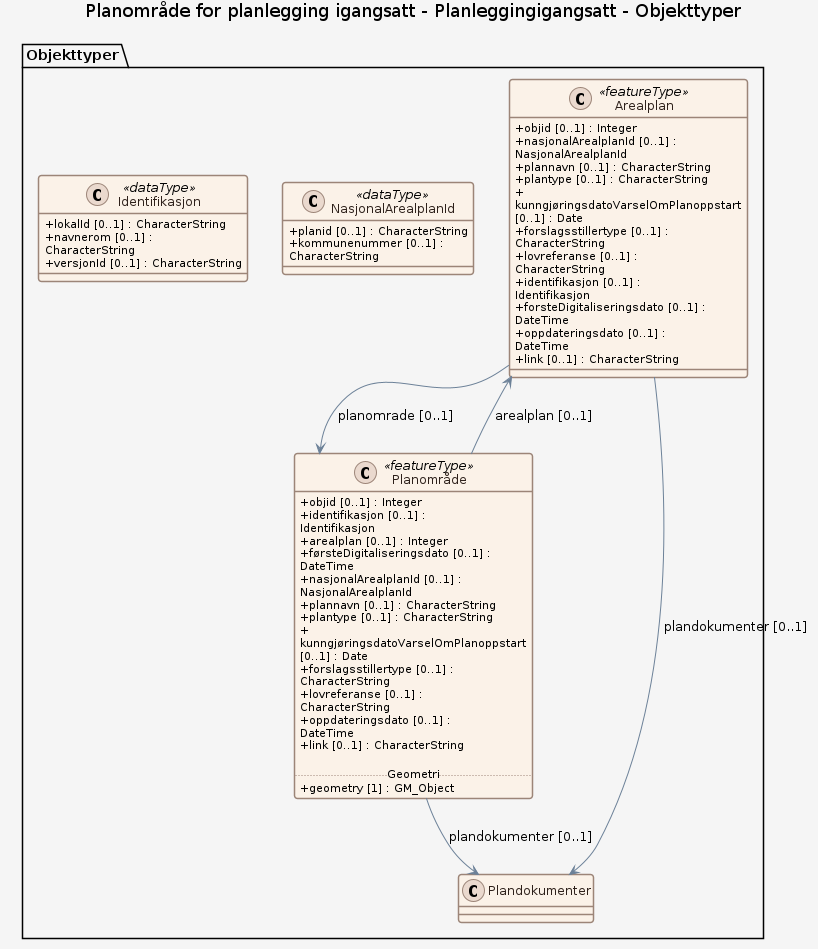

# Produktspesifikasjon: Planområde for planlegging igangsatt

*Datasettet viser område(r) hvor det er varslet at planlegging skal igangsettes etter plan- og bygningsloven (pbl). Formålet er å kunne identifisere og vise hvor planarbeid er startet, slik at naboer, berørte parter, høringsmyndigheter og kommunen får informasjon om planinitiativet.*

**Nøkkelord:** planområde, planomriss, Arealplan, Plan

**Emnekategorier:** Plan og eiendom

**Geografisk utstrekning**:

- **Vest**: 2.0
- **Øst**: 33.0
- **Sør**: 57.0
- **Nord**: 72.0

**Tidsmessig utstrekning**:

- **Tidsperiode**:
  - **Fra**: 2025-10-17
  - **Til**: 2026-06-10

## Om spesifikasjonen

> **Denne versjonen av produktspesifikasjonen:**  
> **Opprettet dato:** 2025-10-17 
> **Endret dato:** 2026-06-10 
> **Språk:** nor 
> **Kontaktinformasjon:** Direktoratet for byggkvalitet, [ftb@dibk.no](mailto:ftb@dibk.no)

## Termer og definisjoner
**Begrep** — kort forklaring

## Forkortelser

| Forkortelse | Betyr |
|-------------|-------|
| SOSI | Samordnet Opplegg for Stedfestet Informasjon |
| GML | Geography Markup Language |

## Om produktet Planområde for planlegging igangsatt

> **Romlig representasjonstype:** Vektor 
> **Unik identifikator:** 779a554b-fc3e-48a6-b202-561b07e9d4c2 
> **Kontaktinformasjon:** Direktoratet for byggkvalitet, [ftb@dibk.no](mailto:ftb@dibk.no)
>
> **Romlig oppløsning:**
>
> **Avstand**:
>
> - **Måleenhet**: meter
> - **Verdi**: 0.01
>
> **Begrensninger:**
>
> **Juridiske begrensninger**:
>
> - **Tilgangsbegrensninger**: Åpne data
> - **Bruksbegrensninger**: Lisens
> - **Lisens**: Norsk lisens for offentlige data (NLOD) 2.0
> - **Lisenslenke**: <https://data.norge.no/nlod/no/2.0>
>
> **Sikkerhetsbegrensninger**:
>
> - **Klassifisering**: Ugradert

### Formål

Formålet er å kunne identifisere og vise hvor planarbeid er startet, slik at naboer, berørte parter, høringsmyndigheter og kommunen får informasjon om planinitiativet og kan medvirke i prosessen.

### Bruksområde

Datasettet brukes som grunnlag ved oversendelse av planinitiativ til kommunen og høringsparter, i varsel om oppstart av planarbeid, som underlag i saksbehandling, uttalelser fra høringsmyndigheter og registrering i  kommunale planregister, samt for visning i kartløsninger.

## Omfang

### Hele datasettet

**Nivå**: dataset

**Nivåbeskrivelse**: Gjelder hele datasettet. Hvis omfang ikke er oppgitt under en overskrift, gjelder teksten for hele datasettet og alle leveranser

### Planleggingigangsatt

**Nivå**: dataset

**Nivåbeskrivelse**: OGC API-Features fra Direktoratet for byggkvalitet

## Datainnhold og struktur

### Datamodell - Planleggingigangsatt

➡️ [Se full datamodell for omfang "Planleggingigangsatt" (diagram per pakke og objektkatalog)](planleggingigangsatt/objektkatalog.html)

## Referansesystem

| EPSG-kode | Navn på referansesystem |
| --- | --- |
| [EPSG:25832](https://epsg.io/25832) | [EUREF89 UTM sone 32, 2d](https://register.geonorge.no/epsg-koder) |
| [EPSG:25833](https://epsg.io/25833) | [EUREF89 UTM sone 33, 2d](https://register.geonorge.no/epsg-koder) |
| [EPSG:25835](https://epsg.io/25835) | [EUREF89 UTM sone 35, 2d](https://register.geonorge.no/epsg-koder) |
| [EPSG:3035](https://epsg.io/3035) | [EUREF89 / ETRS89-LAEA Europe](https://register.geonorge.no/epsg-koder) |
| [EPSG:4326](https://epsg.io/4326) | [WGS84 Geografisk](https://register.geonorge.no/epsg-koder) |
| [EPSG:3857](https://epsg.io/3857) | [Web Mercator / Pseudo-Mercator](https://register.geonorge.no/epsg-koder) |

## Datakvalitet

**Nivå**: dataset

## Datafangst og produksjon

**Datainnsamling og prosessering**:

- **Prosesstrinn**:
  - **Beskrivelse**: datafangst skjer gjennom tjenesten varsel om planoppstart på fellestjenester plan som fylles ut av forslagsstiller eller plankonsulent

## Vedlikehold

**Vedlikeholdsfrekvens**: Kontinuerlig

**Status**: Kontinuerlig oppdatert

## Leveranse

| Tjeneste | Endepunkt | Type | Format | Leveranseenheter |
| --- | --- | --- | --- | --- |
| OGC API-Features | [Lenke](https://plandata.ft.dibk.no/services/rest/planleggingigangsatt) | OGC:API-Features | GeoJSON | landsfiler |
| WMS-tjeneste | [Lenke](https://plandata.ft.dibk.no/services/wms/planleggingigangsatt/?service=WMS&request=GetCapabilities) | OGC:WMS | PNG, BMP, GeoTIFF, JPEG, TIFF | landsfiler |

## Metadata

**Metadatastandard**: ISO19115

**Metadatastandardversjon**: 2003

**Metadatadato**: 2026-06-10

**språk**: nor

**Kontakt**:

- **Organisasjon**: Direktoratet for byggkvalitet
- **Kontaktperson**: Olaug Hana Nesheim
- **Logo**: <https://register.geonorge.no/data/organizations/974760223_DIBK_liten.jpg>
- **Epost**: ftb@dibk.no
- **rolle**: pointOfContact

**Metadataidentifikator**:

- **Utsteder**: Geonorge
- **kode**: 779a554b-fc3e-48a6-b202-561b07e9d4c2
- **koderom**: <https://kartkatalog.geonorge.no/metadata/>
- **Metadatalenke**: <https://kartkatalog.geonorge.no/metadata/779a554b-fc3e-48a6-b202-561b07e9d4c2>

