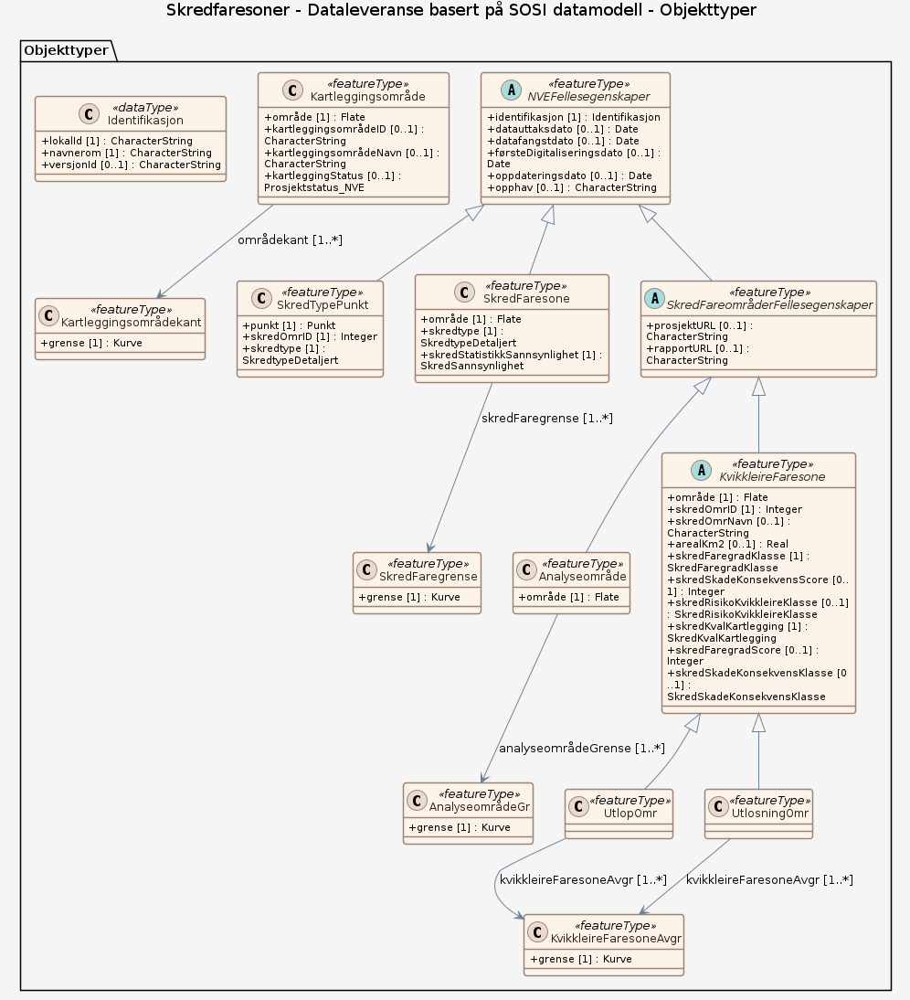

### Datamodell

**Kilde:** [SOSI UML XMI-fil](https://sosi.geonorge.no/svn/SOSI/SOSI%20Del%203/Norges%20vassdrags-%20og%20energidirektorat/Skredfareomr%c3%a5der_1.3.xml)

#### Analyseområde

dekning av et område analysert med tanke på potensiell skredfare

Egenskaper

<table class="feature-attribute-table">
  <colgroup>
    <col style="width: 35%;" />
    <col style="width: 65%;" />
  </colgroup>
  <tbody>
    <tr>
      <th scope="row">Navn:</th>
      <td><strong>område</strong></td>
    </tr>
    <tr>
      <th scope="row">Definisjon:</th>
      <td>objektets utstrekning  -- Definition -- area over which an object extends</td>
    </tr>
    <tr>
      <th scope="row">Multiplisitet:</th>
      <td>1</td>
    </tr>
    <tr>
      <th scope="row">Type:</th>
      <td>Flate</td>
    </tr>
  </tbody>
</table>

Relasjoner

**Arv**
SkredFareområderFellesegenskaper

**Assosiasjoner**
AnalyseområdeGr – rolle: analyseområdeGrense – kardinalitet: 1..*

#### KvikkleireFaresone (abstrakt)

areal med evaluering av risiko for kvikkleireskred basert på skadekonsekvens og faregrad  Merknad: Kvikkleiresonene inndeles deretter i 5 "risikoklasser" basert på skadekonsekvensen og faregraden   -- Definition -- area which has been reviewed for quick clay slide hazard based on damage consequences and degree of hazard

Egenskaper

<table class="feature-attribute-table">
  <colgroup>
    <col style="width: 35%;" />
    <col style="width: 65%;" />
  </colgroup>
  <tbody>
    <tr>
      <th scope="row">Navn:</th>
      <td><strong>område</strong></td>
    </tr>
    <tr>
      <th scope="row">Definisjon:</th>
      <td>objektets utstrekning  -- Definition -- area over which an object extends</td>
    </tr>
    <tr>
      <th scope="row">Multiplisitet:</th>
      <td>1</td>
    </tr>
    <tr>
      <th scope="row">Type:</th>
      <td>Flate</td>
    </tr>
  </tbody>
</table>

<table class="feature-attribute-table">
  <colgroup>
    <col style="width: 35%;" />
    <col style="width: 65%;" />
  </colgroup>
  <tbody>
    <tr>
      <th scope="row">Navn:</th>
      <td><strong>skredOmrID</strong></td>
    </tr>
    <tr>
      <th scope="row">Definisjon:</th>
      <td>unikt id-nummer for skredområde/kvikkleirefaresone  -- Definition -- unique ID number for landslide area or quick clay hazard zone</td>
    </tr>
    <tr>
      <th scope="row">Multiplisitet:</th>
      <td>1</td>
    </tr>
    <tr>
      <th scope="row">Type:</th>
      <td>Integer</td>
    </tr>
  </tbody>
</table>

<table class="feature-attribute-table">
  <colgroup>
    <col style="width: 35%;" />
    <col style="width: 65%;" />
  </colgroup>
  <tbody>
    <tr>
      <th scope="row">Navn:</th>
      <td><strong>skredOmrNavn</strong></td>
    </tr>
    <tr>
      <th scope="row">Definisjon:</th>
      <td>stedsnavn som brukes i forbindelse med en skredhendelse  -- Definition -- place name which is used in connection with a landslide event</td>
    </tr>
    <tr>
      <th scope="row">Multiplisitet:</th>
      <td>0..1</td>
    </tr>
    <tr>
      <th scope="row">Type:</th>
      <td>CharacterString</td>
    </tr>
  </tbody>
</table>

<table class="feature-attribute-table">
  <colgroup>
    <col style="width: 35%;" />
    <col style="width: 65%;" />
  </colgroup>
  <tbody>
    <tr>
      <th scope="row">Navn:</th>
      <td><strong>arealKm2</strong></td>
    </tr>
    <tr>
      <th scope="row">Definisjon:</th>
      <td>faresonens areal i kvadratkilometer (km2)</td>
    </tr>
    <tr>
      <th scope="row">Multiplisitet:</th>
      <td>0..1</td>
    </tr>
    <tr>
      <th scope="row">Type:</th>
      <td>Real</td>
    </tr>
  </tbody>
</table>

<table class="feature-attribute-table">
  <colgroup>
    <col style="width: 35%;" />
    <col style="width: 65%;" />
  </colgroup>
  <tbody>
    <tr>
      <th scope="row">Navn:</th>
      <td><strong>skredFaregradKlasse</strong></td>
    </tr>
    <tr>
      <th scope="row">Definisjon:</th>
      <td>graden av sannsynlighet for at det skal gå et skred  Merknad: Gjenspeiler graden av usikkerhet med hensyn til områdets stabilitet basert på topografiske forhold, geologiske/geotekniske forhold og erosjonsforhold. Skredfaregradklassen er for skredtypen kvikkleire basert på en evaluering av faregrad som fremkommer av at ulike vektede faktorer gir en faregradscore (0-51)  -- Definition -- the degree of probability that there will be a landslide Note: Reflects the degree of hazard as regards the area's stability,, based upon topographic conditions, geological/geotechnical conditions and erosion conditions. For quick clay landslides the landslideHazardLevelClass is based upon a weighed hazardfactorscore (0-51)</td>
    </tr>
    <tr>
      <th scope="row">Multiplisitet:</th>
      <td>1</td>
    </tr>
    <tr>
      <th scope="row">Type:</th>
      <td>SkredFaregradKlasse</td>
    </tr>
    <tr>
      <th scope="row">Tillatte verdier:</th>
      <td>- Ingen – Påvist ikkje kvikkleire/sprøbruddmateriale, eller topografiske forhold som tilsier at kvikkleireskred ikke kan forekomme - Lav – Gunstige topografiske forhold.  Grunnundersøkelser viser at grunnforholdene er akseptable.  Det er lite eller ingen aktiv erosjon i vassdraget.  Det har vært liten skredaktivitet i området.  Ingen terrenginngrep, terrenginngrep har hatt gunstig innvirkning på stabiliteten (faregradscore 0-17) - Middels – Mindre gunstig topografiske forhold.  Mangelfulle grunnundersøkelser, eller grunnundersøkelsene viser mindre gunstige grunnforhold.  Det er aktiv erosjon i vassdraget.  Det har vært betydelig skredaktivitet i området.  Eventuelle terrenginngrep har liten eller ingen stabilitetsforverrende virkning (faregradscore 18-25) - Høy – Ugunstige topografiske forhold.  Mangelfulle grunnundersøkelser eller grunnundersøkelsene viser ugunstige grunnforhold.  Det er betydelig aktiv erosjon i vassdraget.  Det har vært stor skredaktivitet i området.  Terrenginngrep med stabilitetsforverrende virkning (faregradscore 26-51)</td>
    </tr>
  </tbody>
</table>

<table class="feature-attribute-table">
  <colgroup>
    <col style="width: 35%;" />
    <col style="width: 65%;" />
  </colgroup>
  <tbody>
    <tr>
      <th scope="row">Navn:</th>
      <td><strong>skredSkadeKonsekvensScore</strong></td>
    </tr>
    <tr>
      <th scope="row">Definisjon:</th>
      <td>poengverdi basert på vektede faktorer for skadekonsekvensen  Merknad: Se nærmere definisjon i kap. definisjoner og forkortelser.  -- Definition -- value (in points) based on weighted factors for the consequences of damage   Note: See more precise definition in chapter on definitions and abbreviations.</td>
    </tr>
    <tr>
      <th scope="row">Multiplisitet:</th>
      <td>0..1</td>
    </tr>
    <tr>
      <th scope="row">Type:</th>
      <td>Integer</td>
    </tr>
  </tbody>
</table>

<table class="feature-attribute-table">
  <colgroup>
    <col style="width: 35%;" />
    <col style="width: 65%;" />
  </colgroup>
  <tbody>
    <tr>
      <th scope="row">Navn:</th>
      <td><strong>skredRisikoKvikkleireKlasse</strong></td>
    </tr>
    <tr>
      <th scope="row">Definisjon:</th>
      <td>risikoen for at et område kan bli påført skredskade, inndelt etter risikoklasser  Merknad: Denne egenskapen gjengir en klassifisering av risiko for at området vil bli utsatt for skredskade. Klassifiseringsmetoden er basert på en evaluering av skadekonsekvens og faregrad. Evalueringen foretas ved at det beregnes poeng for hver sone i henhold til utarbeidde klassifiseringskriterier (se kapittel definisjoner og forkortelser)  -- Definition -- the risk that a landslide may inflict damage on an area, categorized according to risk classes   Note: This attribute cites a classification of risk that the area will be vulnerable to landslide damage. The classification method is based on a review of damage consequences and hazard levels</td>
    </tr>
    <tr>
      <th scope="row">Multiplisitet:</th>
      <td>0..1</td>
    </tr>
    <tr>
      <th scope="row">Type:</th>
      <td>SkredRisikoKvikkleireKlasse</td>
    </tr>
    <tr>
      <th scope="row">Tillatte verdier:</th>
      <td>- Risikoklasse 0 – Områder hvor det ikke er fare for kvikkleireskred. - Risikoklasse 1 – Områder hvor det normalt ikke vil være aktuelt å foreta noen form for videre evaluering eller tiltak. Ved et eventuelt anleggsmessig inngrep vil det kreves dokumentasjon på at sikkerheten er tilfredsstillende.

-- Definition --
Areas where any further evaluation or action will normally not be relevant. For any intervention in the form of construction, documentation that safety is satisfactory will be required. - Risikoklasse 2 – Som ved risikoklasse 1 vil det heller ikke her  normalt  være aktuelt å foreta noen form for videre evaluering eller tiltak. Ved et eventuelt anleggsmessig inngrep vil det kreves dokumentasjon på at sikkerheten er tilfredsstillende.

-- Definition --
As with Risk Class 1, neither will further evaluation or action normally be relevant here. For any intervention in the form of construction, documentation that safety is satisfactory will be required. - Risikoklasse 3 – Omfatter soner med til dels tett bebyggelse.

-- Definition --
Includes zones that may in part be heavily built-up. - Risikoklasse 4 – Omfatter for det meste soner med tett bebyggelse. Må gis høy prioritet i det videre arbeidet med sikring mot skred.

-- Definition --
Mainly comprising zones that are heavily built-up. Must be given high priority in the further work on preventive measures against landslide. - Risikoklasse 5 – Omfatter soner med høyeste skadekonsekvens og høyeste faregrad. Må gis høy prioritet i det videre arbeidet med sikring mot skred.

-- Definition --
Comprising zones with the greatest injury consequences and highest hazard level. Must be given high priority in the ongoing work of landslide prevention.</td>
    </tr>
  </tbody>
</table>

<table class="feature-attribute-table">
  <colgroup>
    <col style="width: 35%;" />
    <col style="width: 65%;" />
  </colgroup>
  <tbody>
    <tr>
      <th scope="row">Navn:</th>
      <td><strong>skredKvalKartlegging</strong></td>
    </tr>
    <tr>
      <th scope="row">Definisjon:</th>
      <td>angir status og detaljeringsgrad  når det gjelder kartlegging av sonen  -- Definition -- indicates the status and degree of detail as regards the mapping of the zone</td>
    </tr>
    <tr>
      <th scope="row">Multiplisitet:</th>
      <td>1</td>
    </tr>
    <tr>
      <th scope="row">Type:</th>
      <td>SkredKvalKartlegging</td>
    </tr>
    <tr>
      <th scope="row">Tillatte verdier:</th>
      <td>- Ingen undersøkelse – Det er kun topografiske vurderinger som ligger til grunn for
kvikkleirefaresonen, ingen befaring eller grunnundersøkelse. Denne kodeverdien må brukes dersom man skal utveksle soner som ikke er klassifisert - Enkel undersøkelse – Enkel undersøkelse av sonen, oversiktskartlegging

-- Definition --
Simple investigation of the zone, overview mapping. - Supplerende undersøkelser / stabilitet – Utført supplerende undersøkelser og vurdering av stabilitet

-- Definition --
Supplementary investigation and assessment of stability carried out - Sikringstiltak utført – Sikringstiltak er utført</td>
    </tr>
  </tbody>
</table>

<table class="feature-attribute-table">
  <colgroup>
    <col style="width: 35%;" />
    <col style="width: 65%;" />
  </colgroup>
  <tbody>
    <tr>
      <th scope="row">Navn:</th>
      <td><strong>skredFaregradScore</strong></td>
    </tr>
    <tr>
      <th scope="row">Definisjon:</th>
      <td>tallverdi som er fremkommet ved at de viktigste kriteriene og faktorene som påvirker faregraden for kvikkleireskred er vurdert (jfr. Tabell 2 under kap.definisjoner og forkortelser.)  -- Definition -- numerical value which results from the evaluation of the influence of the most important criteria and factors on the degree of hazard of a quick clay slide (cf. Table 2 in the chapter on definitions and abbreviations.)</td>
    </tr>
    <tr>
      <th scope="row">Multiplisitet:</th>
      <td>0..1</td>
    </tr>
    <tr>
      <th scope="row">Type:</th>
      <td>Integer</td>
    </tr>
  </tbody>
</table>

<table class="feature-attribute-table">
  <colgroup>
    <col style="width: 35%;" />
    <col style="width: 65%;" />
  </colgroup>
  <tbody>
    <tr>
      <th scope="row">Navn:</th>
      <td><strong>skredSkadeKonsekvensKlasse</strong></td>
    </tr>
    <tr>
      <th scope="row">Definisjon:</th>
      <td>hvilke økonomiske og samfunnsmessige følger et kvikkleireskred får og fare for tap av menneskeliv  Merknad: Kvalitativ klassifisering av skadekonsekvens i forbindelse med fare for liv, skade på mennesker, økonomiske tap, verdiforringelse samt fare for at viktige samfunnsmessige funksjoner skal stoppe opp.  For skredtypen kvikkleire er inndelingen basert på beregningen av en poengverdi basert på vektede faktorer (se kap. definisjoner og forkortelser.) i kombinasjon med skadekonsekvensen  -- Definition -- what economic and social consequences follow a quick clay slide, and risk of loss of human lives   Note: Qualitative classification of consequences of damage in connection with risk of fatalities, personal injuries, financial loss, value reduction as well as the risk that important social functions can be affected</td>
    </tr>
    <tr>
      <th scope="row">Multiplisitet:</th>
      <td>0..1</td>
    </tr>
    <tr>
      <th scope="row">Type:</th>
      <td>SkredSkadeKonsekvensKlasse</td>
    </tr>
    <tr>
      <th scope="row">Tillatte verdier:</th>
      <td>- Ikke alvorlig - Mindre alvorlig – Liten risiko for skade på mennesker, tap av liv, begrensede økonomiske og samfunnsmessige konsekvenser (0-6 poeng).

-- Definition --
Low risk of personal injuries, loss of life; limited economic and social consequences (0-6 points). - Alvorlig – Risiko for skade på mennesker/tap av liv eller betydelige økonomiske og samfunnsmessige konsekvenser (7-22 poeng).

-- Definition --
Risk of personal injuries/loss of life or substantial economic and social consequences (7-22 points). - Meget alvorlig – Stor risiko for skade på mennesker/tap av liv eller meget store økonomiske og samfunnsmessige konsekvenser (23-45 poeng).

-- Definition --
High risk of personal injuries/loss of life or very great economic and social consequences (23-45 points).</td>
    </tr>
  </tbody>
</table>

Relasjoner

**Arv**
SkredFareområderFellesegenskaper

#### SkredTypePunkt

Punkt som definerer den dimensjonerende skredtypen for en eller flere faresoner.

Egenskaper

<table class="feature-attribute-table">
  <colgroup>
    <col style="width: 35%;" />
    <col style="width: 65%;" />
  </colgroup>
  <tbody>
    <tr>
      <th scope="row">Navn:</th>
      <td><strong>punkt</strong></td>
    </tr>
    <tr>
      <th scope="row">Definisjon:</th>
      <td>sted som objektet eksisterer på</td>
    </tr>
    <tr>
      <th scope="row">Multiplisitet:</th>
      <td>1</td>
    </tr>
    <tr>
      <th scope="row">Type:</th>
      <td>Punkt</td>
    </tr>
  </tbody>
</table>

<table class="feature-attribute-table">
  <colgroup>
    <col style="width: 35%;" />
    <col style="width: 65%;" />
  </colgroup>
  <tbody>
    <tr>
      <th scope="row">Navn:</th>
      <td><strong>skredOmrID</strong></td>
    </tr>
    <tr>
      <th scope="row">Definisjon:</th>
      <td>unikt id-nummer for skredområde/kvikkleirefaresone  -- Definition -- unique ID number for landslide area or quick clay hazard zone</td>
    </tr>
    <tr>
      <th scope="row">Multiplisitet:</th>
      <td>1</td>
    </tr>
    <tr>
      <th scope="row">Type:</th>
      <td>Integer</td>
    </tr>
  </tbody>
</table>

<table class="feature-attribute-table">
  <colgroup>
    <col style="width: 35%;" />
    <col style="width: 65%;" />
  </colgroup>
  <tbody>
    <tr>
      <th scope="row">Navn:</th>
      <td><strong>skredtype</strong></td>
    </tr>
    <tr>
      <th scope="row">Definisjon:</th>
      <td>hvilke skredmasser som er forbundet med skredfaren eller skredhendelsen  Merknad: Ulike typer skredmasser som bl.a. stein, snø, fjell, jord og kombinasjoner av disse  -- Definition -- what type of avalanche/landslide masses related to the avalanche/landslide hazard or event Note: Various types of avalanche/landslide masses, such as rock, snow, soil and combinations these</td>
    </tr>
    <tr>
      <th scope="row">Multiplisitet:</th>
      <td>1</td>
    </tr>
    <tr>
      <th scope="row">Type:</th>
      <td>SkredtypeDetaljert</td>
    </tr>
    <tr>
      <th scope="row">Tillatte verdier:</th>
      <td>- Steinskred, uspesifisert – Steinskred, ikke nærmere bestemt type - Steinsprang (&lt; 100 m3) – Steinsprang (steinblokker &lt; 100 m3) - Lite fjellskred (100 - 10 000 m3) – Lite fjellskred (steinblokker 100 - 10 000 m3) - Fjellskred (&gt; 10 000 m3) – Fjellskred (steinblokker &gt; 10 000 m3) - Undervannsskred, uspesifisert – Undervannsskred, ikke nærmere bestemt type - Snøskred, uspesifisert – Snøskred, ikke nærmere bestemt type - Vått snøskred - Tørt snøskred - Sørpeskred - Løssnøskred, uspesifisert – Løssnøskred, ikke nærmere bestemt type - Vått løssnøskred - Tørt løssnøskred - Flakskred, uspesifisert – Flakskred, ikke nærmere bestemt type - Vått flakskred - Tørt flakskred - Løsmasseskred, uspesifisert – Løsmasseskred, ikke nærmere bestemt type - Kvikkleireskred - Flomskred - Leirskred - Jordskred - Jordskred, uspesifisert – Jordskred, ikke nærmere bestemt type

Merknad: Fra og med 2015 benyttes ikke denne verdien for nye data. - Isnedfall, uspesifisert – Isnedfall, ikke nærmere bestemt type - Skavlfall - Utglidning av veg - Ikke angitt – Skredtype ikke angitt - Ny, ikke-godkjent skredtype – Ny, ikke-godkjent skredtype

Merknad: Fra og med 2015 benyttes ikke denne verdien for nye data.</td>
    </tr>
  </tbody>
</table>

Relasjoner

**Arv**
NVEFellesegenskaper

#### UtlopOmr

areal som påvirkes eller dekkes av skredmassser når skred utløses   -- Definition -- area which is affected or covered by avalanche/landslide masses when an avalanche/landslide occurs

Egenskaper

(ingen)

Relasjoner

**Arv**
KvikkleireFaresone

**Assosiasjoner**
KvikkleireFaresoneAvgr – rolle: kvikkleireFaresoneAvgr – kardinalitet: 1..*

#### NVEFellesegenskaper (abstrakt)

abstrakt objekt som bærer en rekke egenskaper som er fagområde-uavhengige og kan benyttes for alle objekttyper  Merknad: Spesielt i produktspesifikasjonsarbeid vil en velge egenskaper og av grensningslinjer fra denne klassen.

Egenskaper

<table class="feature-attribute-table">
  <colgroup>
    <col style="width: 35%;" />
    <col style="width: 65%;" />
  </colgroup>
  <tbody>
    <tr>
      <th scope="row">Navn:</th>
      <td><strong>identifikasjon</strong></td>
    </tr>
    <tr>
      <th scope="row">Definisjon:</th>
      <td>abstrakt objekt som bærer en rekke egenskaper som er fagområde-uavhengige og kan benyttes for alle objekttyper  Merknad: Spesielt i produktspesifikasjonsarbeid vil en velge egenskaper og av grensningslinjer fra denne klassen.</td>
    </tr>
    <tr>
      <th scope="row">Multiplisitet:</th>
      <td>1</td>
    </tr>
    <tr>
      <th scope="row">Type:</th>
      <td>Identifikasjon</td>
    </tr>
  </tbody>
</table>

<table class="feature-attribute-table">
  <colgroup>
    <col style="width: 35%;" />
    <col style="width: 65%;" />
  </colgroup>
  <tbody>
    <tr>
      <th scope="row">Navn:</th>
      <td><strong>identifikasjon.lokalId</strong></td>
    </tr>
    <tr>
      <th scope="row">Definisjon:</th>
      <td>lokal identifikator, tildelt av dataleverendør/dataforvalter. Den lokale identifikatoren er unik innenfor navnerommet, ingen andre objekter har samme identifikator.  NOTE: Det er data leverendørens ansvar å sørge for at denne lokale identifikatoren er unik innenfor navnerommet.</td>
    </tr>
    <tr>
      <th scope="row">Multiplisitet:</th>
      <td>1</td>
    </tr>
    <tr>
      <th scope="row">Type:</th>
      <td>CharacterString</td>
    </tr>
  </tbody>
</table>

<table class="feature-attribute-table">
  <colgroup>
    <col style="width: 35%;" />
    <col style="width: 65%;" />
  </colgroup>
  <tbody>
    <tr>
      <th scope="row">Navn:</th>
      <td><strong>identifikasjon.navnerom</strong></td>
    </tr>
    <tr>
      <th scope="row">Definisjon:</th>
      <td>navnerom som unikt identifiserer datakilden til objektet, starter med to bokstavs kode jfr ISO 3166. Benytter understreking  ("_") dersom data produsenten ikke er assosiert med bare et land.  NOTE 1 : Verdien for nanverom vil eies av den dataprodusent som har ansvar for de unike identifikatorene og vil registreres i "INSPIRE external  Object Identifier Namespaces Register"  Eksempel: NO for Norge.</td>
    </tr>
    <tr>
      <th scope="row">Multiplisitet:</th>
      <td>1</td>
    </tr>
    <tr>
      <th scope="row">Type:</th>
      <td>CharacterString</td>
    </tr>
  </tbody>
</table>

<table class="feature-attribute-table">
  <colgroup>
    <col style="width: 35%;" />
    <col style="width: 65%;" />
  </colgroup>
  <tbody>
    <tr>
      <th scope="row">Navn:</th>
      <td><strong>identifikasjon.versjonId</strong></td>
    </tr>
    <tr>
      <th scope="row">Definisjon:</th>
      <td>identifikasjon av en spesiell versjon av et geografisk objekt (instans), maksimum lengde på 25 karakterers. Dersom spesifikasjonen av et geografisk objekt med en identifikasjon inkludererer livsløpssyklusinformasjon, benyttes denne versjonId for å skille mellom ulike versjoner av samme objekt. versjonId er en unik  identifikasjon av versjonen.  NOTE Maksimum lengde er valgt for å tillate tidsregistrering i henhold til  ISO 8601, slik som  "2007-02-12T12:12:12+05:30" som versjonId.</td>
    </tr>
    <tr>
      <th scope="row">Multiplisitet:</th>
      <td>0..1</td>
    </tr>
    <tr>
      <th scope="row">Type:</th>
      <td>CharacterString</td>
    </tr>
  </tbody>
</table>

<table class="feature-attribute-table">
  <colgroup>
    <col style="width: 35%;" />
    <col style="width: 65%;" />
  </colgroup>
  <tbody>
    <tr>
      <th scope="row">Navn:</th>
      <td><strong>datauttaksdato</strong></td>
    </tr>
    <tr>
      <th scope="row">Definisjon:</th>
      <td>dato for uttak fra en database  Merknad: Skiller seg fra Kopidato ved at en ikke skiller på om det er uttak fra en originaldatabase eller en kopidatabase.</td>
    </tr>
    <tr>
      <th scope="row">Multiplisitet:</th>
      <td>0..1</td>
    </tr>
    <tr>
      <th scope="row">Type:</th>
      <td>DateTime</td>
    </tr>
  </tbody>
</table>

<table class="feature-attribute-table">
  <colgroup>
    <col style="width: 35%;" />
    <col style="width: 65%;" />
  </colgroup>
  <tbody>
    <tr>
      <th scope="row">Navn:</th>
      <td><strong>datafangstdato</strong></td>
    </tr>
    <tr>
      <th scope="row">Definisjon:</th>
      <td>dato når objektet siste gang ble registrert/observert/målt i terrenget  Merknad: I mange tilfeller er denne forskjellig fra Oppdateringsdato, da registrerte endringer kan bufres i en kortere eller lengre periode før disse legges inn i databasen. Ved førstegangsregistrering settes Datafangstdato lik førsteDatafangstdato.</td>
    </tr>
    <tr>
      <th scope="row">Multiplisitet:</th>
      <td>0..1</td>
    </tr>
    <tr>
      <th scope="row">Type:</th>
      <td>DateTime</td>
    </tr>
  </tbody>
</table>

<table class="feature-attribute-table">
  <colgroup>
    <col style="width: 35%;" />
    <col style="width: 65%;" />
  </colgroup>
  <tbody>
    <tr>
      <th scope="row">Navn:</th>
      <td><strong>førsteDigitaliseringsdato</strong></td>
    </tr>
    <tr>
      <th scope="row">Definisjon:</th>
      <td>dato når en representasjon av objektet i digital form første gang ble etablert  Merknad: førsteDigitaliseringsdato kan skille seg fra førsteDatafangstdato ved at den første datafangsten skjedde analogt og gjort om til digital form senere i en produksjonsprosess. Eventuelt at innlegging i databasen skjedde på et senere tidspunkt enn registreringen /observasjonen / målingen av objektet.</td>
    </tr>
    <tr>
      <th scope="row">Multiplisitet:</th>
      <td>0..1</td>
    </tr>
    <tr>
      <th scope="row">Type:</th>
      <td>DateTime</td>
    </tr>
  </tbody>
</table>

<table class="feature-attribute-table">
  <colgroup>
    <col style="width: 35%;" />
    <col style="width: 65%;" />
  </colgroup>
  <tbody>
    <tr>
      <th scope="row">Navn:</th>
      <td><strong>oppdateringsdato</strong></td>
    </tr>
    <tr>
      <th scope="row">Definisjon:</th>
      <td>dato for siste endring på objektetdataene  Merknad: Oppdateringsdato kan være forskjellig fra Datafangsdato ved at data som er registrert kan bufres en kortere eller lengre periode før disse legges inn i datasystemet (databasen).  -Definition- Date and time at which this version of the spatial object was inserted or changed in the spatial data set.</td>
    </tr>
    <tr>
      <th scope="row">Multiplisitet:</th>
      <td>0..1</td>
    </tr>
    <tr>
      <th scope="row">Type:</th>
      <td>DateTime</td>
    </tr>
  </tbody>
</table>

<table class="feature-attribute-table">
  <colgroup>
    <col style="width: 35%;" />
    <col style="width: 65%;" />
  </colgroup>
  <tbody>
    <tr>
      <th scope="row">Navn:</th>
      <td><strong>opphav</strong></td>
    </tr>
    <tr>
      <th scope="row">Definisjon:</th>
      <td>referanse til opphavsmaterialet, kildematerialet, organisasjons/publiseringskilde  Merknad: Kan også beskrive navn på person og årsak til oppdatering</td>
    </tr>
    <tr>
      <th scope="row">Multiplisitet:</th>
      <td>0..1</td>
    </tr>
    <tr>
      <th scope="row">Type:</th>
      <td>CharacterString</td>
    </tr>
  </tbody>
</table>

#### KvikkleireFaresoneAvgr

avgrensningslinje for areal med evaluering av risiko for kvikkleireskred basert på skadekonsekvens og faregrad   -- Definition -- line delimiting area for which quick clay slide hazard has been evaluated based on damage consequences and degree of hazard

Egenskaper

<table class="feature-attribute-table">
  <colgroup>
    <col style="width: 35%;" />
    <col style="width: 65%;" />
  </colgroup>
  <tbody>
    <tr>
      <th scope="row">Navn:</th>
      <td><strong>grense</strong></td>
    </tr>
    <tr>
      <th scope="row">Definisjon:</th>
      <td>forløp som følger overgang mellom ulike fenomener  -- Definition -- course following the transition between different real world phenomena</td>
    </tr>
    <tr>
      <th scope="row">Multiplisitet:</th>
      <td>1</td>
    </tr>
    <tr>
      <th scope="row">Type:</th>
      <td>Kurve</td>
    </tr>
  </tbody>
</table>

#### Kartleggingsområdekant

avgrensningslinje for et kartleggingsområde som dekker et nærmere angitt geografisk område.

Egenskaper

<table class="feature-attribute-table">
  <colgroup>
    <col style="width: 35%;" />
    <col style="width: 65%;" />
  </colgroup>
  <tbody>
    <tr>
      <th scope="row">Navn:</th>
      <td><strong>grense</strong></td>
    </tr>
    <tr>
      <th scope="row">Definisjon:</th>
      <td>forløp som følger overgang mellom ulike fenomener</td>
    </tr>
    <tr>
      <th scope="row">Multiplisitet:</th>
      <td>1</td>
    </tr>
    <tr>
      <th scope="row">Type:</th>
      <td>Kurve</td>
    </tr>
  </tbody>
</table>

#### AnalyseområdeGr

avgrensningslinje for område analysert med tanke på potensiell skredfare

Egenskaper

<table class="feature-attribute-table">
  <colgroup>
    <col style="width: 35%;" />
    <col style="width: 65%;" />
  </colgroup>
  <tbody>
    <tr>
      <th scope="row">Navn:</th>
      <td><strong>grense</strong></td>
    </tr>
    <tr>
      <th scope="row">Definisjon:</th>
      <td>forløp som følger overgang mellom ulike fenomener  -- Definition -- course following the transition between different real world phenomena</td>
    </tr>
    <tr>
      <th scope="row">Multiplisitet:</th>
      <td>1</td>
    </tr>
    <tr>
      <th scope="row">Type:</th>
      <td>Kurve</td>
    </tr>
  </tbody>
</table>

#### Kartleggingsområde

dekning av et område kartlagt med tanke på potensiell skredfare

Egenskaper

<table class="feature-attribute-table">
  <colgroup>
    <col style="width: 35%;" />
    <col style="width: 65%;" />
  </colgroup>
  <tbody>
    <tr>
      <th scope="row">Navn:</th>
      <td><strong>område</strong></td>
    </tr>
    <tr>
      <th scope="row">Definisjon:</th>
      <td>objektets utstrekning</td>
    </tr>
    <tr>
      <th scope="row">Multiplisitet:</th>
      <td>1</td>
    </tr>
    <tr>
      <th scope="row">Type:</th>
      <td>Flate</td>
    </tr>
  </tbody>
</table>

<table class="feature-attribute-table">
  <colgroup>
    <col style="width: 35%;" />
    <col style="width: 65%;" />
  </colgroup>
  <tbody>
    <tr>
      <th scope="row">Navn:</th>
      <td><strong>kartleggingsområdeID</strong></td>
    </tr>
    <tr>
      <th scope="row">Definisjon:</th>
      <td>kartleggingsområdets identifikator</td>
    </tr>
    <tr>
      <th scope="row">Multiplisitet:</th>
      <td>0..1</td>
    </tr>
    <tr>
      <th scope="row">Type:</th>
      <td>CharacterString</td>
    </tr>
  </tbody>
</table>

<table class="feature-attribute-table">
  <colgroup>
    <col style="width: 35%;" />
    <col style="width: 65%;" />
  </colgroup>
  <tbody>
    <tr>
      <th scope="row">Navn:</th>
      <td><strong>kartleggingsområdeNavn</strong></td>
    </tr>
    <tr>
      <th scope="row">Definisjon:</th>
      <td>navn på kartleggingsområde</td>
    </tr>
    <tr>
      <th scope="row">Multiplisitet:</th>
      <td>0..1</td>
    </tr>
    <tr>
      <th scope="row">Type:</th>
      <td>CharacterString</td>
    </tr>
  </tbody>
</table>

<table class="feature-attribute-table">
  <colgroup>
    <col style="width: 35%;" />
    <col style="width: 65%;" />
  </colgroup>
  <tbody>
    <tr>
      <th scope="row">Navn:</th>
      <td><strong>kartleggingStatus</strong></td>
    </tr>
    <tr>
      <th scope="row">Definisjon:</th>
      <td>Status for kartleggingen av aktuelt område</td>
    </tr>
    <tr>
      <th scope="row">Multiplisitet:</th>
      <td>0..1</td>
    </tr>
    <tr>
      <th scope="row">Type:</th>
      <td>Prosjektstatus_NVE</td>
    </tr>
    <tr>
      <th scope="row">Tillatte verdier:</th>
      <td>- utført – Nei - til ny vurdering – Ja - erstattet av ny – Nei - fjernet – Nei - ajourført – Nei - under planlegging – Nei - pågående – Nei - Ja - Nei</td>
    </tr>
  </tbody>
</table>

Relasjoner

**Assosiasjoner**
Kartleggingsområdekant – rolle: områdekant – kardinalitet: 1..*

#### UtlosningOmr

område hvor skred kan utløses  Merknad: Alle typer skred

Egenskaper

(ingen)

Relasjoner

**Arv**
KvikkleireFaresone

**Assosiasjoner**
KvikkleireFaresoneAvgr – rolle: kvikkleireFaresoneAvgr – kardinalitet: 1..*

#### SkredFaregrense

grenselinje som viser rekkevidden for mulige skred  Merknad: Resten av faresonepolygonet er ofte avgrenset av dataavgrensningslinje   -- Definition -- boundary line which shows the extent of potential avalanches/landslides

Egenskaper

<table class="feature-attribute-table">
  <colgroup>
    <col style="width: 35%;" />
    <col style="width: 65%;" />
  </colgroup>
  <tbody>
    <tr>
      <th scope="row">Navn:</th>
      <td><strong>grense</strong></td>
    </tr>
    <tr>
      <th scope="row">Definisjon:</th>
      <td>forløp som følger overgang mellom ulike fenomener  -- Definition -- course following the transition between different real world phenomena</td>
    </tr>
    <tr>
      <th scope="row">Multiplisitet:</th>
      <td>1</td>
    </tr>
    <tr>
      <th scope="row">Type:</th>
      <td>Kurve</td>
    </tr>
  </tbody>
</table>

#### SkredFaresone

område hvor skredfaren er nærmere vurdert/kartlagt med hensyn til sannsynlighet og rekkevidde  Merknad: Skredfaresonen kan bestå av utløsningsområde og utløpsområde for skred   -- Definition -- area where the avalanche/landslide hazard has been evaluated/surveyed in more detail with regard to probability and extent

Egenskaper

<table class="feature-attribute-table">
  <colgroup>
    <col style="width: 35%;" />
    <col style="width: 65%;" />
  </colgroup>
  <tbody>
    <tr>
      <th scope="row">Navn:</th>
      <td><strong>område</strong></td>
    </tr>
    <tr>
      <th scope="row">Definisjon:</th>
      <td>objektets utstrekning  -- Definition -- area over which an object extends</td>
    </tr>
    <tr>
      <th scope="row">Multiplisitet:</th>
      <td>1</td>
    </tr>
    <tr>
      <th scope="row">Type:</th>
      <td>Flate</td>
    </tr>
  </tbody>
</table>

<table class="feature-attribute-table">
  <colgroup>
    <col style="width: 35%;" />
    <col style="width: 65%;" />
  </colgroup>
  <tbody>
    <tr>
      <th scope="row">Navn:</th>
      <td><strong>skredtype</strong></td>
    </tr>
    <tr>
      <th scope="row">Definisjon:</th>
      <td>hvilke skredmasser som er forbundet med skredfaren eller skredhendelsen  Merknad: Ulike typer skredmasser som bl.a. stein, snø, fjell, jord og kombinasjoner av disse  -- Definition -- what type of avalanche/landslide masses related to the avalanche/landslide hazard or event Note: Various types of avalanche/landslide masses, such as rock, snow, soil and combinations these</td>
    </tr>
    <tr>
      <th scope="row">Multiplisitet:</th>
      <td>1</td>
    </tr>
    <tr>
      <th scope="row">Type:</th>
      <td>SkredtypeDetaljert</td>
    </tr>
    <tr>
      <th scope="row">Tillatte verdier:</th>
      <td>- Steinskred, uspesifisert – Steinskred, ikke nærmere bestemt type - Steinsprang (&lt; 100 m3) – Steinsprang (steinblokker &lt; 100 m3) - Lite fjellskred (100 - 10 000 m3) – Lite fjellskred (steinblokker 100 - 10 000 m3) - Fjellskred (&gt; 10 000 m3) – Fjellskred (steinblokker &gt; 10 000 m3) - Undervannsskred, uspesifisert – Undervannsskred, ikke nærmere bestemt type - Snøskred, uspesifisert – Snøskred, ikke nærmere bestemt type - Vått snøskred - Tørt snøskred - Sørpeskred - Løssnøskred, uspesifisert – Løssnøskred, ikke nærmere bestemt type - Vått løssnøskred - Tørt løssnøskred - Flakskred, uspesifisert – Flakskred, ikke nærmere bestemt type - Vått flakskred - Tørt flakskred - Løsmasseskred, uspesifisert – Løsmasseskred, ikke nærmere bestemt type - Kvikkleireskred - Flomskred - Leirskred - Jordskred - Jordskred, uspesifisert – Jordskred, ikke nærmere bestemt type

Merknad: Fra og med 2015 benyttes ikke denne verdien for nye data. - Isnedfall, uspesifisert – Isnedfall, ikke nærmere bestemt type - Skavlfall - Utglidning av veg - Ikke angitt – Skredtype ikke angitt - Ny, ikke-godkjent skredtype – Ny, ikke-godkjent skredtype

Merknad: Fra og med 2015 benyttes ikke denne verdien for nye data.</td>
    </tr>
  </tbody>
</table>

<table class="feature-attribute-table">
  <colgroup>
    <col style="width: 35%;" />
    <col style="width: 65%;" />
  </colgroup>
  <tbody>
    <tr>
      <th scope="row">Navn:</th>
      <td><strong>skredStatistikkSannsynlighet</strong></td>
    </tr>
    <tr>
      <th scope="row">Definisjon:</th>
      <td>statistisk sannsynlighet for at det går et skred  Betingelse: Egenskapen skredFaregradKlasse eller skredStatistikkSannsynlighet er påkrevet. skredFaregradKlasse benyttes ved kvikkleire og skredStatistikkSannsynlighet ved bratt terreng  Merknad: Oppgis som et skred per antall år. I plan og bygningsloven skal man ta hensyn til 1000 årsskredet.  -- Definition -- statistical probability that an avalanche  landslide will take place   Condition: The attribute landslideHazardLevelClass or avalancheStatisticProbability is mandatory. landslideHazardLevelClass is used in the case of quick clay and avalancheStatisticProbability in the case of steep terrain   Note:  Indicated as a yearly probability of avalanches/landslides. In the Planning and Building Act consideration must be given for the yearly probability of 1/1000</td>
    </tr>
    <tr>
      <th scope="row">Multiplisitet:</th>
      <td>1</td>
    </tr>
    <tr>
      <th scope="row">Type:</th>
      <td>SkredSannsynlighet</td>
    </tr>
    <tr>
      <th scope="row">Tillatte verdier:</th>
      <td>- 100 – Gjentaksintervall: 100 år - 1000 – Gjentaksintervall: 1000 år - 5000 – Gjentaksintervall: 5000 år</td>
    </tr>
  </tbody>
</table>

Relasjoner

**Arv**
NVEFellesegenskaper

**Assosiasjoner**
SkredFaregrense – rolle: skredFaregrense – kardinalitet: 1..*

#### SkredFareområderFellesegenskaper (abstrakt)

abstrakt objekt som bærer en egenskaper som benyttes i flere av fareområdeklassene. Benyttes til arv av egenskaper.

Egenskaper

<table class="feature-attribute-table">
  <colgroup>
    <col style="width: 35%;" />
    <col style="width: 65%;" />
  </colgroup>
  <tbody>
    <tr>
      <th scope="row">Navn:</th>
      <td><strong>prosjektURL</strong></td>
    </tr>
    <tr>
      <th scope="row">Definisjon:</th>
      <td>URL-lenke til kartleggingsprosjektets informasjonsside</td>
    </tr>
    <tr>
      <th scope="row">Multiplisitet:</th>
      <td>0..1</td>
    </tr>
    <tr>
      <th scope="row">Type:</th>
      <td>CharacterString</td>
    </tr>
  </tbody>
</table>

<table class="feature-attribute-table">
  <colgroup>
    <col style="width: 35%;" />
    <col style="width: 65%;" />
  </colgroup>
  <tbody>
    <tr>
      <th scope="row">Navn:</th>
      <td><strong>rapportURL</strong></td>
    </tr>
    <tr>
      <th scope="row">Definisjon:</th>
      <td>URL-lenke til rapport fra kartleggingsprosjektet</td>
    </tr>
    <tr>
      <th scope="row">Multiplisitet:</th>
      <td>0..1</td>
    </tr>
    <tr>
      <th scope="row">Type:</th>
      <td>CharacterString</td>
    </tr>
  </tbody>
</table>

Relasjoner

**Arv**
NVEFellesegenskaper

### Kodelister

#### «Enumeration» SkredFaregradKlasse

**Definisjon:** graden av sannsynlighet for at det skal gå et skred

Merknad: Gjenspeiler graden av usikkerhet med hensyn til områdets stabilitet basert på topografiske forhold, geologiske/geotekniske forhold og erosjonsforhold. Skredfaregradklassen er basert på en evaluering av faregrad som fremkommer av at ulike vektede faktorer gir en faregradscore (0-51)

-- Definition - -
the degree of probability that there will be an landslide
Note: Reflects the degree of hazard as regards the area's stability, based upon topographic conditions, geological/geotechnical conditions and erosion conditions. The landslideHazardLevelClass is based a weighed hazardfactorscore (0-51

Koder

<table class="code-list-table">
  <thead>
    <tr>
      <th>Kodenavn:</th>
      <th>Definisjon:</th>
      <th>Kodeverdi:</th>
    </tr>
  </thead>
  <tbody>
    <tr>
      <td>Ingen</td>
      <td>Påvist ikkje kvikkleire/sprøbruddmateriale, eller topografiske forhold som tilsier at kvikkleireskred ikke kan forekomme</td>
      <td></td>
    </tr>
    <tr>
      <td>Lav</td>
      <td>Gunstige topografiske forhold.  Grunnundersøkelser viser at grunnforholdene er akseptable.  Det er lite eller ingen aktiv erosjon i vassdraget.  Det har vært liten skredaktivitet i området.  Ingen terrenginngrep, terrenginngrep har hatt gunstig innvirkning på stabiliteten (faregradscore 0-17)</td>
      <td></td>
    </tr>
    <tr>
      <td>Middels</td>
      <td>Mindre gunstig topografiske forhold.  Mangelfulle grunnundersøkelser, eller grunnundersøkelsene viser mindre gunstige grunnforhold.  Det er aktiv erosjon i vassdraget.  Det har vært betydelig skredaktivitet i området.  Eventuelle terrenginngrep har liten eller ingen stabilitetsforverrende virkning (faregradscore 18-25)</td>
      <td></td>
    </tr>
    <tr>
      <td>Høy</td>
      <td>Ugunstige topografiske forhold.  Mangelfulle grunnundersøkelser eller grunnundersøkelsene viser ugunstige grunnforhold.  Det er betydelig aktiv erosjon i vassdraget.  Det har vært stor skredaktivitet i området.  Terrenginngrep med stabilitetsforverrende virkning (faregradscore 26-51)</td>
      <td></td>
    </tr>
  </tbody>
</table>

#### «Enumeration» SkredRisikoKvikkleireKlasse

**Definisjon:** risikoen for at et område kan bli påført skredskade, inndelt etter risikoklasser

Merknad: Denne egenskapen gjengir en klassifisering av risiko for at området vil bli utsatt for skredskade. Klassifiseringsmetoden er basert på en evaluering av skadekonsekvens og faregrad. Evalueringen foretas ved at det beregnes poeng for hver sone i henhold til utarbeidde klassifiseringskriterier (se kapittel definisjoner og forkortelser.)

-- Definition - -
the risk that a landslide may inflict damage on an area, categorized according to risk classes  Note: This attribute cites a classification of risk that the area will be vulnerable to landslide damage. The classification method is based on a review of damage consequences and hazard levels

Koder

<table class="code-list-table">
  <thead>
    <tr>
      <th>Kodenavn:</th>
      <th>Definisjon:</th>
      <th>Kodeverdi:</th>
    </tr>
  </thead>
  <tbody>
    <tr>
      <td>Risikoklasse 0</td>
      <td>Områder hvor det ikke er fare for kvikkleireskred.</td>
      <td></td>
    </tr>
    <tr>
      <td>Risikoklasse 1</td>
      <td>Områder hvor det normalt ikke vil være aktuelt å foreta noen form for videre evaluering eller tiltak. Ved et eventuelt anleggsmessig inngrep vil det kreves dokumentasjon på at sikkerheten er tilfredsstillende.

-- Definition --
Areas where any further evaluation or action will normally not be relevant. For any intervention in the form of construction, documentation that safety is satisfactory will be required.</td>
      <td></td>
    </tr>
    <tr>
      <td>Risikoklasse 2</td>
      <td>Som ved risikoklasse 1 vil det heller ikke her  normalt  være aktuelt å foreta noen form for videre evaluering eller tiltak. Ved et eventuelt anleggsmessig inngrep vil det kreves dokumentasjon på at sikkerheten er tilfredsstillende.

-- Definition --
As with Risk Class 1, neither will further evaluation or action normally be relevant here. For any intervention in the form of construction, documentation that safety is satisfactory will be required.</td>
      <td></td>
    </tr>
    <tr>
      <td>Risikoklasse 3</td>
      <td>Omfatter soner med til dels tett bebyggelse.

-- Definition --
Includes zones that may in part be heavily built-up.</td>
      <td></td>
    </tr>
    <tr>
      <td>Risikoklasse 4</td>
      <td>Omfatter for det meste soner med tett bebyggelse. Må gis høy prioritet i det videre arbeidet med sikring mot skred.

-- Definition --
Mainly comprising zones that are heavily built-up. Must be given high priority in the further work on preventive measures against landslide.</td>
      <td></td>
    </tr>
    <tr>
      <td>Risikoklasse 5</td>
      <td>Omfatter soner med høyeste skadekonsekvens og høyeste faregrad. Må gis høy prioritet i det videre arbeidet med sikring mot skred.

-- Definition --
Comprising zones with the greatest injury consequences and highest hazard level. Must be given high priority in the ongoing work of landslide prevention.</td>
      <td></td>
    </tr>
  </tbody>
</table>

#### «Enumeration» SkredKvalKartlegging

**Definisjon:** status og detaljeringsgrad vedrørende kartleggingsarbeidet

-- Definition - -
status, quality and degree of detail regarding the mapping work

Koder

<table class="code-list-table">
  <thead>
    <tr>
      <th>Kodenavn:</th>
      <th>Definisjon:</th>
      <th>Kodeverdi:</th>
    </tr>
  </thead>
  <tbody>
    <tr>
      <td>Ingen undersøkelse</td>
      <td>Det er kun topografiske vurderinger som ligger til grunn for
kvikkleirefaresonen, ingen befaring eller grunnundersøkelse. Denne kodeverdien må brukes dersom man skal utveksle soner som ikke er klassifisert</td>
      <td></td>
    </tr>
    <tr>
      <td>Enkel undersøkelse</td>
      <td>Enkel undersøkelse av sonen, oversiktskartlegging

-- Definition --
Simple investigation of the zone, overview mapping.</td>
      <td></td>
    </tr>
    <tr>
      <td>Supplerende undersøkelser / stabilitet</td>
      <td>Utført supplerende undersøkelser og vurdering av stabilitet

-- Definition --
Supplementary investigation and assessment of stability carried out</td>
      <td></td>
    </tr>
    <tr>
      <td>Sikringstiltak utført</td>
      <td>Sikringstiltak er utført</td>
      <td></td>
    </tr>
  </tbody>
</table>

#### «Enumeration» SkredSkadeKonsekvensKlasse

**Definisjon:** hvilke økonomiske og samfunnsmessige følger et kvikkleireskred får og fare for tap av menneskeliv

Merknad: Kvalitativ klassifisering av skadekonsekvens i forbindelse med fare for liv, skade på mennesker, økonomiske tap, verdiforringelse samt fare for at viktige samfunnsmessige funksjoner skal stoppe opp. For skredtypen

-- Definition - -
what economic and social consequences follow a quick clay slide, and risk of loss of human lives  Note: Qualitative classification of damage consequence in connection with risk of fatalities, personal injuries, financial loss, value reduction as well as the risk that  important social functions can be affected

Koder

<table class="code-list-table">
  <thead>
    <tr>
      <th>Kodenavn:</th>
      <th>Definisjon:</th>
      <th>Kodeverdi:</th>
    </tr>
  </thead>
  <tbody>
    <tr>
      <td>Ikke alvorlig</td>
      <td></td>
      <td></td>
    </tr>
    <tr>
      <td>Mindre alvorlig</td>
      <td>Liten risiko for skade på mennesker, tap av liv, begrensede økonomiske og samfunnsmessige konsekvenser (0-6 poeng).

-- Definition --
Low risk of personal injuries, loss of life; limited economic and social consequences (0-6 points).</td>
      <td></td>
    </tr>
    <tr>
      <td>Alvorlig</td>
      <td>Risiko for skade på mennesker/tap av liv eller betydelige økonomiske og samfunnsmessige konsekvenser (7-22 poeng).

-- Definition --
Risk of personal injuries/loss of life or substantial economic and social consequences (7-22 points).</td>
      <td></td>
    </tr>
    <tr>
      <td>Meget alvorlig</td>
      <td>Stor risiko for skade på mennesker/tap av liv eller meget store økonomiske og samfunnsmessige konsekvenser (23-45 poeng).

-- Definition --
High risk of personal injuries/loss of life or very great economic and social consequences (23-45 points).</td>
      <td></td>
    </tr>
  </tbody>
</table>

#### «Enumeration» SkredtypeDetaljert

**Definisjon:** hvilke skredmasser som er forbundet med skredfaren eller skredhendelsen

Merknad 1: Ulike typer skredmasser som bl.a. stein, snø, fjell, jord og kombinasjoner av disse
Merknad 2: Denne kodelisten er mer detaljert enn Skredtype definert i SOSI-standarden SKRED

-- Definition - -
what type of avalanche/landslide masses related to  the avalanche/landslide hazard or event  Note: Various types of avalanche/landslide masses, such as rock, snow, soil and combinations of these

Koder

<table class="code-list-table">
  <thead>
    <tr>
      <th>Kodenavn:</th>
      <th>Definisjon:</th>
      <th>Kodeverdi:</th>
    </tr>
  </thead>
  <tbody>
    <tr>
      <td>Steinskred, uspesifisert</td>
      <td>Steinskred, ikke nærmere bestemt type</td>
      <td></td>
    </tr>
    <tr>
      <td>Steinsprang (&lt; 100 m3)</td>
      <td>Steinsprang (steinblokker &lt; 100 m3)</td>
      <td></td>
    </tr>
    <tr>
      <td>Lite fjellskred (100 - 10 000 m3)</td>
      <td>Lite fjellskred (steinblokker 100 - 10 000 m3)</td>
      <td></td>
    </tr>
    <tr>
      <td>Fjellskred (&gt; 10 000 m3)</td>
      <td>Fjellskred (steinblokker &gt; 10 000 m3)</td>
      <td></td>
    </tr>
    <tr>
      <td>Undervannsskred, uspesifisert</td>
      <td>Undervannsskred, ikke nærmere bestemt type</td>
      <td></td>
    </tr>
    <tr>
      <td>Snøskred, uspesifisert</td>
      <td>Snøskred, ikke nærmere bestemt type</td>
      <td></td>
    </tr>
    <tr>
      <td>Vått snøskred</td>
      <td></td>
      <td></td>
    </tr>
    <tr>
      <td>Tørt snøskred</td>
      <td></td>
      <td></td>
    </tr>
    <tr>
      <td>Sørpeskred</td>
      <td></td>
      <td></td>
    </tr>
    <tr>
      <td>Løssnøskred, uspesifisert</td>
      <td>Løssnøskred, ikke nærmere bestemt type</td>
      <td></td>
    </tr>
    <tr>
      <td>Vått løssnøskred</td>
      <td></td>
      <td></td>
    </tr>
    <tr>
      <td>Tørt løssnøskred</td>
      <td></td>
      <td></td>
    </tr>
    <tr>
      <td>Flakskred, uspesifisert</td>
      <td>Flakskred, ikke nærmere bestemt type</td>
      <td></td>
    </tr>
    <tr>
      <td>Vått flakskred</td>
      <td></td>
      <td></td>
    </tr>
    <tr>
      <td>Tørt flakskred</td>
      <td></td>
      <td></td>
    </tr>
    <tr>
      <td>Løsmasseskred, uspesifisert</td>
      <td>Løsmasseskred, ikke nærmere bestemt type</td>
      <td></td>
    </tr>
    <tr>
      <td>Kvikkleireskred</td>
      <td></td>
      <td></td>
    </tr>
    <tr>
      <td>Flomskred</td>
      <td></td>
      <td></td>
    </tr>
    <tr>
      <td>Leirskred</td>
      <td></td>
      <td></td>
    </tr>
    <tr>
      <td>Jordskred</td>
      <td></td>
      <td></td>
    </tr>
    <tr>
      <td>Jordskred, uspesifisert</td>
      <td>Jordskred, ikke nærmere bestemt type

Merknad: Fra og med 2015 benyttes ikke denne verdien for nye data.</td>
      <td></td>
    </tr>
    <tr>
      <td>Isnedfall, uspesifisert</td>
      <td>Isnedfall, ikke nærmere bestemt type</td>
      <td></td>
    </tr>
    <tr>
      <td>Skavlfall</td>
      <td></td>
      <td></td>
    </tr>
    <tr>
      <td>Utglidning av veg</td>
      <td></td>
      <td></td>
    </tr>
    <tr>
      <td>Ikke angitt</td>
      <td>Skredtype ikke angitt</td>
      <td></td>
    </tr>
    <tr>
      <td>Ny, ikke-godkjent skredtype</td>
      <td>Ny, ikke-godkjent skredtype

Merknad: Fra og med 2015 benyttes ikke denne verdien for nye data.</td>
      <td></td>
    </tr>
  </tbody>
</table>

#### «Enumeration» Prosjektstatus_NVE

**Definisjon:** Kodeliste for prosjektstatus brukt i NVE

Koder

<table class="code-list-table">
  <thead>
    <tr>
      <th>Kodenavn:</th>
      <th>Definisjon:</th>
      <th>Kodeverdi:</th>
    </tr>
  </thead>
  <tbody>
    <tr>
      <td>utført</td>
      <td>Nei</td>
      <td></td>
    </tr>
    <tr>
      <td>til ny vurdering</td>
      <td>Ja</td>
      <td></td>
    </tr>
    <tr>
      <td>erstattet av ny</td>
      <td>Nei</td>
      <td></td>
    </tr>
    <tr>
      <td>fjernet</td>
      <td>Nei</td>
      <td></td>
    </tr>
    <tr>
      <td>ajourført</td>
      <td>Nei</td>
      <td></td>
    </tr>
    <tr>
      <td>under planlegging</td>
      <td>Nei</td>
      <td></td>
    </tr>
    <tr>
      <td>pågående</td>
      <td>Nei</td>
      <td></td>
    </tr>
    <tr>
      <td>Ja</td>
      <td></td>
      <td></td>
    </tr>
    <tr>
      <td>Nei</td>
      <td></td>
      <td></td>
    </tr>
  </tbody>
</table>

#### «Enumeration» SkredSannsynlighet

**Definisjon:** sannsynlig gjentaksintervall for skredhendelse i området (antall år)

Koder

<table class="code-list-table">
  <thead>
    <tr>
      <th>Kodenavn:</th>
      <th>Definisjon:</th>
      <th>Kodeverdi:</th>
    </tr>
  </thead>
  <tbody>
    <tr>
      <td></td>
      <td>Gjentaksintervall: 100 år</td>
      <td>100</td>
    </tr>
    <tr>
      <td></td>
      <td>Gjentaksintervall: 1000 år</td>
      <td>1000</td>
    </tr>
    <tr>
      <td></td>
      <td>Gjentaksintervall: 5000 år</td>
      <td>5000</td>
    </tr>
  </tbody>
</table>
